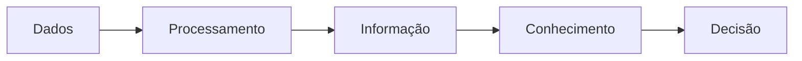
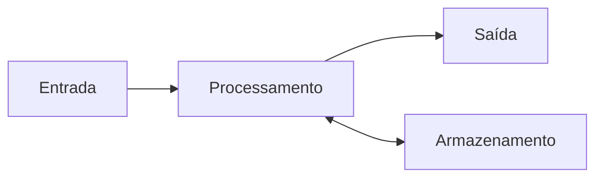
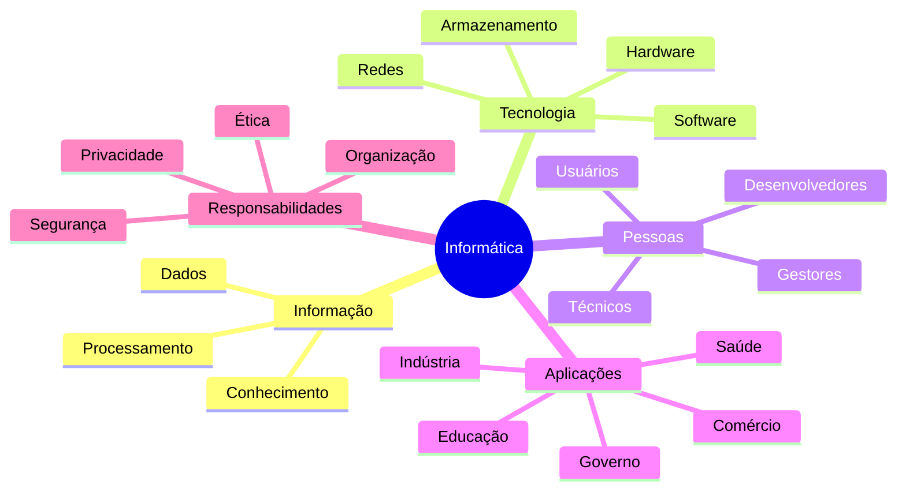

# Aula 01 — O que é Informática

> [!IMPORTANT]
> Este arquivo corresponde à apresentação oficial da primeira aula do módulo **Fundamentos da Informática**.  
> Ele foi planejado para introduzir o estudante ao curso, contextualizar o tema e orientar a forma correta de estudo.

---

## Identificação da aula

| Item | Informação |
|---|---|
| **Curso** | Técnico em Informática |
| **Módulo** | 01 — Fundamentos da Informática |
| **Aula** | 01 — O que é Informática |
| **Arquivo** | `00-Apresentacao.md` |
| **Nível** | Introdutório |
| **Carga horária sugerida** | 4 horas |
| **Modalidade** | Teórica e prática |
| **Pré-requisitos** | Nenhum |
| **Público-alvo** | Estudantes iniciantes, candidatos a cursos técnicos e profissionais em transição de carreira |

---

## Visão geral

A informática está presente em praticamente todas as atividades humanas modernas.

Ela participa do funcionamento de bancos, hospitais, escolas, indústrias, aeroportos, mercados, sistemas de transporte, redes de comunicação, serviços públicos, empresas e residências. Mesmo quando um computador não está visível, é comum que algum sistema computacional esteja executando tarefas, registrando dados ou tomando decisões automáticas.

Entretanto, compreender informática exige mais do que saber utilizar aplicativos ou operar um computador.

A informática envolve o estudo do tratamento automático da informação. Isso inclui a coleta, o armazenamento, o processamento, a transmissão, a proteção e a interpretação de dados por meio de sistemas computacionais.

Nesta aula, o estudante será apresentado aos conceitos fundamentais que sustentam todo o restante do curso.

> [!NOTE]
> Esta aula não pretende ensinar apenas a utilizar um computador. Seu objetivo é construir uma base conceitual para compreender como a informática funciona como área técnica, científica e profissional.

---

## Por que começar por este tema?

Antes de estudar hardware, sistemas operacionais, redes, programação, banco de dados ou segurança da informação, é necessário compreender o que a informática representa.

Sem essa base, o estudante pode até decorar comandos ou repetir procedimentos, mas terá dificuldade para entender:

- por que os sistemas são construídos;
- como os dados são transformados;
- qual é a função de cada componente;
- como as diferentes áreas da tecnologia se relacionam;
- quais problemas a informática procura resolver;
- quais responsabilidades fazem parte da atuação profissional.

Esta aula funciona como o ponto de entrada para todos os conteúdos seguintes.

---

## Perguntas orientadoras

Ao longo da aula, procure responder às seguintes perguntas:

1. O que significa a palavra informática?
2. Qual é a diferença entre dado, informação e conhecimento?
3. O que caracteriza um sistema computacional?
4. Informática e computação são a mesma coisa?
5. O que diferencia hardware de software?
6. Por que a informação precisa ser processada?
7. Quais áreas profissionais fazem parte da informática?
8. Como a informática transforma organizações e atividades humanas?
9. Quais benefícios e riscos acompanham a tecnologia?
10. Qual é o papel do técnico em informática nesse contexto?

> [!TIP]
> Não tente memorizar definições isoladas. Procure relacionar cada conceito com situações reais do seu cotidiano.

---

## Objetivo geral

Compreender o conceito de informática, sua finalidade, seus elementos fundamentais e sua importância para a sociedade, estabelecendo uma base sólida para o estudo técnico de sistemas computacionais.

---

## Objetivos específicos

Ao concluir esta aula, o estudante deverá ser capaz de:

- definir informática de maneira tecnicamente adequada;
- explicar a origem do termo informática;
- diferenciar dado, informação e conhecimento;
- reconhecer as principais etapas do processamento da informação;
- identificar a relação entre pessoas, hardware, software, dados e procedimentos;
- distinguir informática, computação e Tecnologia da Informação;
- identificar aplicações da informática em diferentes setores;
- reconhecer vantagens e limitações dos sistemas computacionais;
- compreender o papel do técnico em informática;
- utilizar corretamente os principais termos apresentados na aula;
- analisar situações cotidianas sob a perspectiva de um sistema de informação;
- relacionar os fundamentos desta aula com os módulos seguintes do curso.

---

## Competências desenvolvidas

Esta aula contribui para o desenvolvimento das seguintes competências:

### Competências conceituais

- compreensão dos fundamentos da informática;
- interpretação de terminologia técnica;
- identificação dos elementos de um sistema computacional;
- compreensão do ciclo de tratamento da informação;
- percepção da relação entre tecnologia, sociedade e trabalho.

### Competências práticas

- observação de sistemas informatizados;
- análise de fluxos de informação;
- organização de conceitos;
- identificação de entradas, processos e saídas;
- descrição técnica de situações do cotidiano.

### Competências profissionais

- comunicação clara;
- atenção a detalhes;
- pensamento lógico;
- raciocínio sistêmico;
- responsabilidade no tratamento de informações;
- capacidade de aprender novas tecnologias.

---

## Resultados de aprendizagem

Ao final da aula, espera-se que o estudante consiga:

- explicar o conceito de informática com suas próprias palavras;
- apresentar exemplos de tratamento automático da informação;
- reconhecer quando uma atividade utiliza recursos computacionais;
- representar um processo simples por meio do modelo entrada, processamento e saída;
- identificar pessoas, equipamentos, programas, dados e procedimentos em um sistema;
- diferenciar um dispositivo eletrônico comum de um sistema computacional;
- explicar a importância da informação para a tomada de decisões;
- descrever o papel de um profissional técnico em informática.

---

## Conteúdos abordados

A aula está organizada nos seguintes arquivos:

| Ordem | Arquivo | Conteúdo principal |
|---:|---|---|
| 00 | `00-Apresentacao.md` | Introdução, objetivos e orientação de estudo |
| 01 | `01-Fundamentos.md` | Fundamentos históricos e conceituais |
| 02 | `02-Conceitos-Essenciais.md` | Dado, informação, conhecimento e processamento |
| 03 | `03-Componentes-e-Elementos.md` | Pessoas, hardware, software, dados e procedimentos |
| 04 | `04-Funcionamento.md` | Entrada, processamento, armazenamento e saída |
| 05 | `05-Procedimentos-Praticos.md` | Observação e análise de sistemas reais |
| 06 | `06-Exemplos.md` | Aplicações em diferentes setores |
| 07 | `07-Erros-Comuns.md` | Equívocos frequentes sobre informática |
| 08 | `08-Boas-Praticas.md` | Condutas recomendadas para estudo e uso da tecnologia |
| 09 | `09-Estudo-de-Caso.md` | Análise completa de um sistema informatizado |
| 10 | `10-Resumo.md` | Síntese dos principais conceitos |
| — | `Exercicios.md` | Questões objetivas, discursivas e desafios |
| — | `Atividade.md` | Atividade aplicada |
| — | `Laboratorio.md` | Prática orientada |
| — | `Projeto.md` | Projeto da aula |
| — | `Checklist.md` | Verificação da aprendizagem |
| — | `Glossario.md` | Termos técnicos |
| — | `FAQ.md` | Perguntas frequentes |
| — | `Ferramentas.md` | Ferramentas utilizadas ou recomendadas |
| — | `Videos.md` | Materiais audiovisuais sugeridos |
| — | `Links.md` | Links complementares |
| — | `Referencias.md` | Referências bibliográficas e técnicas |
| — | `CHANGELOG.md` | Histórico de alterações |

---

## Estrutura conceitual da aula

O conteúdo segue uma progressão lógica:



Essa sequência representa uma das ideias centrais da informática: dados isolados podem ser transformados em informações úteis por meio de processamento.

Outro modelo fundamental será apresentado ao longo da aula:



Esse modelo pode ser utilizado para analisar computadores, aplicativos, sistemas empresariais e muitos outros recursos tecnológicos.

---

## Conceito inicial de informática

A informática pode ser compreendida como a área responsável pelo tratamento automático da informação por meio de sistemas computacionais.

O termo está relacionado à combinação das ideias de:

- **informação**;
- **automação**.

Em termos práticos, a informática permite:

- receber dados;
- processar dados;
- armazenar registros;
- recuperar informações;
- transmitir conteúdo;
- automatizar tarefas;
- apoiar decisões;
- controlar dispositivos;
- integrar pessoas e sistemas.

> [!WARNING]
> Informática não significa apenas “mexer no computador”. Essa expressão é limitada e não representa a complexidade da área.

---

## Informática no cotidiano

Muitas atividades comuns dependem de sistemas informatizados.

### Comunicação

- envio de mensagens;
- chamadas de vídeo;
- correio eletrônico;
- redes sociais;
- plataformas corporativas.

### Serviços financeiros

- pagamentos digitais;
- caixas eletrônicos;
- transferências bancárias;
- compras on-line;
- sistemas antifraude.

### Educação

- ambientes virtuais de aprendizagem;
- bibliotecas digitais;
- plataformas de exercícios;
- sistemas de matrícula;
- videoconferências.

### Saúde

- prontuários eletrônicos;
- agendamento de consultas;
- exames digitais;
- monitoramento de pacientes;
- controle de medicamentos.

### Transporte

- sistemas de navegação;
- bilhetagem eletrônica;
- aplicativos de mobilidade;
- rastreamento de cargas;
- controle de tráfego.

### Comércio

- controle de estoque;
- emissão de notas;
- cadastro de clientes;
- análise de vendas;
- comércio eletrônico.

### Indústria

- automação de linhas de produção;
- robótica;
- controle de qualidade;
- manutenção preditiva;
- monitoramento de máquinas.

### Administração pública

- emissão de documentos;
- sistemas tributários;
- registros públicos;
- portais de serviços;
- transparência de dados.

Esses exemplos demonstram que informática é uma infraestrutura essencial da sociedade contemporânea.

---

## Informática como área interdisciplinar

A informática não existe de forma isolada.

Ela se relaciona com diferentes áreas do conhecimento:

| Área | Relação com a informática |
|---|---|
| Matemática | Algoritmos, lógica, estatística e modelagem |
| Eletrônica | Construção de circuitos e equipamentos |
| Administração | Gestão de processos e sistemas empresariais |
| Comunicação | Redes, mídias digitais e transmissão de dados |
| Direito | Proteção de dados, crimes digitais e contratos |
| Educação | Plataformas de ensino e recursos pedagógicos |
| Saúde | Sistemas clínicos, exames e equipamentos médicos |
| Engenharia | Automação, controle e simulação |
| Design | Interfaces, experiência do usuário e acessibilidade |
| Segurança | Proteção de sistemas, dados e usuários |

> [!NOTE]
> Um profissional de informática não precisa dominar todas essas áreas, mas deve compreender como a tecnologia se integra a diferentes contextos.

---

## Informática, computação e Tecnologia da Informação

Esses termos são próximos, mas não são completamente idênticos.

### Informática

Envolve o tratamento automático da informação por meio de sistemas computacionais.

### Computação

É uma área mais ampla, relacionada ao estudo de algoritmos, processamento, representação de dados e resolução de problemas por máquinas.

### Tecnologia da Informação

Está fortemente ligada ao uso, à gestão e à manutenção de recursos tecnológicos em organizações.

| Termo | Ênfase |
|---|---|
| Informática | Tratamento da informação |
| Computação | Fundamentos, algoritmos e processamento |
| Tecnologia da Informação | Aplicação e gestão da tecnologia |

Na prática profissional, esses conceitos frequentemente se sobrepõem.

---

## O papel do técnico em informática

O técnico em informática atua na instalação, configuração, manutenção e suporte de recursos computacionais.

Entre suas possíveis atribuições estão:

- montar computadores;
- identificar falhas;
- instalar sistemas operacionais;
- configurar programas;
- prestar suporte a usuários;
- configurar redes;
- documentar procedimentos;
- realizar manutenção preventiva;
- proteger dados;
- acompanhar inventários de equipamentos;
- orientar boas práticas;
- colaborar com equipes de desenvolvimento;
- apoiar a implantação de sistemas.

O técnico não atua apenas com equipamentos. Ele também precisa compreender pessoas, processos, documentação e segurança.

> [!IMPORTANT]
> Conhecimento técnico sem organização, ética e comunicação é insuficiente para uma atuação profissional de qualidade.

---

## Perfil esperado do estudante

Não é necessário possuir experiência anterior.

Entretanto, o estudante deve desenvolver algumas atitudes:

- curiosidade;
- disciplina;
- paciência;
- responsabilidade;
- disposição para praticar;
- atenção a detalhes;
- hábito de pesquisar;
- respeito às regras de segurança;
- capacidade de registrar o que foi feito;
- disposição para aprender com erros.

A informática exige atualização contínua. Portanto, aprender a estudar é tão importante quanto dominar uma ferramenta específica.

---

## Como estudar esta aula

Siga a ordem dos arquivos.

### Etapa 1 — Leitura inicial

Leia este arquivo por completo e identifique os objetivos da aula.

### Etapa 2 — Estudo teórico

Leia os arquivos numerados de `01` a `04`.

Durante a leitura:

- destaque conceitos;
- anote dúvidas;
- registre exemplos;
- revise termos desconhecidos;
- observe os diagramas.

### Etapa 3 — Aplicação

Utilize os arquivos:

- `05-Procedimentos-Praticos.md`;
- `06-Exemplos.md`;
- `09-Estudo-de-Caso.md`.

Tente relacionar a teoria com situações reais.

### Etapa 4 — Revisão

Leia:

- `07-Erros-Comuns.md`;
- `08-Boas-Praticas.md`;
- `10-Resumo.md`;
- `Glossario.md`;
- `FAQ.md`.

### Etapa 5 — Avaliação

Conclua:

- `Exercicios.md`;
- `Atividade.md`;
- `Laboratorio.md`;
- `Projeto.md`;
- `Checklist.md`.

> [!TIP]
> Não consulte o gabarito antes de tentar resolver as questões. O erro faz parte do processo de aprendizagem.

---

## Metodologia sugerida

A aula combina quatro formas de aprendizagem.

### Exposição teórica

Apresenta os conceitos fundamentais.

### Observação

Estimula a identificação de sistemas informatizados em situações reais.

### Prática orientada

Permite aplicar os conceitos por meio de atividades estruturadas.

### Produção

Leva o estudante a criar registros, diagramas, análises e pequenas soluções.

Essa combinação evita que o aprendizado fique restrito à memorização.

---

## Carga horária sugerida

| Etapa | Tempo estimado |
|---|---:|
| Apresentação e leitura inicial | 20 minutos |
| Fundamentos | 40 minutos |
| Conceitos essenciais | 50 minutos |
| Componentes e funcionamento | 50 minutos |
| Exemplos e estudo de caso | 35 minutos |
| Exercícios | 25 minutos |
| Atividade e laboratório | 40 minutos |
| Projeto e revisão | 40 minutos |
| **Total** | **4 horas** |

O tempo pode variar de acordo com a experiência e o ritmo do estudante.

---

## Recursos necessários

Para concluir a aula, recomenda-se:

- computador, notebook, tablet ou smartphone;
- acesso a um editor de texto;
- navegador atualizado;
- conexão com a internet para materiais complementares;
- caderno físico ou digital;
- ferramenta para criação de diagramas;
- disposição para observar sistemas reais.

> [!NOTE]
> A maior parte da aula pode ser realizada sem equipamentos avançados. O foco principal é a construção da base conceitual.

---

## Critérios de conclusão

A aula pode ser considerada concluída quando o estudante:

- compreende o conceito de informática;
- diferencia dado e informação;
- reconhece os componentes de um sistema;
- representa um processo por entrada, processamento e saída;
- identifica aplicações da informática;
- conclui os exercícios;
- realiza a atividade prática;
- executa o laboratório;
- entrega o projeto;
- verifica o checklist final.

---

## Critérios de avaliação

A avaliação pode considerar:

| Critério | Peso sugerido |
|---|---:|
| Compreensão conceitual | 25% |
| Participação e registros | 10% |
| Exercícios | 20% |
| Atividade prática | 15% |
| Laboratório | 15% |
| Projeto | 15% |
| **Total** | **100%** |

### Indicadores de desempenho

#### Excelente

O estudante explica conceitos com clareza, utiliza exemplos próprios e relaciona os conteúdos com situações reais.

#### Adequado

O estudante compreende os conceitos principais e consegue aplicá-los em situações simples.

#### Em desenvolvimento

O estudante reconhece parte dos conceitos, mas ainda apresenta dificuldades de aplicação.

#### Insuficiente

O estudante não consegue explicar os conceitos fundamentais nem concluir as atividades propostas.

---

## Conhecimentos prévios

Esta é uma aula introdutória.

Não é necessário saber:

- programar;
- montar computadores;
- utilizar terminal;
- configurar redes;
- instalar sistemas;
- compreender eletrônica.

Entretanto, é útil possuir familiaridade básica com:

- leitura de textos;
- navegação em arquivos;
- uso de teclado e mouse;
- acesso a páginas da internet.

Caso o estudante ainda não possua essas habilidades, poderá desenvolvê-las durante o curso.

---

## Relação com os próximos conteúdos

Os conceitos desta aula serão utilizados em todo o curso.

### Hardware

Será necessário compreender os componentes físicos responsáveis pelo processamento.

### Sistemas operacionais

Será necessário entender como o software gerencia recursos.

### Redes

Será necessário compreender como informações são transmitidas.

### Programação

Será necessário entender como algoritmos processam dados.

### Banco de dados

Será necessário compreender como informações são organizadas e recuperadas.

### Segurança

Será necessário reconhecer o valor e a sensibilidade dos dados.

### Suporte técnico

Será necessário analisar sistemas, usuários e procedimentos.

Por isso, esta aula deve ser estudada com atenção.

---

## Regras de organização

Durante o curso:

- mantenha os arquivos organizados;
- utilize nomes claros;
- preserve a estrutura de pastas;
- registre alterações;
- evite salvar documentos em locais aleatórios;
- crie cópias de segurança;
- mantenha anotações atualizadas;
- utilize datas quando necessário;
- documente testes e resultados.

Essas práticas serão exigidas em atividades futuras.

---

## Conduta ética

O uso da informática envolve responsabilidades.

O estudante deverá:

- respeitar a privacidade;
- proteger credenciais;
- evitar acesso não autorizado;
- respeitar licenças;
- citar fontes;
- não compartilhar dados sensíveis;
- não instalar programas sem autorização;
- não utilizar conhecimento técnico para prejudicar terceiros;
- comunicar falhas de forma responsável;
- cumprir políticas institucionais.

> [!CAUTION]
> Conhecimento técnico não autoriza acesso, modificação ou coleta de dados sem consentimento.

---

## Segurança durante as práticas

Embora esta aula seja introdutória, algumas regras devem ser observadas:

- não execute arquivos desconhecidos;
- não informe senhas em atividades;
- não compartilhe dados pessoais;
- não altere configurações críticas;
- não desative mecanismos de proteção;
- utilize ambientes de teste quando possível;
- leia instruções antes de executar procedimentos;
- mantenha cópias de segurança.

---

## Acessibilidade e inclusão

Os materiais devem ser utilizados de forma acessível.

Recomenda-se:

- ampliar o texto quando necessário;
- utilizar leitores de tela;
- adicionar descrição a imagens;
- evitar depender apenas de cores;
- utilizar linguagem clara;
- manter bom contraste;
- fornecer alternativas textuais;
- respeitar diferentes ritmos de aprendizagem.

A informática deve ampliar o acesso, não criar novas barreiras.

---

## Autoavaliação inicial

Antes de avançar, responda mentalmente:

- Eu consigo explicar o que é informática?
- Sei diferenciar hardware e software?
- Sei o que significa processar informação?
- Consigo citar três sistemas informatizados?
- Conheço alguma área de atuação em informática?
- Sei qual é a função de um técnico em informática?

Não é necessário acertar tudo neste momento.

As respostas serão construídas ao longo da aula.

---

## Desafio de observação

Observe o ambiente ao seu redor e identifique cinco exemplos de informática.

Para cada exemplo, registre:

1. nome do sistema ou dispositivo;
2. dados recebidos;
3. processamento realizado;
4. resultado produzido;
5. pessoas envolvidas;
6. benefício gerado;
7. possível risco.

Exemplo:

| Elemento | Descrição |
|---|---|
| Sistema | Aplicativo de transporte |
| Entrada | Localização, destino e forma de pagamento |
| Processamento | Cálculo da rota e busca por motorista |
| Saída | Preço estimado e veículo disponível |
| Pessoas | Passageiro, motorista e equipe da plataforma |
| Benefício | Facilita o deslocamento |
| Risco | Exposição indevida de localização |

Esse exercício será retomado em arquivos posteriores.

---

## Mapa mental inicial



---

## Termos que aparecerão na aula

Durante o estudo, você encontrará termos como:

- dado;
- informação;
- conhecimento;
- processamento;
- sistema;
- hardware;
- software;
- usuário;
- entrada;
- saída;
- armazenamento;
- automação;
- algoritmo;
- tecnologia;
- rede;
- segurança;
- documentação;
- suporte.

Todos serão explicados nos arquivos correspondentes.

---

## Síntese da apresentação

Nesta apresentação, estabelecemos que:

- informática é uma área ampla;
- seu foco é o tratamento automático da informação;
- ela está presente em diferentes setores;
- o curso exige teoria, prática e organização;
- o técnico em informática atua com equipamentos, sistemas, pessoas e processos;
- a ética e a segurança fazem parte da formação;
- esta aula servirá como base para os próximos módulos.

---

## Próximo arquivo

Continue pelo arquivo:

[`01-Fundamentos.md`](./01-Fundamentos.md)

Nesse arquivo serão abordados:

- origem da informática;
- evolução histórica;
- conceitos fundamentais;
- objetivos da área;
- relação entre computação, tecnologia e sociedade.

---

## Registro do estudante

Ao terminar esta apresentação, registre:

- data de início;
- horário de início;
- principal expectativa;
- maior dificuldade prevista;
- objetivo pessoal com o curso.

Modelo:

```text
Data:
Horário:
Minha principal expectativa:
Minha maior dificuldade prevista:
Meu objetivo com este curso:
```

Esse registro permitirá comparar sua evolução ao longo do curso.

---

> [!TIP]
> Você concluiu a apresentação da Aula 01.  
> O próximo passo é estudar os fundamentos que explicam como a informática surgiu, evoluiu e passou a fazer parte da sociedade.
