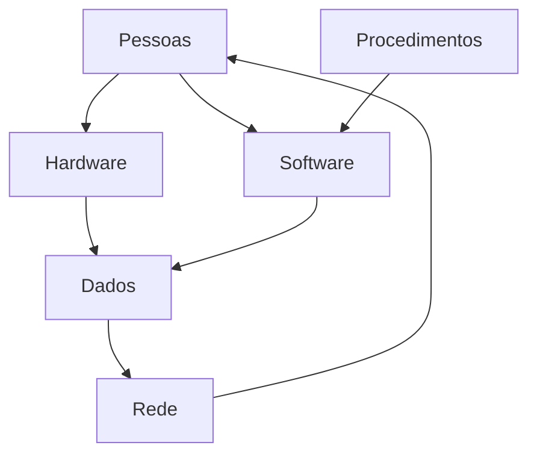
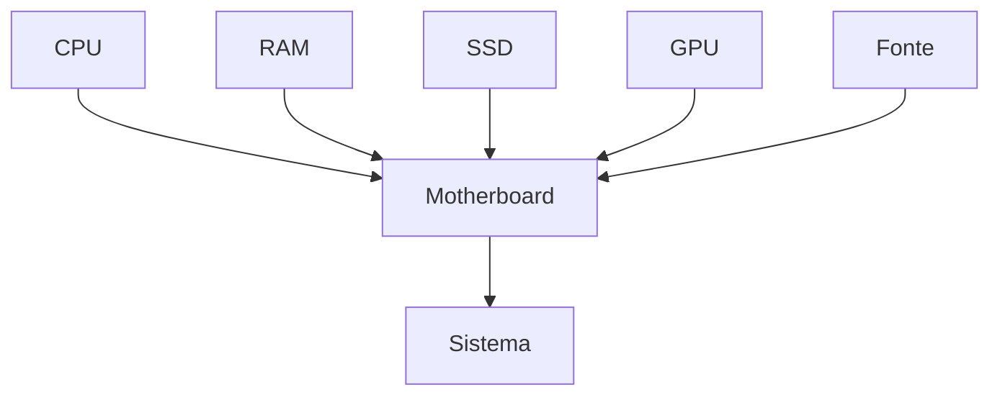
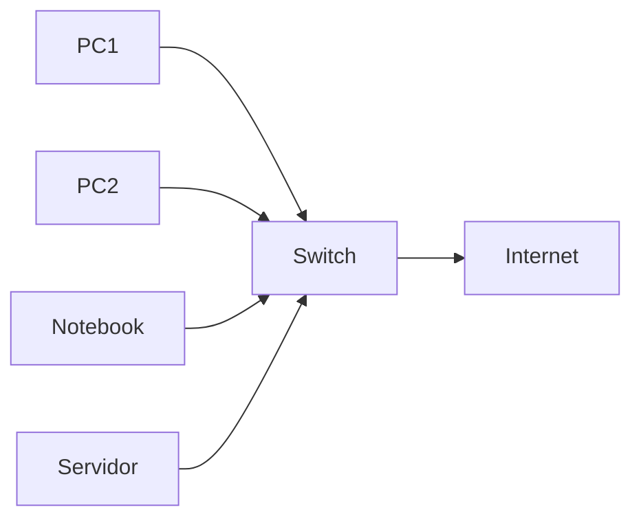

# 🖥️ Componentes e Elementos de um Sistema Computacional

> [!IMPORTANT]
> **Módulo:** 01 — Fundamentos da Informática
>
> **Aula:** 01 — O que é Informática
>
> **Arquivo:** `03-Componentes-e-Elementos.md`

---

# 📖 Introdução

Quando uma pessoa olha para um computador, normalmente enxerga apenas um monitor, um teclado e um gabinete.

Porém, um sistema computacional é muito mais complexo.

Para que um simples clique em um botão produza um resultado, dezenas de componentes trabalham em conjunto.

Hardware, software, pessoas, dados, redes, procedimentos e dispositivos de armazenamento interagem constantemente para transformar informações em resultados úteis.

É justamente essa integração que torna possível utilizar aplicativos, acessar a internet, enviar mensagens, realizar pagamentos, controlar hospitais, administrar empresas e operar sistemas industriais.

Neste capítulo conheceremos todos os elementos que compõem um sistema computacional moderno.

---

# 🎯 Objetivos da aula

Ao concluir este capítulo você deverá ser capaz de:

- identificar os principais componentes de um sistema computacional;
- diferenciar hardware de software;
- compreender o papel dos usuários;
- identificar dispositivos de entrada, saída e armazenamento;
- entender a importância dos dados e procedimentos;
- reconhecer como todos esses elementos trabalham em conjunto.

---

# 🧩 O que é um Sistema Computacional?

Um sistema computacional é um conjunto organizado de componentes capazes de receber dados, processá-los, armazená-los e produzir informações.

Esses componentes não funcionam de maneira isolada.

Cada um possui uma função específica.

Quando um deles apresenta falha, todo o sistema pode ser comprometido.

---

## 📊 Estrutura geral

---

# 🖥️ Hardware

O hardware corresponde à parte física do computador.

Tudo aquilo que pode ser tocado faz parte do hardware.

## Exemplos

- Gabinete
- Processador (CPU)
- Memória RAM
- SSD
- HD
- Placa-mãe
- Fonte
- Placa de vídeo
- Monitor
- Mouse
- Teclado
- Impressora
- Webcam
- Scanner

> [!NOTE]
> Sem software, o hardware não possui utilidade prática.

---

## 🏗️ Como imaginar o hardware?

Uma comparação bastante utilizada é com o corpo humano.

| Corpo Humano | Computador |
|---------------|--------------------|
| Cérebro | Processador |
| Memória | Memória RAM |
| Esqueleto | Placa-mãe |
| Músculos | Fonte de alimentação e circuitos |
| Olhos | Webcam |
| Ouvidos | Microfone |
| Boca | Alto-falantes |
| Mãos | Mouse e teclado |

Essa comparação ajuda a compreender a função de cada componente.

---

# ⚙️ Principais componentes do Hardware

## 🧠 Processador (CPU)

O processador é conhecido como o cérebro do computador.

Sua função é executar instruções.

Sempre que um programa é aberto, milhares ou milhões de instruções são executadas.

### O processador realiza

- cálculos matemáticos;
- operações lógicas;
- controle dos demais componentes;
- comunicação com memória;
- execução de programas.

---

## 🧠 Memória RAM

A memória RAM armazena temporariamente as informações utilizadas pelo computador.

Ela é extremamente rápida.

Entretanto, perde todo seu conteúdo quando o computador é desligado.

> [!WARNING]
> RAM não serve para armazenar arquivos permanentemente.

---

## 💾 SSD

O SSD armazena dados permanentemente.

Ele mantém arquivos mesmo após o desligamento do computador.

Comparado ao HD, apresenta:

- maior velocidade;
- menor consumo de energia;
- maior resistência a impactos;
- menor tempo de inicialização.

---

## 💿 HD

Durante muitos anos foi o principal dispositivo de armazenamento.

Seu funcionamento utiliza discos magnéticos giratórios.

Embora seja mais lento que um SSD, continua sendo utilizado para armazenar grandes volumes de dados.

---

## 🖥️ Placa-mãe

É o componente responsável por conectar todos os demais dispositivos.

Sem ela, processador, memória, armazenamento e placas de expansão não conseguiriam se comunicar.

---

# 💻 Software

Enquanto o hardware representa a parte física, o software representa a parte lógica.

Software é um conjunto de instruções capaz de orientar o hardware.

Sem software, um computador permanece incapaz de executar tarefas úteis.

---

## Exemplos

- Windows
- Linux
- Android
- Word
- Excel
- Chrome
- Firefox
- Discord
- VS Code

---

## Classificação dos softwares

### Software de Sistema

Controla o funcionamento do computador.

Exemplos:

- Windows
- Ubuntu
- Fedora
- macOS

---

### Software Aplicativo

Resolve problemas específicos do usuário.

Exemplos:

- Navegadores
- Jogos
- Editores de texto
- Planilhas
- Sistemas hospitalares

---

### Software de Programação

Utilizado para criar novos programas.

Exemplos:

- Visual Studio Code
- IntelliJ
- Eclipse
- GCC
- Python

---

# 👤 Pessoas

Muitas pessoas acreditam que computadores funcionam sozinhos.

Isso não é verdade.

Todo sistema computacional depende de pessoas.

---

## Usuários

São aqueles que utilizam o sistema.

Exemplos:

- pacientes;
- clientes;
- estudantes;
- funcionários.

---

## Técnicos

Responsáveis por:

- manutenção;
- instalação;
- suporte;
- atualização;
- diagnóstico de falhas.

---

## Desenvolvedores

Criam os sistemas utilizados pelos usuários.

---

## Administradores

Gerenciam servidores, redes e infraestrutura.

---

> [!IMPORTANT]
> Pessoas continuam sendo o componente mais importante de qualquer sistema computacional.

---

# 📂 Dados

Os dados representam a matéria-prima do processamento.

Sem dados, um sistema não consegue produzir informações.

Exemplos:

- CPF;
- Nome;
- Temperatura;
- Data;
- Valor;
- Código de barras.

---

# 📑 Procedimentos

Procedimentos são regras utilizadas para executar atividades.

Exemplo:

Em um hospital:

1. cadastrar paciente;
2. validar documentos;
3. localizar prontuário;
4. registrar atendimento;
5. emitir receita.

Mesmo utilizando excelentes computadores, sem procedimentos corretos o sistema deixa de funcionar adequadamente.

---

# 🌐 Redes

Atualmente praticamente nenhum computador trabalha isoladamente.

Eles estão conectados por redes.

Através delas ocorre:

- compartilhamento de arquivos;
- acesso à internet;
- impressão em rede;
- comunicação entre servidores;
- videoconferências;
- armazenamento em nuvem.

---

---

# 🔄 Como todos trabalham juntos?

Imagine um caixa de supermercado.

Quando o operador passa um produto no leitor:

1. O leitor captura o código.
2. O computador recebe os dados.
3. O software consulta o banco de dados.
4. O processador realiza cálculos.
5. O SSD armazena o registro da venda.
6. A impressora gera o cupom.
7. O estoque é atualizado.

Observe quantos componentes participaram de apenas uma única operação.

---

# 📊 Resumo dos componentes

| Elemento | Função |
|------------|--------------------------------|
| Hardware | Parte física |
| Software | Programas |
| Dados | Informações registradas |
| Pessoas | Utilização e operação |
| Procedimentos | Regras do sistema |
| Redes | Comunicação entre dispositivos |

---

# ⚠️ Erros comuns

❌ Achar que hardware funciona sem software.

❌ Pensar que software pode existir sem hardware.

❌ Confundir memória RAM com armazenamento.

❌ Acreditar que somente computadores fazem parte da informática.

❌ Ignorar a importância das pessoas dentro de um sistema.

---

# 💡 Curiosidade

> [!NOTE]
>
> Um smartphone moderno possui praticamente todos os componentes estudados neste capítulo:
>
> - processador;
> - memória RAM;
> - armazenamento;
> - sistema operacional;
> - aplicativos;
> - sensores;
> - conexão de rede;
> - usuários;
> - dados.

Ou seja, ele também é um sistema computacional completo.

---

# 🧠 Pare e Pense

Observe o computador que você utiliza neste momento.

Tente identificar:

- Qual é o hardware?
- Qual é o software?
- Quais dados estão sendo processados?
- Quem é o usuário?
- Quais procedimentos você está executando?
- Há conexão com uma rede?

Esse exercício ajuda a visualizar como todos os componentes trabalham simultaneamente.

---

# 📌 Resumo Final

Ao longo deste capítulo aprendemos que um sistema computacional é formado pela integração entre hardware, software, pessoas, dados, procedimentos e redes.

Nenhum desses elementos é suficiente isoladamente.

Somente quando todos trabalham em conjunto é possível transformar dados em informações úteis e permitir que computadores resolvam problemas do mundo real.

> [!SUCCESS]
> Você concluiu o estudo dos componentes fundamentais de um sistema computacional.
>
> No próximo arquivo (`04-Funcionamento.md`) veremos como esses componentes interagem internamente durante o processamento de uma informação.
