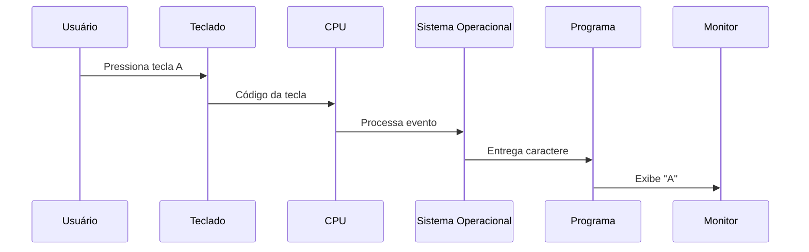
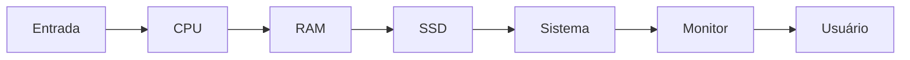

# ⚙️ Funcionamento de um Sistema Computacional

> [!IMPORTANT]
> **Módulo:** 01 — Fundamentos da Informática
>
> **Aula:** 01 — O que é Informática
>
> **Arquivo:** `04-Funcionamento.md`

---

# 📖 Introdução

Agora que você já conhece os componentes que formam um sistema computacional, chegou o momento de compreender **como eles trabalham juntos**.

Muitas pessoas imaginam que um computador simplesmente "executa programas".

Na realidade, cada ação realizada envolve milhões — e, em muitos casos, bilhões — de operações ocorrendo em poucos segundos.

Quando você abre um navegador, envia uma mensagem, assiste a um vídeo ou salva um documento, diversos componentes trabalham simultaneamente.

Processador, memória RAM, SSD, sistema operacional, dispositivos de entrada e saída, rede e programas comunicam-se constantemente para executar cada instrução.

Neste capítulo entenderemos esse funcionamento passo a passo.

---

# 🎯 Objetivos de aprendizagem

Ao concluir este capítulo você será capaz de:

- compreender o ciclo completo do processamento da informação;
- identificar o caminho percorrido pelos dados;
- entender como hardware e software trabalham em conjunto;
- reconhecer o papel da CPU, memória e armazenamento;
- compreender como ocorre a comunicação entre dispositivos.

---

# 🖥️ Como um computador funciona?

Apesar da enorme quantidade de componentes, praticamente todo sistema computacional segue um mesmo princípio.

Ele pode ser resumido em quatro etapas:


Esse ciclo acontece milhares de vezes por segundo.

---

# 📥 Etapa 1 — Entrada (Input)

Tudo começa quando alguma informação entra no sistema.

Essa entrada pode ser realizada de diversas maneiras.

## Exemplos

| Dispositivo | Informação recebida |
|--------------|---------------------|
| ⌨️ Teclado | Letras e números |
| 🖱️ Mouse | Movimento e cliques |
| 🎤 Microfone | Áudio |
| 📷 Webcam | Imagens |
| 📱 Tela Touch | Toques |
| 🌡️ Sensor | Temperatura |
| 🌐 Rede | Dados vindos da Internet |

Imagine que você digite a palavra:

```text
INFORMÁTICA
```

Cada tecla pressionada gera sinais elétricos.

Esses sinais são enviados para o computador.

O computador ainda **não entende letras**.

Ele recebe apenas códigos.

---

> [!NOTE]
>
> Todo dispositivo de entrada converte ações físicas em sinais digitais.

---

# 🔄 O que acontece quando você aperta uma tecla?

Vamos acompanhar uma única tecla sendo pressionada.

Você pressiona:

```
A
```

O teclado identifica qual tecla foi pressionada.

Em seguida:

1. envia um código elétrico;
2. esse código chega à placa-mãe;
3. o processador recebe a informação;
4. o sistema operacional interpreta o código;
5. o programa exibe a letra na tela.

Tudo isso acontece em poucos milissegundos.



---

# ⚙️ Etapa 2 — Processamento

Depois que os dados entram no sistema, começa o processamento.

Essa é a principal responsabilidade da CPU.

A CPU executa milhões de instruções por segundo.

Ela realiza operações como:

- cálculos;
- comparações;
- decisões;
- movimentação de dados;
- controle de memória.

---

## 🧠 Como a CPU trabalha?

O funcionamento básico ocorre em quatro etapas.


Esse processo recebe o nome de **Ciclo de Instrução**.

Ele acontece continuamente enquanto o computador está ligado.

---

# 📚 Exemplo

Imagine uma calculadora.

Você digita:

```
15 + 8
```

A CPU realiza aproximadamente o seguinte processo.

Entrada

```
15

+

8
```

Processamento

```
Somar valores
```

Resultado

```
23
```

Embora pareça simples, internamente milhares de sinais elétricos foram processados.

---

# 🧠 Memória RAM durante o processamento

A CPU trabalha diretamente com a memória RAM.

Ela não busca informações diretamente no SSD toda vez que precisa executar um programa.

Primeiro ocorre:

```
SSD

↓

RAM

↓

CPU
```

Isso acontece porque a memória RAM é muito mais rápida.

---

## 📌 Exemplo

Imagine abrir o navegador.

O navegador está salvo no SSD.

Quando você executa o programa:

1. ele é copiado para a RAM;
2. a CPU passa a executá-lo;
3. enquanto estiver aberto permanece parcialmente na memória.

Quando o computador é desligado, a RAM é apagada.

---

> [!TIP]
>
> Quanto mais memória RAM disponível, maior será a quantidade de programas que podem permanecer carregados ao mesmo tempo.

---

# 💾 Etapa 3 — Armazenamento

Nem toda informação deve desaparecer quando o computador é desligado.

Por isso existem dispositivos de armazenamento permanente.

Exemplos:

- SSD;
- HD;
- Pen Drive;
- Cartão SD;
- Servidores;
- Armazenamento em nuvem.

---

## O que é armazenado?

- documentos;
- fotos;
- vídeos;
- sistemas operacionais;
- jogos;
- programas;
- bancos de dados;
- configurações.

---

# 📤 Etapa 4 — Saída

Após o processamento, os resultados precisam ser apresentados.

Isso ocorre através dos dispositivos de saída.

## Exemplos

| Dispositivo | Resultado apresentado |
|--------------|----------------------|
| 🖥️ Monitor | Imagens |
| 🖨️ Impressora | Documentos |
| 🔊 Alto-falantes | Sons |
| 📱 Smartphone | Notificações |
| 📽️ Projetor | Vídeos |

---

# 🌎 Exemplo completo

Imagine acessar um site.

## Passo 1

Você digita:

```
www.exemplo.com
```

↓

Entrada

---

## Passo 2

O navegador interpreta o endereço.

↓

Processamento

---

## Passo 3

O computador envia uma solicitação pela Internet.

↓

Rede

---

## Passo 4

O servidor responde.

↓

Processamento

---

## Passo 5

As imagens e textos são carregados.

↓

Armazenamento temporário

---

## Passo 6

O site aparece no monitor.

↓

Saída

---

```mermaid
flowchart TD

Usuário

-->

Teclado

-->

CPU

-->

Sistema Operacional

-->

Navegador

-->

Internet

-->

Servidor

-->

Internet

-->

Monitor
```

---

# 🏥 Estudo de Caso — Hospital

Vamos acompanhar o cadastro de um paciente.

## Entrada

Recepcionista digita:

- Nome
- CPF
- Convênio
- Data de nascimento

↓

## Processamento

O sistema verifica:

- CPF válido;
- paciente existente;
- convênio ativo.

↓

## Armazenamento

As informações são gravadas no banco de dados.

↓

## Saída

A ficha do paciente é exibida.

---

# 🛒 Estudo de Caso — Supermercado

Quando um produto passa pelo leitor:

Entrada

↓

Código de barras

↓

CPU consulta banco de dados

↓

Preço localizado

↓

Total atualizado

↓

Cupom impresso

↓

Estoque atualizado

Tudo isso acontece em menos de um segundo.

---

# ⚡ Velocidade impressionante

Um processador moderno pode executar bilhões de instruções por segundo.

Isso significa que, enquanto você lê esta frase, milhões de operações já ocorreram dentro do computador.

---

# 🧠 Pare e Pense

Observe o computador que você está utilizando neste momento.

Quando você clicar em algum botão desta página, tente imaginar todo o caminho percorrido pela informação.

Pergunte-se:

- Qual dispositivo recebeu a entrada?
- Quem processou?
- Onde os dados foram armazenados?
- Como o resultado apareceu na tela?

Esse exercício ajuda a compreender como os conceitos estudados são aplicados na prática.

---

# ⚠️ Erros comuns

❌ Acreditar que a CPU trabalha sozinha.

❌ Pensar que memória RAM serve para guardar arquivos permanentemente.

❌ Confundir SSD com memória RAM.

❌ Imaginar que o computador entende textos como os seres humanos.

❌ Acreditar que apenas o processador é responsável pelo desempenho do sistema.

---

# 💡 Curiosidade

> [!NOTE]
>
> Um simples clique do mouse pode gerar centenas de instruções diferentes antes que um botão seja exibido na tela.

---

# 📊 Resumo Geral



Todo sistema computacional segue uma lógica semelhante.

Ele recebe informações, processa dados, armazena resultados e apresenta uma resposta ao usuário.

Essa sequência acontece continuamente e constitui o princípio de funcionamento de praticamente todos os dispositivos digitais existentes.

> [!TIP]
>
> Agora você compreende como um sistema computacional transforma ações simples do usuário em operações complexas realizadas em frações de segundo.
>
> No próximo capítulo veremos como esses conceitos são aplicados em procedimentos práticos e situações reais do dia a dia do Técnico em Informática.
