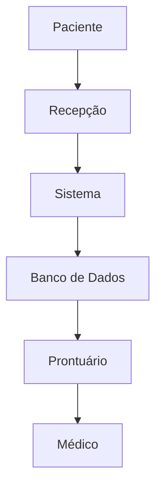

# 🛠️ Procedimentos Práticos

> [!IMPORTANT]
> **Módulo:** 01 — Fundamentos da Informática
>
> **Aula:** 01 — O que é Informática
>
> **Arquivo:** `05-Procedimentos-Praticos.md`

---

# 📖 Introdução

Até este momento, estudamos diversos conceitos fundamentais da informática.

Você aprendeu:

- o que é informática;
- o que são dados, informações e conhecimento;
- quais componentes formam um sistema computacional;
- como ocorre o processamento das informações.

Agora chegou o momento de colocar esses conceitos em prática.

O objetivo deste capítulo **não é ensinar programação nem manutenção de computadores**, mas desenvolver uma habilidade extremamente importante para qualquer profissional da área de tecnologia:

> **Observar, identificar e compreender como um sistema computacional funciona no mundo real.**

Essa capacidade será utilizada durante toda a carreira de um Técnico em Informática.

---

# 🎯 Objetivos

Ao concluir este capítulo você será capaz de:

- identificar sistemas computacionais no cotidiano;
- reconhecer dispositivos de entrada e saída;
- identificar hardware e software utilizados;
- analisar o fluxo das informações;
- representar processos utilizando diagramas;
- documentar procedimentos técnicos;
- desenvolver pensamento analítico.

---

# 📚 O que é um procedimento?

Na informática, um procedimento é uma sequência organizada de ações realizadas para atingir um determinado objetivo.

Por exemplo:

```text
Ligar o computador
↓
Entrar no sistema
↓
Abrir um programa
↓
Executar uma atividade
↓
Salvar os dados
↓
Encerrar o programa
↓
Desligar o computador
```

Perceba que existe uma ordem lógica.

Se invertermos essas etapas, provavelmente ocorrerão erros.

---

> [!NOTE]
>
> Um bom profissional de TI sempre trabalha seguindo procedimentos bem definidos.

---

# 🔍 Procedimento 1 — Identificando um Sistema Computacional

Observe qualquer ambiente ao seu redor.

Pode ser:

- sua casa;
- sua escola;
- um hospital;
- um supermercado;
- um banco;
- uma farmácia.

Agora responda:

## Qual sistema você escolheu?

Exemplo:

```
Sistema de Caixa de Supermercado
```

---

## Quem utiliza esse sistema?

Exemplo:

- operador de caixa;
- cliente;
- gerente;
- setor financeiro.

---

## Qual é o objetivo desse sistema?

Exemplo:

Registrar vendas e controlar o estoque.

---

## Quais equipamentos existem?

Faça uma lista.

Exemplo:

- computador;
- monitor;
- teclado;
- mouse;
- leitor de código de barras;
- impressora térmica;
- gaveta de dinheiro.

---

## Quais softwares são utilizados?

Nem sempre será possível saber exatamente.

Observe e registre.

Exemplo:

- sistema de vendas;
- sistema operacional;
- software fiscal.

---

## Quais dados entram no sistema?

Exemplo:

- código do produto;
- quantidade;
- CPF;
- forma de pagamento.

---

## Quais informações são produzidas?

Exemplo:

- valor total;
- troco;
- nota fiscal;
- atualização do estoque.

---

## Onde esses dados ficam armazenados?

Pense nas possibilidades.

- SSD local;
- servidor;
- banco de dados;
- nuvem.

---

# 🏥 Exemplo Completo — Hospital

Vamos analisar um hospital.

## Entrada

Recepcionista informa:

- nome;
- CPF;
- convênio;
- telefone;
- sintomas.

↓

## Processamento

O sistema verifica:

- cadastro;
- médico disponível;
- convênio;
- histórico.

↓

## Armazenamento

As informações são gravadas no prontuário eletrônico.

↓

## Saída

- ficha de atendimento;
- senha;
- direcionamento ao consultório.

---



---

# 🛒 Procedimento 2 — Mapeando Entradas e Saídas

Escolha um sistema.

Monte uma tabela semelhante.

| Entrada | Processamento | Saída |
|-----------|---------------|--------|
| Código de barras | Consulta banco de dados | Valor do produto |
| CPF | Consulta cadastro | Dados do cliente |
| Senha | Validação | Acesso autorizado |

---

# 📊 Procedimento 3 — Identificando Hardware

Observe um computador.

Liste todos os componentes visíveis.

| Equipamento | Função |
|---------------|----------------|
| Monitor | Exibir informações |
| Mouse | Entrada |
| Teclado | Entrada |
| Impressora | Saída |
| Webcam | Captura de imagem |

Agora tente descobrir quais componentes não são visíveis.

Exemplo:

- processador;
- memória RAM;
- SSD;
- placa-mãe.

---

# 💻 Procedimento 4 — Identificando Software

Abra seu computador.

Liste os programas que estão em execução.

Exemplo:

| Programa | Categoria |
|-----------|-------------|
| Windows | Sistema Operacional |
| Chrome | Navegador |
| Discord | Comunicação |
| VS Code | Desenvolvimento |

Agora responda:

Qual deles controla o computador?

Qual deles você utiliza diretamente?

---

# 🌐 Procedimento 5 — Identificando a Rede

Observe:

Seu computador está conectado à Internet?

Se sim:

Como ocorre essa conexão?

- Wi-Fi
- Cabo
- Dados móveis

Agora tente descobrir o caminho da comunicação.


---

# 🧠 Procedimento 6 — Fluxo da Informação

Escolha um aplicativo.

Exemplo:

WhatsApp.

Quando você envia uma mensagem, tente identificar todas as etapas.

1. Digitação.
2. Entrada pelo teclado.
3. Processamento.
4. Envio pela Internet.
5. Servidor recebe.
6. Servidor encaminha.
7. Destinatário recebe.
8. Mensagem aparece na tela.

---

# 📱 Estudo Prático — Smartphone

Observe seu celular.

Complete a tabela.

| Item | Identificado |
|---------|-------------|
| Hardware | |
| Sistema Operacional | |
| Aplicativos | |
| Armazenamento | |
| Conexão | |
| Sensores | |

---

# 💡 Desafio

Escolha três sistemas diferentes.

Exemplos:

- Caixa eletrônico;
- Elevador;
- Aplicativo de transporte.

Para cada um identifique:

- hardware;
- software;
- dados;
- processamento;
- saída.

---

# 📝 Atividade de Observação

Durante um dia inteiro tente identificar sistemas computacionais utilizados.

Faça uma lista.

Exemplo.

| Ambiente | Sistema |
|--------------|----------------|
| Escola | Controle de presença |
| Mercado | Caixa |
| Banco | Caixa eletrônico |
| Hospital | Prontuário eletrônico |
| Casa | Smart TV |

Quantos sistemas você encontrou?

Provavelmente mais do que imaginava.

---

# ⚠️ Erros comuns

❌ Pensar que apenas computadores são sistemas computacionais.

❌ Esquecer que smartphones também possuem processador, memória e sistema operacional.

❌ Confundir hardware com software.

❌ Ignorar os dados processados.

❌ Não documentar as observações.

---

# 📌 Boas práticas

✔ Observe antes de concluir.

✔ Documente suas descobertas.

✔ Utilize tabelas.

✔ Faça diagramas.

✔ Compare diferentes sistemas.

✔ Pergunte como as informações circulam.

✔ Identifique entradas e saídas.

✔ Procure compreender o objetivo do sistema.

---

# 🧠 Exercício Final

Escolha o sistema computacional que você mais utiliza.

Produza um pequeno relatório contendo:

## 1. Nome do sistema

---

## 2. Objetivo

---

## 3. Hardware utilizado

---

## 4. Software utilizado

---

## 5. Dados de entrada

---

## 6. Processamento

---

## 7. Informações geradas

---

## 8. Dispositivos de saída

---

## 9. Possíveis melhorias

---

## 10. Conclusão

Explique, com suas palavras, por que esse sistema pode ser considerado um sistema computacional.

---

# 🎓 Conclusão

Ao realizar os procedimentos apresentados neste capítulo, você percebe que a informática não está restrita aos computadores tradicionais.

Ela está presente em celulares, caixas eletrônicos, hospitais, escolas, automóveis, supermercados, relógios inteligentes, televisores, indústrias e praticamente todos os setores da sociedade.

Mais importante do que memorizar conceitos é desenvolver a capacidade de observar, analisar e compreender como os sistemas funcionam.

Essa habilidade acompanhará você durante todo o curso e será essencial para atuar profissionalmente na área de Tecnologia da Informação.

> [!TIP]
>
> Parabéns! Você concluiu a parte prática dos fundamentos da informática.
>
> No próximo arquivo (`06-Exemplos.md`) veremos estudos de casos completos e aplicações reais em diferentes áreas, analisando como empresas e organizações utilizam sistemas computacionais para resolver problemas do dia a dia.
