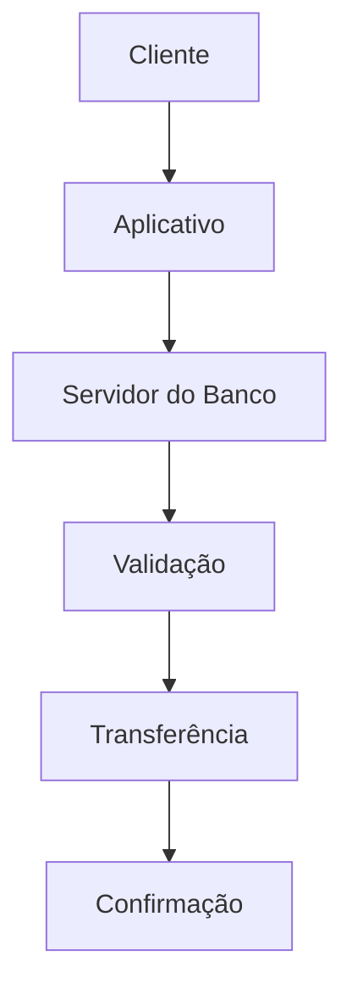

# 🌍 Exemplos e Aplicações da Informática

> [!IMPORTANT]
> **Módulo:** 01 — Fundamentos da Informática
>
> **Aula:** 01 — O que é Informática
>
> **Arquivo:** `06-Exemplos.md`

---

# 📖 Introdução

Depois de compreender os conceitos fundamentais da informática e o funcionamento de um sistema computacional, é importante responder a uma pergunta:

> **Onde a informática está presente no nosso dia a dia?**

A resposta é simples: praticamente em todos os lugares.

Mesmo quando não percebemos, centenas de sistemas computacionais trabalham continuamente para facilitar atividades cotidianas.

Comprar um produto, sacar dinheiro, marcar uma consulta médica, assistir a um filme, utilizar um aplicativo de transporte ou até destrancar um celular com a digital são exemplos de processos que dependem diretamente da informática.

Neste capítulo veremos aplicações reais da informática em diferentes áreas da sociedade.

---

# 🎯 Objetivos

Ao concluir este capítulo você será capaz de:

- identificar aplicações da informática em diferentes setores;
- compreender como sistemas computacionais resolvem problemas reais;
- reconhecer os benefícios da informatização;
- analisar exemplos práticos de processamento de dados;
- relacionar conceitos estudados com situações do cotidiano.

---

# 🏥 Informática na Saúde

A área da saúde foi uma das que mais evoluiu com a informatização.

Hospitais modernos utilizam centenas de computadores conectados em rede para registrar informações, armazenar exames, controlar medicamentos e acompanhar pacientes em tempo real.

Sem esses sistemas, muitos procedimentos demorariam horas ou até dias para serem concluídos.

## Principais aplicações

- Prontuário eletrônico
- Cadastro de pacientes
- Agendamento de consultas
- Controle de medicamentos
- Exames laboratoriais
- Radiologia digital
- Controle de leitos
- Gestão hospitalar

### Exemplo

Imagine que um paciente chega ao hospital.

Antes da informatização:

- preenchimento manual;
- pesquisa em arquivos físicos;
- demora para localizar históricos;
- maior risco de perda de documentos.

Hoje:

Todo esse processo pode ocorrer em poucos minutos.

---

> [!TIP]
>
> Sistemas hospitalares precisam seguir rígidos padrões de segurança para proteger informações médicas dos pacientes.

---

# 🏦 Informática nos Bancos

Poucos setores dependem tanto da informática quanto o sistema financeiro.

Quando um cliente realiza um PIX, por exemplo, diversas verificações acontecem em segundos.

O sistema precisa confirmar:

- identidade do usuário;
- saldo disponível;
- autenticidade da operação;
- comunicação entre bancos;
- registro da transação.

Tudo isso ocorre quase instantaneamente.

## Exemplo

---

## Serviços informatizados

- PIX
- TED
- DOC
- Internet Banking
- Aplicativos bancários
- Cartões de crédito
- Caixas eletrônicos
- Pagamentos por aproximação

---

# 🛒 Informática no Comércio

Imagine um supermercado moderno.

Quando um produto passa pelo leitor de código de barras, diversas operações acontecem automaticamente.

- identificação do produto;
- consulta ao preço;
- cálculo de descontos;
- atualização do estoque;
- emissão da nota fiscal;
- registro da venda.

Tudo isso ocorre em menos de um segundo.

## Fluxo simplificado

---

# 🎓 Informática na Educação

As escolas utilizam sistemas computacionais para administrar praticamente todas as atividades acadêmicas.

## Exemplos

- matrícula;
- diário eletrônico;
- biblioteca;
- ambiente virtual de aprendizagem;
- emissão de boletins;
- controle de frequência;
- avaliações online.

Além da administração, a informática também transformou a forma de aprender.

Hoje existem:

- videoaulas;
- simuladores;
- laboratórios virtuais;
- plataformas adaptativas;
- inteligência artificial aplicada ao ensino.

---

# 🚓 Informática na Segurança Pública

Órgãos de segurança utilizam sistemas computacionais para integrar informações e agilizar operações.

Algumas aplicações incluem:

- consulta de placas;
- reconhecimento facial;
- registro de ocorrências;
- monitoramento por câmeras;
- comunicação entre viaturas;
- geolocalização.

Esses sistemas aumentam a eficiência e reduzem o tempo de resposta em situações de emergência.

---

# 🚗 Informática nos Transportes

A tecnologia está presente em praticamente todos os meios de transporte.

## Exemplos

- aplicativos de navegação;
- GPS;
- controle de tráfego;
- monitoramento de frotas;
- aplicativos de transporte;
- venda de passagens;
- sistemas aeroportuários.

Um simples aplicativo de navegação calcula rotas utilizando milhões de dados sobre ruas, velocidade média, acidentes e trânsito em tempo real.

---

# 🏭 Informática na Indústria

A indústria moderna utiliza automação para aumentar a produtividade e reduzir erros.

Robôs industriais executam tarefas repetitivas com alta precisão.

Sensores monitoram continuamente:

- temperatura;
- pressão;
- velocidade;
- vibração;
- consumo de energia.

Esses dados são enviados para sistemas que tomam decisões automaticamente ou alertam operadores quando ocorre alguma anomalia.

---

# 🌐 Informática na Internet

A Internet é um dos maiores exemplos de aplicação da informática.

Sempre que um usuário acessa um site, ocorre uma troca constante de informações entre dispositivos distribuídos pelo mundo.

## Exemplo

Sem perceber, o usuário interage com diversos computadores remotos.

---

# 📱 Informática em Smartphones

Os smartphones são verdadeiros computadores de bolso.

Eles possuem:

- processador;
- memória RAM;
- armazenamento;
- sistema operacional;
- sensores;
- conexão Wi-Fi;
- Bluetooth;
- GPS;
- câmera;
- microfone.

Praticamente todos os conceitos estudados neste módulo também se aplicam aos dispositivos móveis.

---

# ☁️ Informática na Nuvem

Muitas pessoas acreditam que seus arquivos ficam armazenados "na Internet".

Na realidade, eles ficam em enormes centros de processamento de dados conhecidos como **Data Centers**.

Esses centros armazenam milhões de arquivos em servidores distribuídos.

Exemplos de serviços em nuvem:

- Google Drive;
- OneDrive;
- Dropbox;
- iCloud.

---

# 🤖 Inteligência Artificial

A Inteligência Artificial é uma das áreas que mais crescem dentro da informática.

Ela permite que sistemas reconheçam padrões em grandes volumes de dados para executar tarefas como:

- reconhecimento de voz;
- tradução automática;
- geração de imagens;
- recomendação de produtos;
- detecção de fraudes;
- assistentes virtuais.

É importante destacar que a IA **não substitui completamente o ser humano**, mas auxilia na tomada de decisões e na automação de tarefas.

---

# 🌎 Um dia na vida de uma pessoa

Observe quantas vezes utilizamos a informática sem perceber.

| Situação | Aplicação |
|----------|-----------|
| Desbloquear o celular | Biometria |
| Conversar por mensagens | Aplicativo de comunicação |
| Assistir a vídeos | Streaming |
| Fazer compras | Comércio eletrônico |
| Solicitar transporte | Aplicativo de mobilidade |
| Pagar contas | Internet Banking |
| Estudar | Plataforma educacional |
| Pedir comida | Delivery |

Mesmo sem utilizar um computador tradicional, uma pessoa interage com dezenas de sistemas computacionais diariamente.

---

# 💡 Benefícios da Informática

A informatização trouxe inúmeras vantagens para pessoas e organizações.

Entre elas destacam-se:

- maior velocidade no processamento de informações;
- redução de erros;
- aumento da produtividade;
- automação de tarefas repetitivas;
- facilidade de comunicação;
- armazenamento seguro de grandes volumes de dados;
- acesso remoto às informações;
- integração entre diferentes setores.

---

# ⚠️ Desafios

Apesar dos benefícios, a informática também apresenta desafios.

Alguns exemplos:

- ataques cibernéticos;
- vazamento de dados;
- golpes virtuais;
- dependência tecnológica;
- necessidade constante de atualização profissional;
- descarte correto de equipamentos eletrônicos.

Esses temas serão aprofundados nos módulos de Segurança da Informação e Suporte Técnico.

---

# 🧠 Estudo de Caso

Imagine uma farmácia.

Quando um cliente compra um medicamento:

1. o código de barras é lido;
2. o sistema identifica o produto;
3. o estoque é atualizado;
4. o valor é calculado;
5. a nota fiscal é emitida;
6. o pagamento é registrado;
7. relatórios financeiros são atualizados.

Perceba que um único processo envolve hardware, software, banco de dados, rede, armazenamento e processamento.

---

# 📌 Conclusão

A informática está presente em praticamente todos os setores da sociedade moderna.

Muito além dos computadores pessoais, ela faz parte de hospitais, bancos, escolas, indústrias, meios de transporte, serviços públicos, comércio e dispositivos móveis.

Compreender essas aplicações permite visualizar a importância da Tecnologia da Informação na resolução de problemas reais e reforça a necessidade de dominar seus fundamentos antes de avançar para temas mais complexos.

> [!TIP]
>
> Após estudar os exemplos apresentados neste capítulo, você consegue identificar aplicações da informática em diferentes contextos e compreender como os conceitos fundamentais vistos anteriormente são utilizados no mundo real.
>
> No próximo arquivo (`07-Boas-Praticas.md`), serão abordadas boas práticas para utilização responsável, eficiente e segura de sistemas computacionais.
