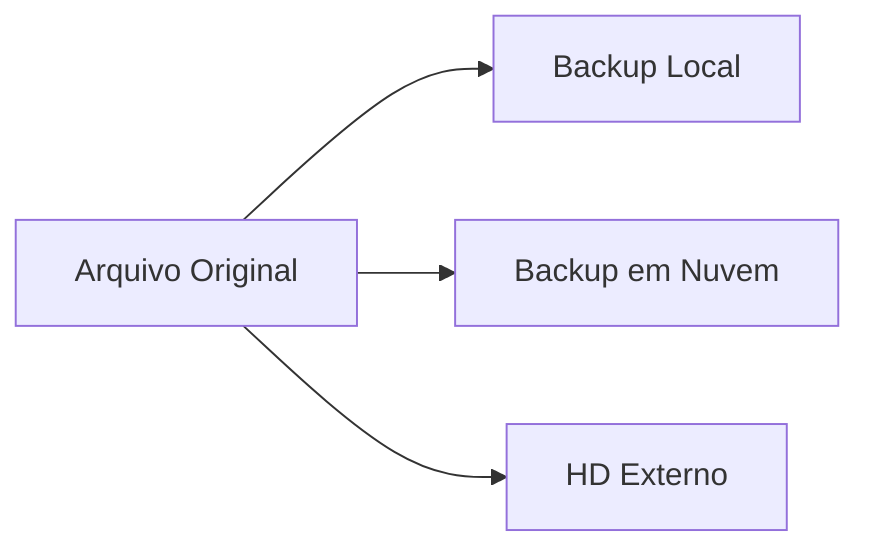
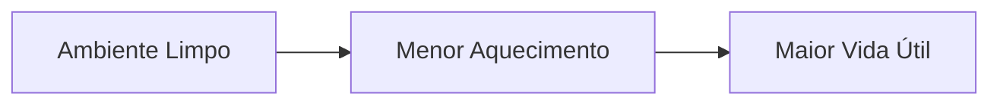

# ✅ Boas Práticas na Utilização de Sistemas Computacionais

> [!IMPORTANT]
> **Módulo:** 01 — Fundamentos da Informática
>
> **Aula:** 01 — O que é Informática
>
> **Arquivo:** `08-Boas-Praticas.md`

---

# 📖 Introdução

Saber utilizar um computador vai muito além de ligar a máquina e abrir programas.

Um bom profissional de Tecnologia da Informação precisa desenvolver hábitos que garantam:

- segurança;
- organização;
- eficiência;
- confiabilidade;
- disponibilidade das informações.

Esses hábitos são conhecidos como **boas práticas**.

Embora muitas pareçam simples, elas fazem grande diferença na prevenção de problemas, na produtividade e na proteção de equipamentos e dados.

Neste capítulo conheceremos as principais boas práticas utilizadas por profissionais da área de TI e que devem ser adotadas desde o primeiro contato com um sistema computacional.

---

# 🎯 Objetivos de aprendizagem

Ao concluir este capítulo você será capaz de:

- compreender a importância das boas práticas;
- utilizar computadores de forma segura;
- organizar arquivos corretamente;
- proteger informações importantes;
- identificar comportamentos que evitam falhas;
- desenvolver hábitos utilizados por profissionais de TI.

---

# 🤔 O que são boas práticas?

Boas práticas são procedimentos recomendados que reduzem riscos e aumentam a eficiência durante a utilização de um sistema computacional.

Essas recomendações foram desenvolvidas com base em experiências acumuladas por profissionais da área e são adotadas em empresas, órgãos públicos, hospitais, instituições financeiras e centros de tecnologia.

Seguir boas práticas significa trabalhar de forma mais organizada, segura e profissional.

---

> [!NOTE]
>
> Muitos problemas de informática não são causados por defeitos no computador, mas por erros de utilização.

---

# 🖥️ Utilize o computador corretamente

O primeiro passo é utilizar o equipamento de maneira adequada.

Algumas recomendações incluem:

- ligar e desligar corretamente o computador;
- evitar desligamentos forçados;
- não remover dispositivos durante gravações;
- manter o ambiente limpo;
- utilizar estabilização elétrica quando necessário.

---

## ❌ Desligamento incorreto

Desligar um computador retirando diretamente o cabo de energia pode causar:

- perda de arquivos;
- corrupção do sistema operacional;
- danos ao disco durante gravações;
- falhas na inicialização.

Sempre utilize o procedimento correto de desligamento do sistema operacional.

---

# 📂 Organização de arquivos

Uma boa organização facilita o trabalho e reduz o risco de perda de informações.

Imagine procurar um documento importante em uma pasta contendo milhares de arquivos sem qualquer organização.

Provavelmente levará muito tempo.

---

## ✔️ Recomendações

Crie pastas organizadas.

Exemplo:

```text
Documentos
│
├── Estudos
│   ├── Informática
│   ├── Redes
│   └── Programação
│
├── Trabalho
│
├── Projetos
│
└── Financeiro
```

---

## ✔️ Utilize nomes descritivos

Evite nomes como:

```
arquivo1.docx

novo.pdf

teste.txt

documento2.docx
```

Prefira:

```
Relatorio_Final_Maio_2026.pdf

Projeto_Web_Versao_2.docx

Aula_Informática_Introducao.md
```

---

> [!TIP]
>
> Um nome bem escolhido permite identificar rapidamente o conteúdo de um arquivo.

---

# 💾 Faça backups regularmente

Todo dispositivo de armazenamento pode falhar.

Por esse motivo, nunca mantenha arquivos importantes em apenas um local.

Um backup é uma cópia de segurança dos dados.

---

## Estratégia 3-2-1

Uma das estratégias mais utilizadas na área de TI é a regra **3-2-1**.

Ela recomenda:

- manter **3 cópias** dos arquivos;
- utilizar **2 tipos diferentes de armazenamento**;
- manter **1 cópia em outro local**.



---

## Exemplos de backup

- HD Externo
- SSD Externo
- Pen Drive
- NAS
- Google Drive
- OneDrive
- Dropbox

---

# 🔒 Proteja suas senhas

Uma senha fraca representa um dos maiores riscos para qualquer sistema.

Evite utilizar:

- datas de nascimento;
- sequências numéricas;
- nome próprio;
- telefone;
- CPF.

---

## Exemplo ruim

```
123456
```

---

## Exemplo ruim

```
senha123
```

---

## Exemplo melhor

```
C4f3!Rio#2026
```

---

## Características de uma boa senha

- letras maiúsculas;
- letras minúsculas;
- números;
- caracteres especiais;
- tamanho adequado;
- difícil de adivinhar.

---

> [!WARNING]
>
> Nunca compartilhe suas senhas com outras pessoas.

---

# 🔐 Utilize autenticação em dois fatores

Sempre que possível, habilite a autenticação em dois fatores (2FA).

Além da senha, será necessária uma segunda confirmação.

Exemplos:

- código enviado ao celular;
- aplicativo autenticador;
- chave física;
- biometria.

Isso reduz significativamente o risco de acesso não autorizado.

---

# 🦠 Mantenha o computador protegido

Utilize ferramentas de segurança.

Exemplos:

- antivírus;
- firewall;
- atualizações automáticas;
- filtros contra phishing.

Essas ferramentas ajudam a proteger o sistema contra ameaças conhecidas.

---

# 🔄 Mantenha o sistema atualizado

Atualizações corrigem:

- falhas;
- vulnerabilidades;
- erros;
- problemas de desempenho.

Também podem adicionar novos recursos.

---

## O que deve ser atualizado?

- sistema operacional;
- navegadores;
- aplicativos;
- drivers;
- antivírus.

---

# 🌐 Navegue com responsabilidade

Nem todo site é confiável.

Antes de fornecer informações pessoais, observe:

- endereço do site;
- certificado HTTPS;
- reputação da empresa;
- erros de ortografia;
- aparência suspeita.

---

## Exemplo

```
https://www.banco.com.br
```

É diferente de:

```
https://banco-seguro-login.xyz
```

Mesmo que pareçam semelhantes.

---

# 📧 Cuidado com golpes

Golpes digitais normalmente utilizam engenharia social.

Objetivo:

Convencer o usuário a fornecer informações.

Alguns exemplos:

- falsas promoções;
- boletos falsos;
- mensagens de bancos;
- e-mails fraudulentos;
- falsas centrais de atendimento.

---

# 🧹 Mantenha o ambiente organizado

Boas práticas também envolvem o ambiente físico.

Evite:

- excesso de poeira;
- líquidos próximos ao computador;
- cabos desorganizados;
- ventilação bloqueada.

---



---

# ⚡ Utilize energia elétrica de forma segura

Problemas elétricos podem causar danos aos equipamentos.

Sempre que possível:

- utilize filtros de linha de qualidade;
- mantenha o aterramento adequado;
- evite sobrecarga em tomadas;
- desligue equipamentos durante tempestades severas quando não houver proteção apropriada.

---

# 🤝 Compartilhamento responsável

Ao compartilhar arquivos:

- verifique se o arquivo está correto;
- remova informações desnecessárias;
- confirme o destinatário;
- evite compartilhar dados confidenciais sem autorização.

---

# 📋 Documente seu trabalho

Profissionais de TI registram procedimentos.

Documentar significa:

- facilitar futuras manutenções;
- reduzir erros;
- acelerar suporte técnico;
- preservar conhecimento.

Exemplo:

```text
Data:
30/07/2026

Equipamento:
Computador 07

Procedimento:
Atualização do sistema operacional.

Resultado:
Concluído sem erros.
```

---

# 🧠 Desenvolva hábitos profissionais

Independentemente da área de atuação, procure sempre:

- ler mensagens de erro antes de clicar em qualquer botão;
- entender o problema antes de tentar resolvê-lo;
- pesquisar documentação oficial;
- realizar testes antes de aplicar mudanças importantes;
- evitar alterações sem planejamento.

Esses hábitos fazem parte da rotina de qualquer técnico experiente.

---

# 📊 Resumo das Boas Práticas

| Boa prática | Benefício |
|--------------|-----------|
| Organizar arquivos | Localização rápida |
| Fazer backup | Evita perda de dados |
| Utilizar senhas fortes | Maior segurança |
| Atualizar sistemas | Correção de falhas |
| Manter antivírus | Proteção contra ameaças |
| Documentar procedimentos | Facilidade na manutenção |
| Navegar com cuidado | Redução de golpes |
| Cuidar do equipamento | Maior vida útil |

---

# ⚠️ Erros comuns

❌ Salvar tudo na Área de Trabalho.

❌ Nunca fazer backup.

❌ Utilizar a mesma senha em todos os serviços.

❌ Ignorar atualizações do sistema.

❌ Baixar programas de fontes desconhecidas.

❌ Desligar o computador retirando o cabo de energia.

❌ Compartilhar informações sensíveis sem verificar o destinatário.

❌ Ignorar mensagens de erro.

---

# 💡 Curiosidade

> [!NOTE]
>
> Em muitas empresas, a maior parte dos incidentes de segurança não ocorre por falhas técnicas, mas por erros humanos, como clicar em links maliciosos, utilizar senhas fracas ou compartilhar informações sem autorização.

---

# 📝 Checklist de Boas Práticas

Antes de encerrar o expediente, verifique:

- [ ] Salvei todos os arquivos importantes.
- [ ] Fiz backup das informações necessárias.
- [ ] Fechei os programas corretamente.
- [ ] Não deixei senhas anotadas em locais visíveis.
- [ ] Bloqueei o computador ao me afastar.
- [ ] Organizei os arquivos produzidos.
- [ ] Removi dispositivos USB com segurança.
- [ ] Verifiquei se o sistema está atualizado.

---

# 🎓 Conclusão

Boas práticas não dependem de equipamentos sofisticados ou softwares avançados.

Elas dependem principalmente de disciplina, organização e responsabilidade.

Ao adotar esses hábitos desde o início da sua formação, você reduz a ocorrência de falhas, protege informações importantes e desenvolve uma postura profissional valorizada em qualquer área da Tecnologia da Informação.

> [!TIP]
>
> Você concluiu o estudo das principais boas práticas na utilização de sistemas computacionais.
>
> No próximo arquivo (`09-Estudo-de-Caso.md`), exploraremos fatos históricos, curiosidades e informações interessantes sobre a evolução da informática e das tecnologias que utilizamos atualmente.
