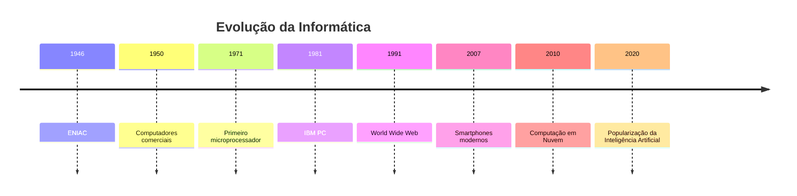

# 💡 Curiosidades e Fatos Históricos da Informática

> [!IMPORTANT]
> **Módulo:** 01 — Fundamentos da Informática
>
> **Aula:** 01 — O que é Informática
>
> **Arquivo:** `08-Curiosidades.md`

---

# 📖 Introdução

A informática evoluiu em uma velocidade impressionante.

Em pouco mais de meio século, passamos de computadores que ocupavam salas inteiras para dispositivos que cabem no bolso e possuem poder de processamento milhares de vezes superior.

Essa evolução não aconteceu de forma repentina.

Ela foi construída por milhares de cientistas, engenheiros, matemáticos e pesquisadores que contribuíram para transformar a tecnologia no que conhecemos atualmente.

Neste capítulo conheceremos curiosidades, acontecimentos históricos e fatos interessantes que ajudam a compreender como a informática evoluiu ao longo do tempo.

---

# 🎯 Objetivos

Ao concluir este capítulo você será capaz de:

- conhecer marcos históricos da informática;
- compreender como os computadores evoluíram;
- identificar tecnologias que transformaram a sociedade;
- relacionar fatos históricos com os computadores atuais.

---

# ⏳ Uma breve linha do tempo

---

# 🧮 Antes dos computadores

Muito antes da existência dos computadores eletrônicos, as pessoas já buscavam formas de facilitar cálculos.

Alguns exemplos foram:

- ábaco;
- réguas de cálculo;
- calculadoras mecânicas;
- máquinas de tabulação.

Esses equipamentos não eram computadores como conhecemos hoje, mas representam importantes etapas da evolução da computação.

---

# 🏛️ O ENIAC

Um dos computadores mais famosos da história foi o **ENIAC**, apresentado em 1946.

Algumas características impressionam até hoje.

| Característica | Valor aproximado |
|----------------|-----------------:|
| Peso | 30 toneladas |
| Área ocupada | Cerca de 170 m² |
| Válvulas eletrônicas | Mais de 17.000 |
| Consumo elétrico | Aproximadamente 150 kW |

Apesar dessas dimensões, seu poder de processamento era inferior ao de um smartphone moderno.

---

> [!NOTE]
>
> O ENIAC era programado por meio de cabos e chaves físicas. Alterar uma tarefa podia levar horas.

---

# 💾 Os primeiros discos rígidos

Os primeiros discos rígidos eram enormes.

Um dos exemplos mais conhecidos é o **IBM 350**, lançado em 1956.

Ele armazenava aproximadamente **5 MB**.

Hoje, uma única fotografia feita por um smartphone pode ocupar mais espaço do que isso.

---

## Comparação

| Tecnologia | Capacidade aproximada |
|-------------|----------------------:|
| IBM 350 (1956) | 5 MB |
| Pendrive atual | 64 GB |
| SSD moderno | 1 TB |
| Servidores corporativos | Centenas de TB ou mais |

---

# 🧠 O primeiro microprocessador

Em 1971 foi lançado o **Intel 4004**, considerado o primeiro microprocessador comercial.

Ele possuía:

- 4 bits;
- cerca de 2.300 transistores;
- frequência de aproximadamente 740 kHz.

Hoje, processadores modernos possuem **bilhões de transistores** e executam bilhões de operações por segundo.

---

# 💻 O computador pessoal

Durante muitos anos, computadores eram utilizados apenas por governos, universidades e grandes empresas.

Com o lançamento do **IBM PC** em 1981, os computadores pessoais começaram a se popularizar.

Isso abriu caminho para o desenvolvimento de programas, jogos e sistemas voltados ao usuário comum.

---

# 🌐 O nascimento da Web

Em 1991, a **World Wide Web (WWW)** foi disponibilizada ao público.

A Web tornou muito mais simples acessar informações pela Internet.

É importante destacar que:

- **Internet** é a infraestrutura de redes.
- **Web** é um dos serviços que funciona sobre essa infraestrutura.

Essa diferença costuma gerar bastante confusão.

---

> [!TIP]
>
> Toda Web utiliza a Internet, mas nem toda a Internet é composta apenas pela Web.

---

# 📱 O smartphone é mais poderoso do que parece

Os smartphones atuais concentram diversas tecnologias em um único equipamento.

Eles possuem:

- processador;
- memória RAM;
- armazenamento;
- câmera;
- GPS;
- acelerômetro;
- giroscópio;
- sensores de proximidade;
- Wi-Fi;
- Bluetooth;
- NFC.

Há poucas décadas seria necessário utilizar vários equipamentos diferentes para obter essas mesmas funcionalidades.

---

# 🚀 A Lei de Moore

Durante muitos anos observou-se que a quantidade de transistores em um chip tendia a dobrar em intervalos regulares, aumentando significativamente o desempenho dos processadores.

Essa observação ficou conhecida como **Lei de Moore**.

Embora o ritmo tenha desacelerado com o avanço tecnológico, ela influenciou profundamente a evolução da indústria da computação.

---

# ☁️ A era da Computação em Nuvem

Antigamente era comum armazenar arquivos apenas no computador.

Hoje, muitos documentos permanecem armazenados em servidores distribuídos ao redor do mundo.

Isso permite:

- acesso remoto;
- sincronização entre dispositivos;
- colaboração em tempo real;
- maior disponibilidade.

---

# 🤖 Inteligência Artificial

A Inteligência Artificial deixou de ser apenas um tema da ficção científica.

Ela já está presente em:

- mecanismos de busca;
- tradutores automáticos;
- reconhecimento facial;
- assistentes virtuais;
- sistemas de recomendação;
- diagnósticos médicos;
- geração de imagens;
- geração de texto.

Apesar do avanço, a IA depende de grandes volumes de dados e de algoritmos desenvolvidos por pessoas.

---

# 🛰️ Satélites e GPS

Quando um aplicativo informa sua localização, ele utiliza sinais enviados por satélites em órbita da Terra.

O receptor calcula sua posição comparando o tempo de chegada dos sinais provenientes de diferentes satélites.

Esse processo ocorre em poucos segundos.

---

# 🎮 A evolução dos jogos

Os primeiros jogos eletrônicos possuíam gráficos extremamente simples.

Hoje é possível encontrar jogos com:

- iluminação em tempo real;
- inteligência artificial avançada;
- física complexa;
- mundos abertos;
- interação online com milhões de jogadores.

Essa evolução foi possível graças ao aumento do poder computacional.

---

# 🌎 Data Centers

Quando você utiliza um serviço online, seus dados normalmente não estão armazenados em seu computador.

Eles ficam em grandes centros de processamento chamados **Data Centers**.

Essas instalações podem conter milhares de servidores funcionando continuamente.

---

# 🔢 Curiosidades rápidas

## 📌 Você sabia?

- Um computador entende apenas números em formato binário.
- Um único processador pode executar bilhões de instruções por segundo.
- A maioria dos computadores utiliza relógios internos para sincronizar operações.
- O primeiro "bug" documentado da computação foi causado por um inseto preso em um equipamento eletromecânico.
- Um endereço de Internet é convertido automaticamente em um endereço IP por sistemas chamados **DNS**.
- Muitos serviços online utilizam centenas ou milhares de servidores trabalhando em conjunto.

---

# 📊 Comparação entre ontem e hoje

| Característica | Décadas atrás | Atualmente |
|----------------|---------------|------------|
| Tamanho | Salas inteiras | Dispositivos de bolso |
| Armazenamento | Megabytes | Terabytes |
| Processamento | Milhares de operações por segundo | Bilhões de operações por segundo |
| Comunicação | Limitada | Global e instantânea |
| Acesso | Restrito | Amplamente disponível |

---

# 🌍 A informática no cotidiano

É difícil passar um dia inteiro sem utilizar algum sistema computacional.

Pense em atividades como:

- desbloquear o celular;
- utilizar redes sociais;
- consultar o clima;
- assistir a um vídeo;
- fazer compras online;
- pagar contas;
- chamar um transporte por aplicativo.

Todas essas ações dependem diretamente da informática.

---

# 🧠 Desafio

Observe sua rotina de hoje.

Faça uma lista de todos os momentos em que você utilizou algum sistema computacional.

Ao final do dia, conte quantas vezes isso aconteceu.

É bastante comum que esse número ultrapasse dezenas de interações.

---

# 📚 Você sabia?

> [!NOTE]
>
> O termo **"bug"**, utilizado para indicar falhas em programas e equipamentos, tornou-se famoso após um inseto encontrado em um computador eletromecânico na década de 1940. Desde então, a palavra passou a representar erros de hardware e software.

---

# 🎓 Conclusão

A história da informática demonstra como a tecnologia evoluiu em poucas décadas.

Equipamentos gigantescos deram lugar a computadores compactos e extremamente poderosos.

Ao compreender essa evolução, torna-se mais fácil perceber que a informática é uma área dinâmica, em constante transformação e com enorme impacto sobre a sociedade.

O profissional de Tecnologia da Informação deve acompanhar essa evolução continuamente, pois novas tecnologias surgem a todo momento.

> [!TIP]
>
> Você concluiu o estudo das curiosidades e fatos históricos relacionados à informática.
>
> No próximo arquivo (`09-Resumo.md`), revisaremos os principais conceitos aprendidos ao longo desta aula, consolidando todo o conteúdo antes dos exercícios e atividades práticas.
