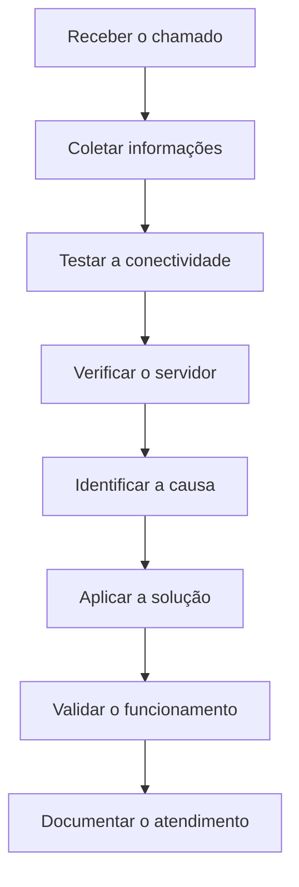
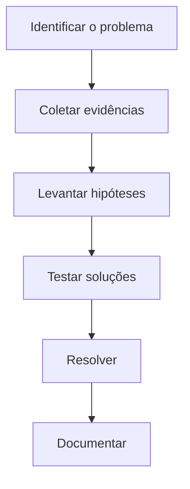

# 🧩 Estudo de Caso — A Informática na Prática

> [!IMPORTANT]
> **Módulo:** 01 — Fundamentos da Informática
>
> **Aula:** 01 — O que é Informática
>
> **Arquivo:** `09-Estudo-de-Caso.md`

---

# 📖 Introdução

Até este momento, estudamos diversos conceitos fundamentais da informática:

- definição de informática;
- dados, informação e conhecimento;
- componentes de um sistema computacional;
- funcionamento interno dos computadores;
- aplicações no cotidiano;
- erros comuns;
- boas práticas.

Agora chegou o momento de reunir todos esses conhecimentos em situações reais.

Neste capítulo serão apresentados estudos de caso inspirados em cenários encontrados por Técnicos em Informática em empresas, hospitais, escolas e organizações.

O objetivo não é apenas encontrar a resposta correta, mas desenvolver a capacidade de observar, analisar e solucionar problemas de forma lógica e organizada.

---

# 🎯 Objetivos

Ao concluir este capítulo você será capaz de:

- identificar problemas em sistemas computacionais;
- analisar situações reais;
- aplicar os conceitos estudados;
- propor soluções técnicas;
- desenvolver raciocínio analítico.

---

# 📚 O que é um Estudo de Caso?

Um estudo de caso é a análise detalhada de uma situação real ou simulada.

Na área de Tecnologia da Informação, ele é utilizado para compreender:

- como um problema surgiu;
- quais componentes estão envolvidos;
- quais impactos foram causados;
- quais soluções podem ser aplicadas.

Durante este capítulo, você assumirá o papel de um Técnico em Informática responsável por analisar diferentes cenários.

---

# 🏥 Caso 1 — Sistema Hospitalar Indisponível

## Situação

São 7h30 da manhã.

O horário de maior movimento acaba de começar.

De repente, todos os computadores da recepção deixam de acessar o sistema hospitalar.

Os atendimentos são interrompidos.

Pacientes começam a formar filas.

Os funcionários informam que:

- os computadores continuam ligados;
- o mouse e o teclado funcionam normalmente;
- o sistema exibe uma mensagem informando que não foi possível conectar ao servidor.

---

## Diagrama da situação

---

## Componentes envolvidos

| Elemento | Participação |
|-----------|--------------|
| Hardware | Computadores, switch, servidor |
| Software | Sistema hospitalar |
| Rede | Comunicação entre clientes e servidor |
| Banco de Dados | Prontuários e cadastros |
| Usuários | Recepcionistas e médicos |

---

## Perguntas para análise

1. O problema está necessariamente nos computadores?

2. O servidor pode estar indisponível?

3. A rede pode ter sido interrompida?

4. O banco de dados pode estar inacessível?

5. O sistema continua funcionando para outros setores?

---

## Possíveis causas

- cabo de rede desconectado;
- falha no switch;
- servidor desligado;
- banco de dados indisponível;
- manutenção não programada;
- falha elétrica.

---

## Como um Técnico em Informática deve agir?

Uma abordagem profissional envolve seguir um processo estruturado.

---

> [!TIP]
>
> Nunca comece substituindo equipamentos sem antes identificar a origem do problema.

---

# 🏫 Caso 2 — Laboratório de Informática Muito Lento

## Situação

Uma escola informa que todos os computadores do laboratório estão extremamente lentos.

Os professores relatam que:

- os programas demoram para abrir;
- o navegador trava frequentemente;
- o sistema demora vários minutos para iniciar.

---

## Informações coletadas

| Item | Situação |
|------|-----------|
| Sistema Operacional | Atualizado |
| SSD | Presente |
| Memória RAM | 4 GB |
| Navegador | Muitas abas abertas |
| Programas em segundo plano | Diversos |

---

## Análise

Antes de concluir que os computadores precisam ser substituídos, o técnico deve investigar:

- quantidade de memória utilizada;
- espaço disponível no SSD;
- programas iniciados automaticamente;
- presença de malware;
- utilização do processador.

---

## Possíveis soluções

- remover programas desnecessários;
- ampliar a memória RAM;
- reduzir programas iniciados automaticamente;
- verificar infecção por malware;
- atualizar drivers quando necessário.

---

# 🛒 Caso 3 — Caixa de Supermercado Não Registra Produtos

## Situação

Durante o atendimento, o leitor de código de barras deixa de identificar produtos.

Os clientes começam a formar filas.

O restante do computador continua funcionando normalmente.

---

## Fluxo do sistema

---

## Hipóteses

O problema pode estar relacionado a:

- cabo USB desconectado;
- leitor defeituoso;
- driver ausente;
- software do caixa;
- código de barras danificado.

---

## Pergunta

Trocar imediatamente o computador resolveria o problema?

**Provavelmente não.**

Um diagnóstico correto evita substituições desnecessárias.

---

# 🏢 Caso 4 — Arquivos Perdidos

## Situação

Uma empresa informa que diversos documentos desapareceram após a falha de um SSD.

Ao investigar, o técnico descobre que:

- não existia backup;
- todos os arquivos estavam armazenados apenas naquele computador.

---

## Consequências

- perda de documentos;
- atraso em projetos;
- prejuízo financeiro;
- retrabalho.

---

## O que poderia ter evitado esse problema?

- política de backup;
- armazenamento em nuvem;
- HD externo;
- redundância de dados.

---

# 🏦 Caso 5 — Golpe por Engenharia Social

## Situação

Um funcionário recebe um e-mail informando que sua conta corporativa será bloqueada.

A mensagem solicita:

- usuário;
- senha;
- código de autenticação.

Sem verificar a origem do e-mail, o funcionário fornece as informações.

Pouco tempo depois, invasores acessam a conta corporativa.

---

## O erro ocorreu por falha técnica?

Não.

O incidente ocorreu devido a um erro humano.

Esse tipo de ataque é conhecido como **engenharia social**.

---

## Como evitar?

- confirmar o remetente;
- desconfiar de mensagens urgentes;
- verificar o endereço do site;
- utilizar autenticação em dois fatores;
- participar de treinamentos de conscientização.

---

# 🏠 Caso 6 — Computador Doméstico Muito Quente

## Situação

Um usuário reclama que o computador desliga sozinho após alguns minutos de uso.

Ao abrir o gabinete, observa-se grande acúmulo de poeira nos ventiladores.

---

## Possível causa

O excesso de poeira dificulta a circulação de ar.

Isso provoca superaquecimento dos componentes.

---

## Possíveis soluções

- limpeza preventiva;
- substituição da pasta térmica (quando necessário);
- organização dos cabos internos;
- melhoria da ventilação do gabinete.

---

# 🧠 Como analisar um problema?

Sempre siga uma sequência lógica.

---

# ❌ Erros durante um diagnóstico

Evite atitudes como:

- trocar peças sem testes;
- formatar o computador imediatamente;
- apagar arquivos sem autorização;
- ignorar mensagens de erro;
- assumir que o problema possui apenas uma causa.

---

# 📋 Checklist de Análise

Antes de concluir um atendimento, verifique:

- [ ] O problema foi reproduzido?
- [ ] Foram coletadas informações suficientes?
- [ ] Todos os testes necessários foram realizados?
- [ ] A solução resolveu a causa e não apenas o sintoma?
- [ ] O funcionamento foi validado?
- [ ] O procedimento foi documentado?

---

# 🧩 Desafio

Escolha um equipamento eletrônico que você utiliza diariamente.

Pode ser:

- computador;
- smartphone;
- videogame;
- Smart TV;
- impressora.

Agora responda:

1. Quais componentes de hardware ele possui?
2. Quais softwares utiliza?
3. Quais dados processa?
4. Quais informações produz?
5. Quais problemas podem ocorrer?
6. Como um Técnico em Informática poderia solucionar esses problemas?

---

# 📌 Conclusão

Os estudos de caso apresentados demonstram que a atuação de um Técnico em Informática vai muito além de trocar peças ou instalar programas.

Um bom profissional deve investigar, analisar evidências, formular hipóteses, testar soluções e documentar cada procedimento realizado.

Essa abordagem reduz custos, evita erros e aumenta a confiabilidade dos sistemas.

Os conceitos estudados ao longo deste módulo servem como base para todos os demais temas do curso, desde hardware e redes até programação, banco de dados, segurança da informação e computação em nuvem.

> [!TIP]
>
> Você concluiu os estudos de caso do primeiro módulo.
>
> No próximo arquivo (`10-Resumo.md`), faremos uma revisão completa dos principais conceitos aprendidos, consolidando todo o conhecimento adquirido antes de iniciar os exercícios, laboratórios e projetos.
