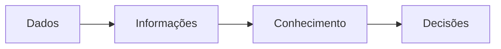
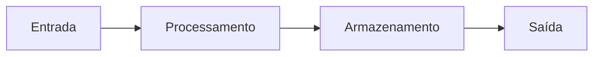
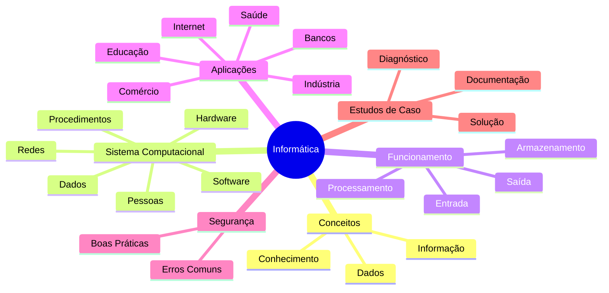

# 📚 Resumo Geral da Aula

> [!IMPORTANT]
> **Módulo:** 01 — Fundamentos da Informática
>
> **Aula:** 01 — O que é Informática
>
> **Arquivo:** `10-Resumo.md`

---

# 📖 Introdução

Parabéns!

Você concluiu todos os conteúdos teóricos da primeira aula do curso.

Ao longo desta unidade estudamos desde a definição de informática até exemplos reais de utilização em diferentes áreas da sociedade.

Este resumo tem como objetivo revisar os principais conceitos, reforçar os pontos mais importantes e preparar você para os exercícios, laboratórios e projetos presentes neste módulo.

> [!TIP]
> Utilize este material sempre que precisar revisar rapidamente os conceitos antes de uma prova, entrevista ou atividade prática.

---

# 🧠 O que é Informática?

A informática é a ciência responsável pelo tratamento automático das informações por meio de sistemas computacionais.

Ela reúne conhecimentos de diversas áreas, como:

- Computação;
- Matemática;
- Eletrônica;
- Telecomunicações;
- Engenharia;
- Programação.

Seu principal objetivo é transformar dados em informações úteis para auxiliar pessoas e organizações na tomada de decisões.

---

# 📌 Dados, Informação e Conhecimento

Um dos conceitos mais importantes estudados foi a diferença entre esses três termos.

| Conceito | Definição |
|----------|-----------|
| **Dado** | Valor bruto sem interpretação. |
| **Informação** | Dados organizados e contextualizados. |
| **Conhecimento** | Interpretação da informação baseada na experiência. |

### Exemplo

```text
39,2
```

É apenas um dado.

Agora observe:

```text
Temperatura corporal: 39,2 °C
```

Agora existe contexto.

Logo:

➡️ O paciente apresenta febre.

Essa conclusão representa uma informação.

Quando um médico interpreta esse resultado e decide o tratamento, aplica-se o conhecimento.

---



---

# 🖥️ Componentes de um Sistema Computacional

Aprendemos que um sistema computacional é formado pela integração de diversos elementos.

Os principais são:

- Hardware;
- Software;
- Dados;
- Pessoas;
- Procedimentos;
- Redes.

Nenhum desses componentes é suficiente isoladamente.

Todos trabalham em conjunto para produzir resultados.

---

# 💻 Hardware

Hardware corresponde à parte física do computador.

Exemplos:

- Processador;
- Memória RAM;
- SSD;
- HD;
- Placa-mãe;
- Monitor;
- Mouse;
- Teclado;
- Impressora.

---

# ⚙️ Software

Software corresponde aos programas que controlam o funcionamento do hardware.

Classificam-se em:

- Sistemas Operacionais;
- Aplicativos;
- Softwares de Programação.

Exemplos:

- Windows;
- Linux;
- Google Chrome;
- Microsoft Word;
- Visual Studio Code.

---

# ⚙️ Funcionamento do Computador

Todo sistema computacional segue um ciclo básico.



## Entrada

Recebimento dos dados.

Exemplos:

- teclado;
- mouse;
- scanner;
- câmera;
- sensores.

---

## Processamento

A CPU interpreta e executa instruções.

É durante essa etapa que ocorrem cálculos, comparações e decisões lógicas.

---

## Armazenamento

Os dados podem ser armazenados:

- temporariamente (RAM);
- permanentemente (SSD e HD).

---

## Saída

O resultado do processamento é apresentado ao usuário.

Exemplos:

- monitor;
- impressora;
- alto-falantes;
- projetor.

---

# 🌍 Aplicações da Informática

A informática está presente em praticamente todos os setores da sociedade.

Alguns exemplos estudados:

🏥 Saúde

- prontuários eletrônicos;
- exames digitais;
- agendamentos.

🏦 Bancos

- PIX;
- Internet Banking;
- caixas eletrônicos.

🏫 Educação

- plataformas virtuais;
- bibliotecas digitais;
- sistemas acadêmicos.

🏭 Indústria

- robótica;
- automação;
- sensores.

🛒 Comércio

- controle de estoque;
- emissão de notas fiscais;
- sistemas de vendas.

📱 Smartphones

- comunicação;
- localização;
- pagamentos;
- aplicativos.

---

# ⚠️ Erros Comuns

Durante a aula vimos diversos erros frequentemente cometidos por usuários.

Entre eles:

- confundir hardware e software;
- acreditar que memória RAM armazena arquivos;
- utilizar senhas fracas;
- instalar programas de fontes desconhecidas;
- não realizar backups;
- ignorar atualizações;
- clicar em links suspeitos;
- desligar incorretamente o computador.

Reconhecer esses erros é o primeiro passo para evitá-los.

---

# ✅ Boas Práticas

Também estudamos hábitos recomendados para qualquer usuário de computador.

Entre eles:

- manter o sistema atualizado;
- organizar arquivos;
- utilizar senhas fortes;
- realizar backups;
- utilizar autenticação em dois fatores;
- instalar programas apenas de fontes confiáveis;
- documentar procedimentos;
- manter o ambiente limpo e organizado.

Essas práticas reduzem riscos e aumentam a confiabilidade dos sistemas.

---

# 🧩 Estudos de Caso

Foram analisados diversos cenários inspirados em situações reais.

Exemplos:

- sistema hospitalar indisponível;
- laboratório de informática lento;
- caixa de supermercado com falha;
- perda de arquivos por ausência de backup;
- ataques de engenharia social;
- superaquecimento de computadores.

Esses estudos demonstraram que um Técnico em Informática deve atuar de forma investigativa, analisando evidências antes de aplicar qualquer solução.

---

# 🧠 Competências Desenvolvidas

Ao concluir esta aula você passou a ser capaz de:

- compreender o conceito de informática;
- diferenciar dado, informação e conhecimento;
- identificar hardware e software;
- compreender o funcionamento básico de um computador;
- reconhecer aplicações da informática;
- identificar erros comuns;
- aplicar boas práticas;
- analisar problemas simples em sistemas computacionais.

Essas competências servirão de base para todos os módulos seguintes do curso.

---

# 📋 Mapa Mental da Aula



---

# 📝 Checklist de Aprendizagem

Antes de prosseguir para a próxima aula, confirme se você consegue responder às perguntas abaixo.

- [ ] Sei explicar o que é informática.
- [ ] Sei diferenciar dados, informações e conhecimento.
- [ ] Sei identificar hardware e software.
- [ ] Entendo como funciona o ciclo Entrada → Processamento → Armazenamento → Saída.
- [ ] Consigo citar aplicações da informática em diferentes áreas.
- [ ] Reconheço os erros mais comuns na utilização de computadores.
- [ ] Conheço as principais boas práticas de segurança e organização.
- [ ] Consigo analisar um problema simples utilizando raciocínio lógico.

Se alguma resposta for **não**, revise o capítulo correspondente antes de continuar.

---

# 🎯 Conclusão

A primeira aula apresentou os fundamentos sobre os quais todo o restante do curso será construído.

Os conceitos estudados aqui aparecem em praticamente todas as áreas da Tecnologia da Informação, incluindo hardware, redes de computadores, programação, bancos de dados, segurança da informação, computação em nuvem e DevOps.

Dominar esses fundamentos permitirá compreender com muito mais facilidade os conteúdos dos próximos módulos.

> [!TIP]
> **Parabéns!**
>
> Você concluiu a **Aula 01 — O que é Informática**.
>
> Agora você possui uma base sólida para avançar para a próxima aula do módulo **Fundamentos da Informática**, onde os conceitos estudados serão aprofundados e aplicados em novos contextos.
