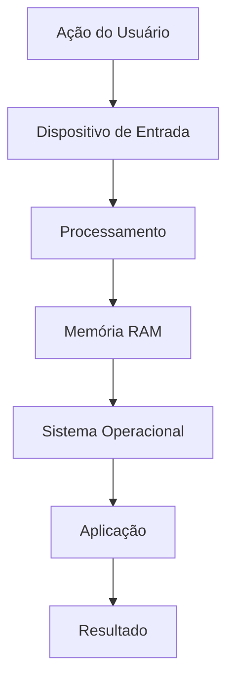
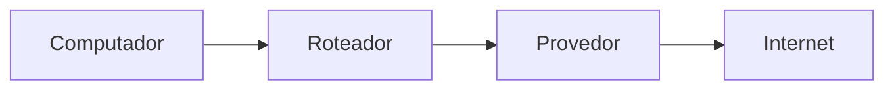

# 🧪 Laboratório 01 — Explorando um Sistema Computacional

> [!IMPORTANT]
> **Módulo:** 01 — Fundamentos da Informática
>
> **Aula:** 01 — O que é Informática
>
> **Arquivo:** `Laboratorio.md`
>
> **Tempo estimado:** 60 a 90 minutos
>
> **Dificuldade:** ⭐ Iniciante

---

# 📖 Apresentação

Um dos maiores erros de quem está começando na área de Tecnologia da Informação é acreditar que estudar informática significa apenas ler conceitos.

Na prática, um Técnico em Informática aprende principalmente **observando**, **testando**, **analisando** e **documentando**.

Este laboratório foi desenvolvido para apresentar a forma como profissionais de TI trabalham no dia a dia.

Durante as atividades você aprenderá a observar um computador de forma técnica, identificar seus componentes, compreender como eles trabalham juntos e registrar suas descobertas utilizando documentação profissional.

Ao final deste laboratório você terá produzido seu primeiro relatório técnico.

---

# 🎯 Objetivos

Ao concluir este laboratório você será capaz de:

- identificar componentes físicos de um computador;
- reconhecer hardware e software;
- compreender o fluxo das informações;
- identificar dispositivos de entrada e saída;
- analisar um sistema computacional;
- documentar procedimentos técnicos;
- desenvolver pensamento analítico.

---

# 📋 Materiais Necessários

## Obrigatórios

- Computador ou notebook
- Sistema Operacional Windows, Linux ou macOS
- Editor de texto
- Navegador de Internet

## Opcionais

- Smartphone
- Pen Drive
- Webcam
- Impressora
- Fone de ouvido

---

# ⚠️ Regras do Laboratório

> [!WARNING]
>
> Durante este laboratório **não abra o gabinete do computador**.
>
> Todas as atividades deverão ser realizadas apenas utilizando os componentes externos e as informações disponíveis pelo sistema operacional.

---

# 🔍 Atividade 1 — Conhecendo seu computador

Observe atentamente o computador utilizado.

Responda.

## Equipamento

```
________________________________________________
```

---

## Fabricante

```
________________________________________________
```

---

## Modelo

```
________________________________________________
```

---

## Tipo

Marque apenas uma opção.

- [ ] Desktop
- [ ] Notebook
- [ ] All in One
- [ ] Mini PC
- [ ] Outro

---

## Sistema Operacional

```
________________________________________________
```

---

## Versão

```
________________________________________________
```

---

# 🖥️ Atividade 2 — Identificando Hardware

Observe todos os equipamentos conectados.

Complete a tabela.

| Equipamento | Entrada | Saída | Entrada e Saída |
|--------------|:------:|:-----:|:---------------:|
| Monitor | ☐ | ☐ | ☐ |
| Mouse | ☐ | ☐ | ☐ |
| Teclado | ☐ | ☐ | ☐ |
| Webcam | ☐ | ☐ | ☐ |
| Impressora | ☐ | ☐ | ☐ |
| Microfone | ☐ | ☐ | ☐ |
| Caixa de Som | ☐ | ☐ | ☐ |
| Scanner | ☐ | ☐ | ☐ |

---

# 💻 Atividade 3 — Identificando Software

Abra o computador.

Anote cinco programas instalados.

| Programa | Categoria |
|-----------|-----------|
| | |
| | |
| | |
| | |
| | |

Agora responda.

### Qual programa controla o computador?

```
____________________________________
```

---

### Qual programa você utiliza com maior frequência?

```
____________________________________
```

---

### Existe algum programa que inicia automaticamente?

```
____________________________________
```

---

# ⚙️ Atividade 4 — Fluxo da Informação

Escolha uma ação simples.

Exemplo:

Abrir um navegador.

Agora descreva todas as etapas.



Agora responda.

### Qual foi o dispositivo de entrada?

```
____________________________________
```

### O que foi processado?

```
____________________________________
```

### Qual foi a saída produzida?

```
____________________________________
```

---

# 🌐 Atividade 5 — Conexão com a Rede

Verifique como seu computador está conectado.

- [ ] Wi-Fi
- [ ] Cabo
- [ ] Sem conexão

Caso exista conexão, represente o caminho.



---

# 📂 Atividade 6 — Organização dos Arquivos

Observe sua pasta **Documentos**.

Responda.

### Os arquivos estão organizados?

- [ ] Sim
- [ ] Parcialmente
- [ ] Não

---

Existe alguma estrutura de pastas?

```
______________________________________
```

---

Como essa organização poderia ser melhorada?

```
______________________________________
```

---

# 🔐 Atividade 7 — Segurança

Sem informar nenhuma senha pessoal, responda.

Você utiliza:

| Recurso | Sim | Não |
|----------|:---:|:---:|
| Senha no computador | ☐ | ☐ |
| Biometria | ☐ | ☐ |
| PIN | ☐ | ☐ |
| Autenticação em dois fatores | ☐ | ☐ |
| Antivírus | ☐ | ☐ |

---

# 📊 Atividade 8 — Observação do Sistema

Durante cinco minutos utilize normalmente seu computador.

Enquanto isso observe.

Complete a tabela.

| Situação observada | Resposta |
|--------------------|-----------|
| O computador respondeu rapidamente? | |
| Algum programa travou? | |
| Houve lentidão? | |
| O cooler aumentou a velocidade? | |
| Houve uso da Internet? | |

---

# 🧠 Atividade 9 — Estudo de Caso

Imagine a seguinte situação.

Um usuário informa que o computador está extremamente lento.

Antes de trocar qualquer componente, liste **cinco verificações** que você realizaria.

1.

---

2.

---

3.

---

4.

---

5.

---

# 📋 Atividade 10 — Produção de Relatório Técnico

Agora produza um pequeno relatório sobre o computador analisado.

Utilize o modelo abaixo.

---

## Identificação

**Data:**

```
_____________________________________
```

**Responsável:**

```
_____________________________________
```

---

## Equipamento

```
_____________________________________
```

---

## Sistema Operacional

```
_____________________________________
```

---

## Componentes observados

```
_____________________________________

_____________________________________

_____________________________________
```

---

## Softwares identificados

```
_____________________________________

_____________________________________

_____________________________________
```

---

## Problemas encontrados

```
_____________________________________

_____________________________________
```

---

## Melhorias sugeridas

```
_____________________________________

_____________________________________
```

---

## Conclusão

Escreva um pequeno texto (5 a 10 linhas) explicando como os conceitos estudados nesta aula foram identificados durante o laboratório.

```
____________________________________________________________________

____________________________________________________________________

____________________________________________________________________

____________________________________________________________________

____________________________________________________________________
```

---

# ✅ Checklist do Laboratório

Marque os itens concluídos.

- [ ] Identifiquei o hardware.
- [ ] Identifiquei o software.
- [ ] Observei dispositivos de entrada.
- [ ] Observei dispositivos de saída.
- [ ] Analisei a organização dos arquivos.
- [ ] Observei a conexão de rede.
- [ ] Produzi um relatório técnico.
- [ ] Revisei os conceitos estudados.

---

# 🏆 Desafio Extra

Escolha outro equipamento eletrônico da sua casa.

Pode ser:

- Smart TV;
- Videogame;
- Smartphone;
- Impressora;
- Roteador.

Produza uma análise semelhante à realizada neste laboratório.

Compare os dois equipamentos e responda:

- Quais componentes são semelhantes?
- Quais funções são diferentes?
- Ambos podem ser considerados sistemas computacionais? Justifique sua resposta.

---

# 🎓 Encerramento

Parabéns!

Você concluiu seu primeiro laboratório do curso.

Mais do que memorizar conceitos, você observou como a informática está presente em equipamentos reais e como hardware, software, dados, usuários e redes trabalham em conjunto para formar um sistema computacional.

Essa forma de observar, registrar e analisar será utilizada durante todo o restante do curso e representa uma das principais habilidades de um profissional de Tecnologia da Informação.

> [!TIP]
> **Laboratório concluído com sucesso!**
>
> Você está preparado para avançar para os exercícios, projetos e para a próxima aula do módulo **Fundamentos da Informática**.
