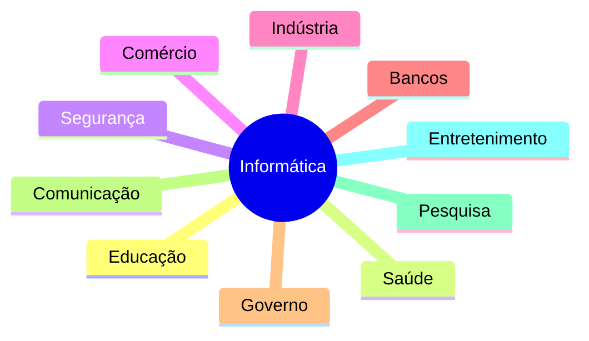

# 💻 Aula 01 — O que é Informática

> [!IMPORTANT]
> **Módulo:** 01 — Fundamentos da Informática
>
> Bem-vindo à primeira aula do curso **Técnico em Informática Completo**. Nesta aula você conhecerá os conceitos fundamentais da informática, sua evolução histórica, suas aplicações e sua importância no mundo moderno.

---

# 📖 Sobre esta Aula

A informática está presente em praticamente todos os aspectos da vida cotidiana. Desde smartphones e computadores até hospitais, bancos, escolas, indústrias e sistemas de transporte, a tecnologia é responsável por armazenar, processar e transmitir informações de forma rápida e eficiente.

Nesta aula serão apresentados os conceitos essenciais que servirão como base para todo o restante do curso.

Ao final do estudo você compreenderá:

- o que é informática;
- como surgiu;
- quais são seus principais objetivos;
- onde ela é aplicada;
- quais áreas fazem parte da Tecnologia da Informação.

---

# 🎯 Objetivos de Aprendizagem

Após concluir esta aula você será capaz de:

- ✅ Definir informática.
- ✅ Compreender sua evolução histórica.
- ✅ Reconhecer suas aplicações no cotidiano.
- ✅ Identificar os principais componentes de um sistema computacional.
- ✅ Entender a importância da informação.
- ✅ Relacionar informática com outras áreas da tecnologia.

---

# 📚 Conteúdo Principal

| Arquivo | Conteúdo |
|----------|----------|
| 📄 [00-Apresentacao.md](00-Apresentacao.md) | Apresentação da aula e objetivos. |
| 📄 [01-Fundamentos.md](01-Fundamentos.md) | Introdução ao conceito de informática. |
| 📄 [02-Conceitos-Essenciais.md](02-Conceitos-Essenciais.md) | Definições fundamentais e terminologia. |
| 📄 [03-Componentes-e-Elementos.md](03-Componentes-e-Elementos.md) | Elementos que compõem um sistema computacional. |
| 📄 [04-Funcionamento.md](04-Funcionamento.md) | Como ocorre o processamento das informações. |
| 📄 [05-Procedimentos-Praticos.md](05-Procedimentos-Praticos.md) | Atividades práticas de observação e exploração. |
| 📄 [06-Exemplos.md](06-Exemplos.md) | Exemplos da informática no dia a dia. |
| 📄 [07-Erros-Comuns.md](07-Erros-Comuns.md) | Erros e equívocos frequentes. |
| 📄 [08-Boas-Praticas.md](08-Boas-Praticas.md) | Recomendações para utilização da tecnologia. |
| 📄 [09-Estudo-de-Caso.md](09-Estudo-de-Caso.md) | Situação prática para análise. |
| 📄 [10-Resumo.md](10-Resumo.md) | Revisão dos principais conceitos. |

---

# 🧪 Materiais Complementares

| Arquivo | Finalidade |
|----------|------------|
| 📝 [Atividade.md](Atividade.md) | Exercícios para fixação do conteúdo. |
| 📝 [Exercicios.md](Exercicios.md) | Lista complementar de exercícios. |
| 🧪 [Laboratorio.md](Laboratorio.md) | Aula prática guiada. |
| 💻 [Projeto.md](Projeto.md) | Projeto aplicado sobre os conceitos estudados. |
| ✅ [Checklist.md](Checklist.md) | Lista de verificação dos conhecimentos adquiridos. |
| 📖 [Glossario.md](Glossario.md) | Termos técnicos utilizados na aula. |
| ❓ [FAQ.md](FAQ.md) | Perguntas frequentes. |
| 🛠️ [Ferramentas.md](Ferramentas.md) | Ferramentas recomendadas. |
| 🔗 [Links.md](Links.md) | Sites e documentações úteis. |
| 📚 [Referencias.md](Referencias.md) | Bibliografia utilizada. |
| 🎥 [Videos.md](Videos.md) | Vídeos recomendados. |
| 📝 [CHANGELOG.md](CHANGELOG.md) | Histórico de alterações desta aula. |

---

# 🗂️ Sequência Recomendada de Estudo

```text
Apresentação
      │
      ▼
Fundamentos
      │
      ▼
Conceitos Essenciais
      │
      ▼
Componentes e Elementos
      │
      ▼
Funcionamento
      │
      ▼
Procedimentos Práticos
      │
      ▼
Exemplos
      │
      ▼
Erros Comuns
      │
      ▼
Boas Práticas
      │
      ▼
Estudo de Caso
      │
      ▼
Resumo
      │
      ▼
Atividade
      │
      ▼
Exercícios
      │
      ▼
Laboratório
      │
      ▼
Projeto
```

---

# 🌎 Áreas de Aplicação da Informática



---

# 🧠 Competências Desenvolvidas

Ao concluir esta aula você desenvolverá competências relacionadas a:

- compreensão dos conceitos fundamentais;
- interpretação de termos técnicos;
- identificação de aplicações da informática;
- pensamento computacional;
- raciocínio lógico;
- organização de informações;
- comunicação técnica.

---

# 💼 Aplicações Profissionais

Os conhecimentos desta aula são utilizados em diversas áreas da Tecnologia da Informação.

- 🖥️ Suporte Técnico
- 🌐 Redes de Computadores
- 🔧 Manutenção
- 💻 Desenvolvimento de Software
- 🗄️ Banco de Dados
- ☁️ Computação em Nuvem
- 🔒 Segurança da Informação
- 📱 Desenvolvimento Mobile
- 🤖 Automação
- 📡 Internet das Coisas (IoT)

---

# 📚 Pré-requisitos

Esta é a primeira aula do curso e não exige conhecimentos prévios.

Recomenda-se apenas:

- curiosidade para aprender;
- familiaridade básica com computadores;
- interesse pela área de Tecnologia da Informação.

---

# 🚀 Após concluir esta aula

Recomenda-se seguir esta sequência:

1. 📝 Resolver a [Atividade](Atividade.md)
2. 📖 Fazer os [Exercicios](Exercicios.md)
3. 🧪 Executar o [Laboratorio](Laboratorio.md)
4. 💻 Desenvolver o [Projeto](Projeto.md)
5. ✅ Conferir o [Checklist](Checklist.md)
6. 📖 Revisar o [Glossario](Glossario.md)
7. ❓ Consultar o [FAQ](FAQ.md)
8. 🎥 Assistir aos vídeos em [Videos.md](Videos.md)

---

# 📋 Resumo

Esta aula apresenta os conceitos que servirão de base para todo o curso Técnico em Informática. Compreender o significado da informática, sua evolução e suas aplicações é o primeiro passo para entender tecnologias mais avançadas que serão estudadas nos próximos módulos.

> [!TIP]
> Antes de avançar para a próxima aula, certifique-se de compreender os conceitos fundamentais apresentados aqui. Eles serão utilizados continuamente ao longo de todo o curso e facilitarão o aprendizado dos conteúdos mais técnicos.
