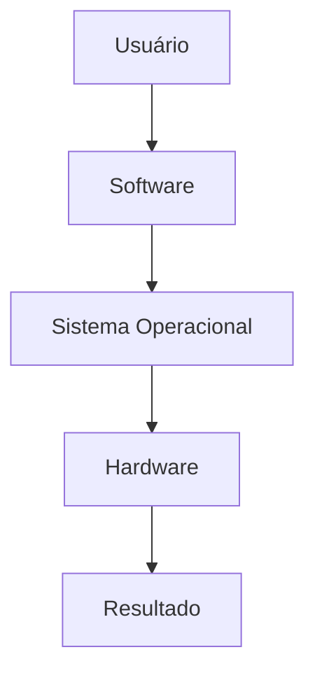

# 🚀 Aula 02 — Hardware e Software

> [!IMPORTANT]
> **Módulo:** 01 — Fundamentos da Informática
>
> **Aula:** 02
>
> **Tema:** Hardware e Software
>
> **Duração estimada:** 4 a 6 horas
>
> **Nível:** Iniciante

---

# 📖 Apresentação

Após compreender o conceito de informática na aula anterior, chegou o momento de conhecer os dois pilares fundamentais de qualquer sistema computacional: **hardware** e **software**.

Todo computador, smartphone, servidor, caixa eletrônico, Smart TV ou videogame funciona graças à interação entre componentes físicos e programas.

Enquanto o hardware fornece a estrutura física capaz de executar operações, o software determina quais tarefas serão realizadas e como elas deverão acontecer.

Compreender essa relação é essencial para qualquer profissional da área de Tecnologia da Informação, pois praticamente todos os problemas encontrados no dia a dia envolvem um ou ambos os elementos.

Nesta aula você aprenderá a identificar componentes físicos, compreender a função dos principais dispositivos, conhecer os diferentes tipos de software e entender como hardware e software trabalham juntos para executar aplicações.

---

# 🎯 Objetivos da Aula

Ao concluir esta aula você será capaz de:

- compreender a diferença entre hardware e software;
- identificar os principais componentes físicos de um computador;
- reconhecer dispositivos de entrada, saída e armazenamento;
- compreender as funções dos principais tipos de software;
- diferenciar sistema operacional, aplicativos e softwares de programação;
- analisar a interação entre hardware e software;
- identificar problemas básicos relacionados aos componentes físicos e lógicos;
- aplicar esses conceitos em situações práticas.

---

# 🧠 Competências Desenvolvidas

Durante esta aula você desenvolverá competências como:

- identificação de componentes computacionais;
- interpretação da arquitetura básica de computadores;
- análise de funcionamento de sistemas;
- resolução inicial de problemas;
- documentação técnica;
- pensamento lógico aplicado à infraestrutura de TI.

---

# 📚 Pré-requisitos

Para um melhor aproveitamento desta aula, recomenda-se ter concluído:

- ✅ Aula 01 — O que é Informática

Especialmente os conceitos de:

- dados;
- informação;
- sistema computacional;
- funcionamento básico do computador.

---

# 📂 Estrutura da Aula

Esta aula está organizada da seguinte forma:

| Arquivo | Conteúdo |
|---------|-----------|
| **00-Apresentacao.md** | Introdução da aula |
| **01-Hardware.md** | Conceitos fundamentais de hardware |
| **02-Componentes-do-Hardware.md** | Principais componentes físicos |
| **03-Software.md** | Conceitos fundamentais de software |
| **04-Tipos-de-Software.md** | Sistemas operacionais, aplicativos e programação |
| **05-Interacao-Hardware-Software.md** | Como trabalham em conjunto |
| **06-Exemplos-Praticos.md** | Exemplos do cotidiano |
| **07-Erros-Comuns.md** | Equívocos frequentes |
| **08-Boas-Praticas.md** | Cuidados e recomendações |
| **09-Estudo-de-Caso.md** | Situações reais |
| **10-Resumo.md** | Revisão geral da aula |
| **Exercicios.md** | Exercícios de fixação |
| **Atividade.md** | Avaliação prática |
| **Laboratorio.md** | Atividades em computador real |
| **Projeto.md** | Projeto aplicado |
| **Checklist.md** | Verificação da aprendizagem |
| **Glossario.md** | Termos técnicos |
| **FAQ.md** | Perguntas frequentes |
| **Ferramentas.md** | Softwares e utilitários recomendados |
| **Videos.md** | Conteúdo audiovisual complementar |
| **Links.md** | Sites úteis |
| **Referencias.md** | Bibliografia e documentação |

---

# 🗺️ Visão Geral da Aula

Ao longo desta unidade você descobrirá como cada componente físico possui uma função específica e como diferentes tipos de software utilizam esses componentes para executar tarefas.

---

# 💡 Por que estudar Hardware e Software?

Imagine tentar consertar um automóvel sem saber diferenciar o motor da direção.

Da mesma forma, um profissional de Tecnologia da Informação precisa identificar rapidamente se um problema é causado por:

- um componente físico;
- um programa;
- uma configuração inadequada;
- um erro do usuário;
- uma falha na comunicação entre hardware e software.

Esse conhecimento reduz o tempo de diagnóstico e aumenta a eficiência na solução de problemas.

---

# 🌍 Onde esses conceitos aparecem?

Os conceitos estudados nesta aula estão presentes em praticamente todos os equipamentos modernos.

Alguns exemplos incluem:

- computadores pessoais;
- notebooks;
- smartphones;
- tablets;
- servidores;
- Smart TVs;
- consoles de videogame;
- caixas eletrônicos;
- equipamentos hospitalares;
- sistemas industriais;
- veículos modernos;
- dispositivos de Internet das Coisas (IoT).

---

# 📈 O que você aprenderá na prática?

Ao longo da aula será possível:

- identificar componentes internos e externos;
- reconhecer dispositivos de entrada e saída;
- diferenciar memória RAM de armazenamento;
- compreender o papel da CPU;
- conhecer diferentes sistemas operacionais;
- entender como aplicativos utilizam o hardware;
- analisar situações reais envolvendo falhas de hardware e software.

---

# 🔍 Metodologia

Esta aula combina diferentes métodos de aprendizagem:

- explicações teóricas;
- diagramas em Mermaid;
- exemplos práticos;
- estudos de caso;
- atividades guiadas;
- laboratório;
- projeto prático;
- exercícios de revisão.

O objetivo é desenvolver não apenas conhecimento teórico, mas também habilidades de observação, análise e resolução de problemas.

---

# 📌 Ao final desta aula...

Você será capaz de olhar para qualquer computador e compreender:

- quais componentes físicos ele possui;
- qual a função de cada componente;
- quais softwares estão sendo utilizados;
- como hardware e software interagem;
- onde podem surgir problemas e como iniciar um diagnóstico.

Esses conhecimentos servirão como base para os próximos módulos, que abordarão arquitetura de computadores, sistemas operacionais, redes, manutenção, programação e segurança da informação.

> [!TIP]
> Bem-vindo à **Aula 02 — Hardware e Software**.
>
> Nos próximos capítulos você conhecerá, em detalhes, os componentes que tornam possível o funcionamento de qualquer sistema computacional moderno.
