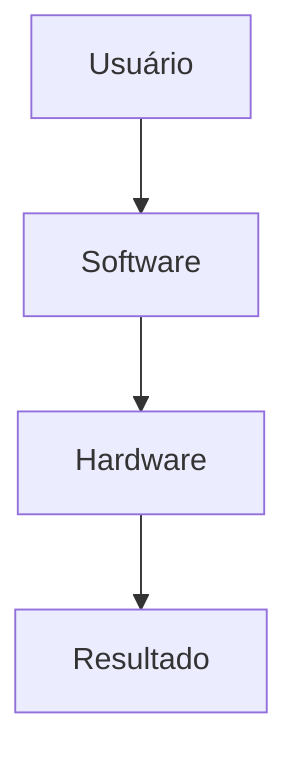

# 🖥️ Fundamentos de Hardware

> [!IMPORTANT]
> **Módulo:** 01 — Fundamentos da Informática
>
> **Aula:** 02 — Hardware e Software
>
> **Arquivo:** `01-Fundamentos.md`

---

# 📖 Introdução

Na aula anterior você aprendeu o que é informática e como os computadores transformam dados em informações.

Agora é o momento de compreender um dos pilares fundamentais da computação: **o hardware**.

Sempre que utilizamos um computador, smartphone, videogame ou qualquer outro dispositivo eletrônico, existe um conjunto de componentes físicos trabalhando em conjunto para executar milhares ou até bilhões de operações por segundo.

Esses componentes recebem comandos, processam informações, armazenam dados e apresentam resultados ao usuário.

Conhecer esses conceitos é indispensável para qualquer profissional de Tecnologia da Informação, pois praticamente todas as áreas da computação dependem do correto funcionamento do hardware.

---

# 🎯 Objetivos

Ao concluir este capítulo você será capaz de:

- compreender o conceito de hardware;
- identificar sua importância em um sistema computacional;
- diferenciar hardware e software;
- conhecer as principais classificações do hardware;
- entender como o hardware participa do processamento das informações.

---

# 🧠 O que é Hardware?

Hardware é o conjunto de todos os componentes físicos de um sistema computacional.

São as partes que possuem existência material e que tornam possível o funcionamento do computador.

Esses componentes podem ser vistos, tocados, conectados, substituídos ou atualizados.

Sem hardware, um software não teria onde ser executado.

Da mesma forma, um hardware sem software seria incapaz de realizar tarefas úteis.

---

# 📜 Origem da Palavra

O termo **Hardware** é formado por duas palavras da língua inglesa:

- **Hard** → duro, físico.
- **Ware** → produto ou componente.

Na computação, hardware representa toda a infraestrutura física responsável pelo funcionamento do sistema.

---

# 🌍 Onde Existe Hardware?

O hardware está presente em praticamente todos os equipamentos eletrônicos modernos.

Exemplos:

- computadores;
- notebooks;
- smartphones;
- tablets;
- servidores;
- Smart TVs;
- relógios inteligentes;
- caixas eletrônicos;
- videogames;
- impressoras;
- roteadores;
- drones;
- equipamentos hospitalares;
- máquinas industriais;
- veículos modernos.

Sempre que um equipamento processa informações, existe hardware envolvido.

---

# ⚙️ O Papel do Hardware

O hardware possui diversas responsabilidades dentro de um sistema computacional.

Entre elas:

- receber dados;
- processar informações;
- armazenar arquivos;
- controlar dispositivos;
- comunicar-se com outros equipamentos;
- apresentar resultados ao usuário.

Cada componente realiza uma tarefa específica.

O funcionamento do computador depende da colaboração entre todos eles.

---

# 🔄 Hardware em Funcionamento

Observe o fluxo simplificado de funcionamento de um computador.

O processo acontece continuamente.

1. O usuário envia um comando.
2. O hardware recebe esse comando.
3. Os componentes executam o processamento.
4. O resultado é apresentado.

---

# 🤝 Hardware e Software

Hardware e software trabalham juntos.

Nenhum deles possui utilidade isoladamente.

Por exemplo:

Ao abrir um navegador:

- o software solicita a abertura;
- o hardware executa essa solicitação;
- o monitor apresenta a interface.

---

# 🏗️ Classificação do Hardware

Os componentes físicos podem ser agrupados conforme sua função.

## Hardware de Entrada

Recebem informações enviadas pelo usuário.

Exemplos:

- teclado;
- mouse;
- scanner;
- webcam;
- microfone;
- leitor biométrico.

---

## Hardware de Saída

Apresentam informações processadas.

Exemplos:

- monitor;
- impressora;
- caixas de som;
- projetor.

---

## Hardware de Entrada e Saída

Executam ambas as funções.

Exemplos:

- touchscreen;
- impressora multifuncional;
- headset;
- dispositivos USB;
- placas de rede.

---

## Hardware de Processamento

Executam cálculos e instruções.

Exemplos:

- CPU;
- GPU;
- chipset.

---

## Hardware de Armazenamento

Guardam informações.

Exemplos:

- SSD;
- HD;
- Pen Drive;
- cartão de memória.

---

# 🖥️ Hardware Interno

São componentes instalados dentro do computador.

Exemplos:

- placa-mãe;
- processador;
- memória RAM;
- SSD;
- HD;
- fonte de alimentação;
- placa de vídeo.

Esses componentes normalmente não ficam visíveis durante a utilização do equipamento.

---

# 🖱️ Hardware Externo

Também chamados de **periféricos**.

São dispositivos conectados ao computador.

Exemplos:

- teclado;
- mouse;
- monitor;
- webcam;
- impressora;
- scanner;
- caixas de som;
- microfone.

---

# 📊 Características do Hardware

Ao avaliar um componente físico, normalmente são observados fatores como:

- desempenho;
- velocidade;
- capacidade;
- consumo de energia;
- compatibilidade;
- confiabilidade;
- durabilidade;
- custo.

Nem sempre o componente mais caro será a melhor escolha.

Tudo depende da necessidade do usuário.

---

# 🌎 Exemplos do Cotidiano

## Em casa

- notebook;
- computador;
- videogame;
- Smart TV;
- roteador.

---

## Na escola

- laboratórios;
- projetores;
- impressoras;
- computadores administrativos.

---

## Nos hospitais

- monitores cardíacos;
- tomógrafos;
- aparelhos de ultrassom;
- computadores médicos.

---

## Na indústria

- robôs;
- sensores;
- controladores industriais;
- computadores embarcados.

---

# 📈 Evolução do Hardware

O hardware evoluiu rapidamente ao longo das últimas décadas.

| Antes | Atualmente |
|--------|------------|
| Disquete | SSD NVMe |
| HD IDE | SSD PCIe |
| Monitores CRT | LED, OLED e Mini LED |
| CPU de um núcleo | CPUs com dezenas de núcleos |
| Portas seriais | USB-C e Thunderbolt |

Além do aumento do desempenho, os equipamentos se tornaram menores, mais eficientes e mais econômicos.

---

# 💡 Por que estudar Hardware?

Independentemente da área escolhida em Tecnologia da Informação, compreender hardware é importante.

Esse conhecimento é utilizado por profissionais que trabalham com:

- suporte técnico;
- manutenção;
- infraestrutura;
- redes;
- servidores;
- segurança da informação;
- desenvolvimento de software;
- computação em nuvem;
- inteligência artificial;
- Internet das Coisas (IoT).

Mesmo programadores precisam entender como o hardware executa seus programas.

---

# ❌ Mitos Comuns

## "Hardware é apenas o gabinete."

Falso.

Todo componente físico faz parte do hardware.

---

## "Notebook não possui hardware."

Falso.

Ele possui os mesmos componentes de um computador desktop, porém integrados em um único equipamento.

---

## "Smartphones não são computadores."

Também é falso.

Eles possuem processador, memória, armazenamento, sistema operacional e diversos dispositivos de entrada e saída.

---

## "Quanto mais caro o computador, melhor."

Nem sempre.

O ideal é escolher componentes adequados ao tipo de utilização.

Um computador para escritório possui necessidades diferentes de um computador para edição de vídeo ou jogos.

---

# 💡 Boas Práticas

Ao utilizar equipamentos de informática:

- mantenha o equipamento limpo;
- evite impactos;
- proteja contra líquidos;
- mantenha boa ventilação;
- desligue corretamente o sistema;
- utilize componentes compatíveis;
- realize manutenção preventiva quando necessário.

Esses cuidados ajudam a prolongar a vida útil do equipamento.

---

# 📋 Resumo

Hardware corresponde à parte física de qualquer sistema computacional.

Ele é formado por diversos componentes especializados que trabalham em conjunto para receber dados, executar instruções, armazenar informações e apresentar resultados.

Compreender esses fundamentos é indispensável para qualquer profissional da área de Tecnologia da Informação e servirá de base para o estudo detalhado de cada componente nas próximas aulas.

> [!TIP]
> No próximo capítulo estudaremos detalhadamente os principais componentes internos e externos de um computador moderno, compreendendo suas funções e como eles trabalham em conjunto para executar programas e processar informações.
