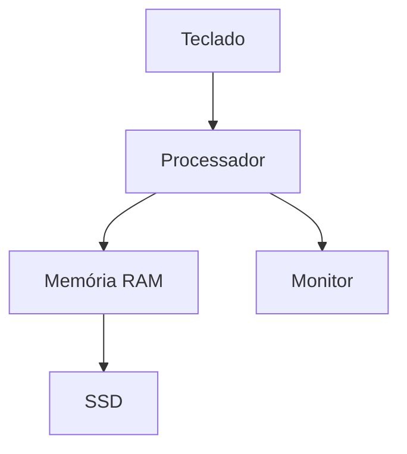

# 💻 01 — Hardware

> [!IMPORTANT]
> **Módulo:** 01 — Fundamentos da Informática
>
> **Aula:** 02 — Hardware e Software
>
> **Arquivo:** `01-Hardware.md`

---

# 📖 Introdução

Quando pensamos em um computador, normalmente imaginamos um gabinete, um monitor, um teclado ou um notebook.

Todos esses elementos fazem parte do **hardware**, ou seja, dos componentes físicos de um sistema computacional.

O hardware é responsável por executar as instruções enviadas pelos programas (softwares), armazenar informações, realizar cálculos, processar dados e permitir a interação entre o usuário e o computador.

Nesta aula você conhecerá os principais conceitos relacionados ao hardware, compreenderá sua importância e aprenderá a identificar os componentes presentes em diferentes equipamentos eletrônicos.

---

# 🎯 Objetivos

Ao concluir este capítulo você será capaz de:

- definir o conceito de hardware;
- identificar componentes físicos de um computador;
- compreender a função do hardware em um sistema computacional;
- diferenciar hardware interno e externo;
- reconhecer exemplos de hardware presentes no cotidiano.

---

# 🧠 O que é Hardware?

Hardware é o conjunto de **componentes físicos** de um sistema computacional.

São todas as partes que podem ser vistas e, na maioria dos casos, tocadas.

Esses componentes trabalham em conjunto para executar instruções, armazenar informações e permitir a comunicação entre o usuário e o computador.

Sem hardware, nenhum software poderia ser executado.

> [!NOTE]
> A palavra **hardware** tem origem na língua inglesa, sendo formada por *hard* (duro, físico) e *ware* (produto ou componente).

---

# 🖥️ O Hardware no Dia a Dia

O hardware está presente em praticamente todos os dispositivos eletrônicos modernos.

Exemplos:

- computadores;
- notebooks;
- smartphones;
- tablets;
- servidores;
- Smart TVs;
- caixas eletrônicos;
- videogames;
- relógios inteligentes;
- impressoras;
- roteadores;
- equipamentos hospitalares.

Embora esses equipamentos tenham formatos e capacidades diferentes, todos possuem componentes físicos responsáveis pelo processamento de informações.

---

# ⚙️ Como o Hardware Funciona?

O hardware recebe informações, realiza o processamento das instruções e apresenta os resultados ao usuário.

Esse funcionamento ocorre em conjunto com o software.

Na prática:

1. O usuário fornece uma entrada.
2. O hardware recebe essa informação.
3. O processador executa as instruções.
4. Os dados podem ser armazenados.
5. O resultado é apresentado.

---

# 🧩 Principais Funções do Hardware

O hardware possui diversas responsabilidades dentro de um sistema computacional.

Entre as principais estão:

- executar cálculos;
- armazenar informações;
- controlar dispositivos;
- comunicar-se com outros equipamentos;
- exibir resultados;
- receber comandos do usuário.

Cada componente possui uma função específica, mas todos trabalham de forma integrada.

---

# 🏗️ Classificação do Hardware

Os componentes físicos podem ser classificados em diferentes categorias.

## Hardware de Entrada

São dispositivos utilizados para enviar informações ao computador.

Exemplos:

- teclado;
- mouse;
- scanner;
- webcam;
- microfone;
- leitor biométrico;
- leitor de código de barras.

---

## Hardware de Saída

São dispositivos responsáveis por apresentar informações ao usuário.

Exemplos:

- monitor;
- impressora;
- caixas de som;
- projetor;
- fones de ouvido.

---

## Hardware de Entrada e Saída

Alguns dispositivos desempenham ambas as funções.

Exemplos:

- tela sensível ao toque (touchscreen);
- impressora multifuncional;
- headset;
- dispositivos USB;
- placas de rede.

---

## Hardware de Processamento

São responsáveis por executar instruções e controlar o funcionamento do sistema.

Exemplos:

- processador (CPU);
- placa de vídeo (GPU);
- chipset.

---

## Hardware de Armazenamento

São utilizados para guardar informações.

Exemplos:

- SSD;
- HD;
- Pen Drive;
- cartão de memória;
- DVD;
- Blu-ray.

---

# 🖥️ Hardware Interno e Externo

Outra forma de classificar o hardware é de acordo com sua localização.

## Hardware Interno

São componentes instalados dentro do computador.

Exemplos:

- placa-mãe;
- processador;
- memória RAM;
- SSD;
- HD;
- fonte de alimentação;
- placa de vídeo.

---

## Hardware Externo

São periféricos conectados ao computador.

Exemplos:

- monitor;
- teclado;
- mouse;
- impressora;
- webcam;
- caixas de som;
- scanner.

---

# 🔄 Integração entre os Componentes

Nenhum componente funciona isoladamente.

Todos precisam trabalhar em conjunto para que o computador execute uma tarefa.

Por exemplo, ao abrir um navegador:

- o teclado ou mouse envia um comando;
- a CPU processa a solicitação;
- a memória RAM armazena temporariamente os dados;
- o SSD fornece os arquivos do programa;
- o monitor apresenta o resultado.

---

# 🌍 Exemplos no Cotidiano

## Smartphone

Hardware presente:

- tela;
- processador;
- bateria;
- câmera;
- memória;
- alto-falantes;
- microfone.

---

## Caixa Eletrônico

Hardware presente:

- monitor;
- teclado;
- leitor de cartão;
- impressora;
- leitor biométrico;
- processador.

---

## Hospital

Equipamentos como tomógrafos, aparelhos de ultrassom e monitores cardíacos utilizam hardware especializado para coletar, processar e apresentar informações médicas.

---

## Indústria

Robôs industriais utilizam sensores, motores, controladores e processadores para automatizar processos de fabricação.

---

# 📈 Evolução do Hardware

Ao longo das últimas décadas, os componentes físicos evoluíram significativamente.

| Antes | Atualmente |
|--------|------------|
| Disquetes | SSDs NVMe |
| Monitores CRT | Monitores LED e OLED |
| HDs lentos | SSDs de alta velocidade |
| Processadores de um núcleo | CPUs com múltiplos núcleos |
| Cabos seriais | USB-C e Thunderbolt |

Essa evolução trouxe maior desempenho, menor consumo de energia e equipamentos mais compactos.

---

# 🧠 Características do Hardware

Um componente de hardware pode ser avaliado por diversos fatores.

Entre eles:

- desempenho;
- capacidade;
- velocidade;
- consumo de energia;
- compatibilidade;
- confiabilidade;
- durabilidade;
- custo.

Ao escolher um equipamento, é importante considerar o uso pretendido e o equilíbrio entre esses fatores.

---

# ❌ Mitos sobre Hardware

Algumas ideias incorretas são bastante comuns.

### "Quanto mais memória RAM, melhor o computador."

Nem sempre.

O desempenho depende também do processador, do armazenamento, da placa de vídeo e da otimização do software.

---

### "Todo computador precisa de placa de vídeo dedicada."

Falso.

Muitos computadores utilizam gráficos integrados ao processador, suficientes para atividades como estudos, navegação e trabalho em escritório.

---

### "Computadores mais novos nunca apresentam problemas."

Falso.

Qualquer equipamento pode apresentar falhas devido a desgaste, defeitos de fabricação, superaquecimento, mau uso ou problemas elétricos.

---

# 💡 Boas Práticas

Ao utilizar equipamentos de informática:

- mantenha o computador limpo;
- evite impactos físicos;
- proteja o equipamento contra líquidos;
- utilize estabilização elétrica quando apropriado;
- desligue corretamente o sistema;
- mantenha boa ventilação ao redor do equipamento;
- realize manutenções preventivas quando necessário.

Esses cuidados ajudam a aumentar a vida útil dos componentes.

---

# 📋 Resumo

Hardware corresponde à parte física de um sistema computacional.

Ele inclui todos os componentes responsáveis por receber dados, processar informações, armazenar arquivos e apresentar resultados.

Compreender o funcionamento do hardware é indispensável para diagnosticar problemas, escolher equipamentos adequados e entender como os computadores executam suas tarefas.

> [!TIP]
> Agora que você compreende o conceito de hardware, no próximo capítulo estudaremos detalhadamente os principais componentes internos e externos que formam um computador moderno.
