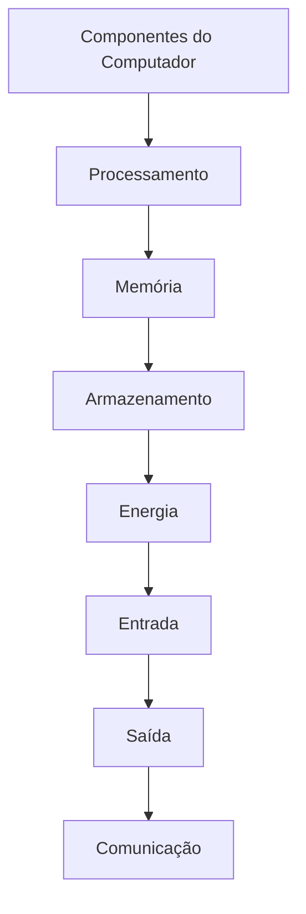
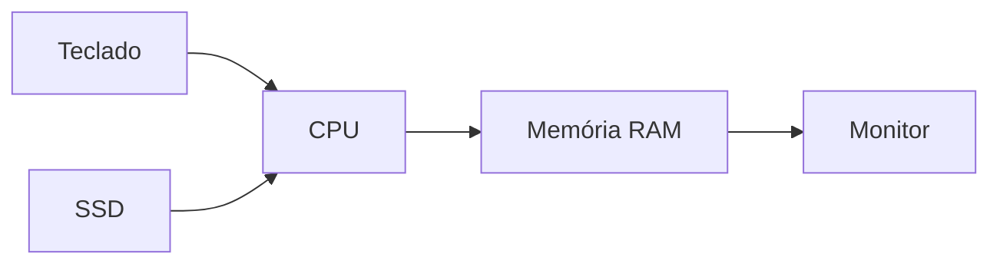

# 🖥️ 03 — Componentes e Elementos

> [!IMPORTANT]
> **Módulo:** 01 — Fundamentos da Informática
>
> **Aula:** 02 — Hardware e Software
>
> **Arquivo:** `03-Componentes-e-Elementos.md`

---

# 📖 Introdução

Todo computador é formado por diversos componentes físicos que trabalham de maneira integrada.

Cada componente possui uma função específica e indispensável para o funcionamento do sistema. Enquanto alguns executam cálculos, outros armazenam informações, fornecem energia, exibem imagens ou permitem que o usuário interaja com o computador.

Conhecer esses elementos é um dos primeiros passos para quem deseja trabalhar com manutenção, suporte técnico, infraestrutura, programação ou qualquer outra área da Tecnologia da Informação.

Neste capítulo estudaremos os principais componentes presentes em computadores modernos, entendendo suas funções e como eles se relacionam.

---

# 🧩 Organização dos Componentes

Os componentes de um computador podem ser agrupados em diferentes categorias.

Cada grupo desempenha uma função diferente dentro do sistema computacional.

---

# 🏛️ Placa-Mãe

A **placa-mãe** é o principal circuito eletrônico do computador.

Ela conecta todos os demais componentes, permitindo que eles troquem informações.

Sem a placa-mãe, os dispositivos funcionariam de forma isolada.

---

## Principais funções

- conectar todos os componentes;
- distribuir energia elétrica;
- permitir comunicação entre dispositivos;
- fornecer interfaces de expansão;
- controlar o funcionamento básico do sistema.

---

## Elementos encontrados na placa-mãe

- soquete do processador;
- slots de memória RAM;
- chipset;
- conectores SATA;
- conectores M.2;
- slots PCI Express;
- portas USB;
- conectores de alimentação;
- bateria CMOS.

---

# 🧠 Processador (CPU)

A CPU (**Central Processing Unit**) é responsável pela execução das instruções dos programas.

Ela realiza operações matemáticas, lógicas e controla praticamente todas as atividades do computador.

É frequentemente chamada de **cérebro do computador**.

---

## Principais características

- frequência de operação (GHz);
- número de núcleos;
- número de threads;
- memória cache;
- arquitetura.

---

## Funções

- executar programas;
- controlar dispositivos;
- processar cálculos;
- coordenar operações do sistema operacional.

---

# 💾 Memória RAM

A memória RAM armazena temporariamente os dados utilizados pelos programas.

Sempre que um software é aberto, parte de suas informações é carregada para a memória.

Quando o computador é desligado, esses dados normalmente são perdidos.

---

## Funções

- armazenar dados temporários;
- acelerar o processamento;
- permitir multitarefa;
- fornecer acesso rápido às informações.

---

> [!NOTE]
> Memória RAM não substitui o SSD ou o HD.
>
> Ela existe apenas para armazenamento temporário.

---

# 💽 SSD

O SSD (**Solid State Drive**) é o principal dispositivo de armazenamento utilizado atualmente.

Ele utiliza memória flash e não possui partes móveis.

---

## Vantagens

- inicialização rápida;
- leitura veloz;
- gravação eficiente;
- menor consumo de energia;
- maior resistência a impactos;
- funcionamento silencioso.

---

# 💿 HD

O HD (**Hard Disk Drive**) armazena informações utilizando discos magnéticos.

Apesar de ser mais lento que um SSD, ainda é utilizado principalmente quando se deseja grande capacidade de armazenamento por menor custo.

---

## Características

- grande capacidade;
- menor custo por gigabyte;
- possui partes mecânicas;
- maior sensibilidade a impactos.

---

# 🎮 Placa de Vídeo (GPU)

A GPU (**Graphics Processing Unit**) é especializada no processamento gráfico.

Ela é responsável pela geração das imagens apresentadas no monitor.

---

## Aplicações

- jogos;
- edição de imagens;
- edição de vídeo;
- modelagem tridimensional;
- inteligência artificial;
- computação científica.

---

## Tipos

### Integrada

Compartilha recursos com o processador.

Indicada para tarefas comuns.

---

### Dedicada

Possui memória própria.

Indicada para aplicações de alto desempenho.

---

# ⚡ Fonte de Alimentação

A fonte converte a energia elétrica proveniente da tomada em tensões adequadas para cada componente do computador.

Sem ela nenhum dispositivo recebe alimentação.

---

## Responsabilidades

- fornecer energia;
- estabilizar tensões;
- distribuir alimentação elétrica;
- proteger parcialmente contra falhas elétricas.

---

# 🌡️ Sistema de Refrigeração

Durante o funcionamento, os componentes geram calor.

Para evitar superaquecimento são utilizados diversos sistemas de refrigeração.

Exemplos:

- dissipadores;
- coolers;
- ventoinhas;
- water coolers.

Uma refrigeração adequada aumenta a estabilidade e a vida útil do computador.

---

# 🌐 Placa de Rede

A placa de rede permite que o computador se comunique com outros dispositivos.

Ela pode utilizar:

- cabo Ethernet;
- Wi-Fi;
- fibra óptica (por meio de equipamentos de rede).

Graças a ela é possível acessar redes locais e a Internet.

---

# 🔊 Dispositivos de Entrada

São responsáveis por enviar informações ao computador.

Exemplos:

- teclado;
- mouse;
- scanner;
- webcam;
- microfone;
- leitor biométrico;
- leitor de código de barras.

---

# 🖥️ Dispositivos de Saída

Apresentam informações processadas pelo computador.

Exemplos:

- monitor;
- impressora;
- caixas de som;
- projetor;
- fones de ouvido.

---

# 🔄 Dispositivos de Entrada e Saída

Alguns equipamentos executam ambas as funções.

Exemplos:

- touchscreen;
- impressora multifuncional;
- headset;
- dispositivos USB;
- placas de rede.

---

# 🔌 Portas e Conectores

Os componentes comunicam-se através de diferentes interfaces.

Entre as mais comuns estão:

- USB;
- HDMI;
- DisplayPort;
- Ethernet;
- SATA;
- M.2;
- PCI Express;
- Áudio P2;
- Thunderbolt.

Cada interface possui uma finalidade específica.

---

# 🔋 Bateria CMOS

A bateria CMOS mantém determinadas configurações da placa-mãe mesmo quando o computador está desligado.

Ela preserva informações como:

- data;
- hora;
- configurações da BIOS ou UEFI.

Quando essa bateria se esgota, essas configurações podem ser perdidas.

---

# 🧩 Como os Componentes Trabalham Juntos?

Observe um exemplo simplificado.

Fluxo do processo:

1. O usuário envia um comando.
2. O SSD fornece os arquivos necessários.
3. A CPU processa as instruções.
4. A memória RAM mantém os dados temporariamente.
5. O monitor apresenta o resultado.

Todo esse processo acontece em frações de segundo.

---

# 📱 Componentes em Outros Equipamentos

Os mesmos princípios utilizados em computadores também aparecem em diversos dispositivos.

## Smartphone

- processador;
- memória;
- armazenamento;
- tela;
- sensores;
- bateria.

---

## Smart TV

- CPU;
- memória;
- armazenamento;
- placa de rede;
- alto-falantes.

---

## Console de Videogame

- CPU;
- GPU;
- memória RAM;
- SSD;
- placa de rede.

---

## Servidor

Além dos componentes comuns, normalmente possui:

- múltiplos processadores;
- maior quantidade de memória RAM;
- armazenamento redundante;
- fontes redundantes;
- sistemas avançados de refrigeração.

---

# 📊 Resumo dos Componentes

| Componente | Função Principal |
|------------|------------------|
| Placa-mãe | Interliga todos os componentes |
| CPU | Processa instruções |
| Memória RAM | Armazena dados temporários |
| SSD | Armazena dados permanentemente |
| HD | Armazena grandes volumes de dados |
| GPU | Processa gráficos |
| Fonte | Fornece energia |
| Placa de Rede | Comunicação com redes |
| Monitor | Exibe informações |
| Teclado | Entrada de dados |
| Mouse | Controle do cursor |
| Impressora | Produção de documentos físicos |

---

# 💡 Curiosidade

Embora um smartphone seja muito menor que um computador desktop, ele também possui processador, memória, armazenamento, dispositivos de entrada e saída, sistema operacional e diversos sensores.

Na prática, trata-se de um computador altamente integrado e otimizado para mobilidade.

---

# 📋 Resumo

Cada componente físico possui uma função específica, mas somente a integração entre todos eles permite que o computador funcione corretamente.

A placa-mãe conecta os dispositivos, a CPU executa instruções, a memória RAM armazena dados temporários, o SSD guarda informações permanentemente, a fonte fornece energia e os periféricos permitem a interação com o usuário.

Compreender esses elementos é fundamental para diagnosticar problemas, realizar manutenções e escolher corretamente equipamentos para diferentes finalidades.

> [!TIP]
> No próximo capítulo estudaremos o **software**, entendendo como os programas utilizam todos esses componentes físicos para executar tarefas e transformar o hardware em um sistema funcional.
