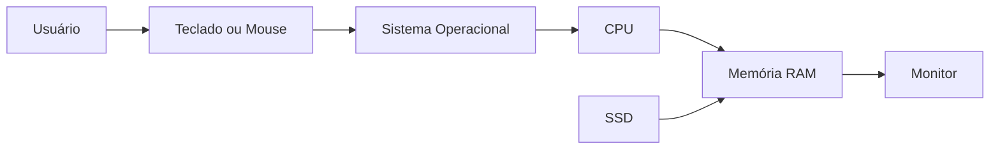
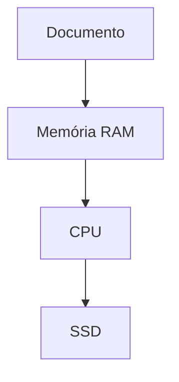

# ⚙️ 04 — Funcionamento

> [!IMPORTANT]
> **Módulo:** 01 — Fundamentos da Informática
>
> **Aula:** 02 — Hardware e Software
>
> **Arquivo:** `04-Funcionamento.md`

---

# 📖 Introdução

Até este momento conhecemos os principais conceitos de hardware e identificamos os componentes que formam um computador.

Agora surge uma pergunta importante:

**Como todos esses componentes trabalham juntos?**

Embora cada peça tenha uma função específica, nenhuma delas é capaz de realizar todas as tarefas sozinha. O funcionamento do computador depende da comunicação constante entre hardware e software.

Neste capítulo você compreenderá como uma simples ação do usuário, como abrir um navegador ou salvar um arquivo, envolve diversos componentes trabalhando em perfeita sincronização.

---

# 🎯 Objetivos

Ao concluir este capítulo você será capaz de:

- compreender como hardware e software trabalham juntos;
- entender o fluxo básico de processamento das informações;
- identificar a função de cada componente durante a execução de um programa;
- compreender como dados são armazenados e recuperados;
- visualizar o ciclo completo de funcionamento de um computador.

---

# 🔄 O Ciclo Básico de Funcionamento

Todo computador executa continuamente um ciclo de processamento.

Esse ciclo pode ser resumido em quatro etapas.

Essas etapas acontecem milhares de vezes por segundo.

---

# ⌨️ Etapa 1 — Entrada

Tudo começa quando alguma informação chega ao computador.

Essa entrada pode ser realizada por diversos dispositivos.

Exemplos:

- teclado;
- mouse;
- touchscreen;
- webcam;
- microfone;
- scanner.

Cada ação realizada pelo usuário gera informações que serão processadas pelo sistema.

---

# 🧠 Etapa 2 — Processamento

Após receber uma entrada, o computador precisa interpretar as informações.

Quem realiza essa tarefa é principalmente o **processador (CPU)**.

Durante essa etapa a CPU:

- interpreta instruções;
- realiza cálculos;
- toma decisões lógicas;
- controla outros componentes;
- envia comandos ao sistema operacional.

Essa operação ocorre em velocidades extremamente elevadas.

---

# 💾 Etapa 3 — Armazenamento

Durante o processamento, diferentes tipos de armazenamento são utilizados.

## Memória RAM

Armazena temporariamente os dados utilizados pelos programas.

Exemplos:

- documentos abertos;
- navegador em execução;
- jogos carregados;
- arquivos temporários.

---

## SSD ou HD

Armazenam informações permanentemente.

Exemplos:

- sistema operacional;
- programas;
- fotos;
- vídeos;
- documentos.

Quando um programa é aberto, seus arquivos saem do SSD ou HD e são carregados para a memória RAM.

---

# 🖥️ Etapa 4 — Saída

Após o processamento, o computador apresenta os resultados.

Isso pode ocorrer através de diversos dispositivos.

Exemplos:

- monitor;
- impressora;
- caixas de som;
- projetor.

É nessa etapa que o usuário visualiza o resultado de suas ações.

---

# 🔁 Funcionamento Completo

Observe o fluxo simplificado.

Embora pareça simples, milhares de operações internas acontecem entre cada etapa.

---

# 📂 Exemplo 1 — Abrindo um Programa

Imagine que o usuário deseja abrir um navegador.

O processo ocorre da seguinte forma.

## Passo 1

O usuário clica duas vezes sobre o ícone.

---

## Passo 2

O sistema operacional recebe essa solicitação.

---

## Passo 3

O SSD fornece os arquivos necessários.

---

## Passo 4

Os arquivos são carregados para a memória RAM.

---

## Passo 5

A CPU interpreta e executa as instruções.

---

## Passo 6

O monitor apresenta a janela do navegador.

Todo esse processo normalmente leva apenas alguns segundos.

---

# 💾 Exemplo 2 — Salvando um Documento

Quando um documento é salvo ocorre outro fluxo.

O computador:

1. processa o documento;
2. organiza os dados;
3. grava as informações no SSD;
4. confirma que o salvamento foi realizado.

---

# 🌐 Exemplo 3 — Acessando um Site

Ao abrir uma página da Internet diversos componentes participam.

- placa de rede envia a solicitação;
- roteador encaminha os dados;
- servidor responde;
- SSD armazena arquivos temporários;
- memória RAM mantém os dados carregados;
- CPU processa o conteúdo;
- GPU gera as imagens;
- monitor apresenta o resultado.

Tudo isso acontece em poucos instantes.

---

# ⚡ Processamento Paralelo

Os computadores modernos conseguem executar diversas tarefas ao mesmo tempo.

Por exemplo:

- reproduzir música;
- baixar arquivos;
- navegar na Internet;
- editar documentos;
- executar um antivírus.

Isso é possível graças à combinação de:

- múltiplos núcleos do processador;
- memória RAM;
- sistema operacional;
- gerenciamento eficiente dos recursos.

---

# 🤝 Comunicação entre Hardware e Software

O software envia instruções.

O hardware executa essas instruções.

Sem essa comunicação o computador não conseguiria realizar nenhuma tarefa útil.

---

# 📊 Exemplo Completo

Imagine escrever um texto.

Durante essa atividade acontecem diversas operações simultaneamente.

| Ação | Componente Principal |
|------|----------------------|
| Digitar letras | Teclado |
| Processar caracteres | CPU |
| Armazenar temporariamente | Memória RAM |
| Exibir texto | Monitor |
| Salvar documento | SSD |
| Controlar todo o processo | Sistema Operacional |

Embora o usuário veja apenas o texto aparecendo na tela, centenas de operações acontecem continuamente.

---

# ⚙️ O Papel do Sistema Operacional

O sistema operacional atua como intermediário entre o usuário e o hardware.

Entre suas responsabilidades estão:

- gerenciar memória;
- controlar dispositivos;
- organizar arquivos;
- executar programas;
- distribuir recursos;
- fornecer interface gráfica.

Sem ele seria necessário controlar cada componente manualmente.

---

# 🚀 Por que o SSD torna o computador mais rápido?

Ao abrir um programa, seus arquivos precisam ser lidos do armazenamento.

Como o SSD possui velocidades muito superiores às de um HD tradicional, o carregamento acontece em menos tempo.

Isso melhora:

- inicialização do sistema;
- abertura de programas;
- carregamento de jogos;
- transferência de arquivos.

---

# 🌡️ O Que Acontece Durante o Uso?

Enquanto o computador funciona:

- a CPU realiza bilhões de cálculos;
- a memória RAM recebe e libera dados continuamente;
- o SSD realiza leituras e gravações;
- os coolers dissipam calor;
- a fonte distribui energia;
- o sistema operacional coordena todos os recursos.

Tudo isso acontece automaticamente.

---

# 📋 Resumo

O funcionamento de um computador depende da cooperação entre hardware e software.

O usuário fornece informações por dispositivos de entrada, o sistema operacional organiza os recursos, a CPU executa as instruções, a memória RAM armazena dados temporariamente, o SSD guarda informações permanentemente e os dispositivos de saída apresentam os resultados.

Esse ciclo ocorre milhões de vezes por segundo, permitindo que o computador execute tarefas de forma rápida, organizada e confiável.

> [!TIP]
> Compreender o funcionamento interno do computador facilita o diagnóstico de problemas e torna muito mais simples entender os assuntos que serão estudados nos próximos módulos, como sistemas operacionais, manutenção, redes e arquitetura de computadores.
