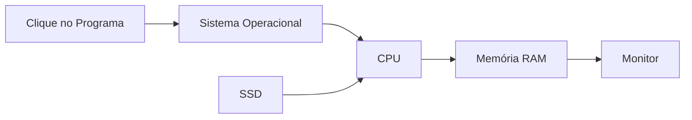

# 🛠️ 05 — Procedimentos Práticos

> [!IMPORTANT]
> **Módulo:** 01 — Fundamentos da Informática
>
> **Aula:** 02 — Hardware e Software
>
> **Arquivo:** `05-Procedimentos-Praticos.md`

---

# 📖 Introdução

A teoria é indispensável para compreender o funcionamento dos computadores, mas é durante a prática que o conhecimento realmente se consolida.

Neste capítulo você realizará atividades que permitem identificar componentes físicos, reconhecer softwares, observar o funcionamento do computador e compreender como hardware e software trabalham em conjunto.

As atividades foram desenvolvidas para serem executadas em computadores com Windows, Linux ou macOS, podendo ser adaptadas conforme o ambiente disponível.

---

# 🎯 Objetivos

Ao concluir este capítulo você será capaz de:

- identificar componentes físicos do computador;
- reconhecer dispositivos de entrada e saída;
- localizar informações do hardware instalado;
- identificar softwares do sistema;
- compreender a interação entre hardware e software;
- desenvolver habilidades de observação e análise.

---

# 🧰 Materiais Necessários

Para realizar as atividades recomenda-se possuir:

- computador ou notebook;
- acesso ao sistema operacional;
- teclado e mouse;
- conexão com a Internet (opcional);
- bloco de anotações.

---

# 🖥️ Atividade 1 — Identificando o Hardware

Observe atentamente o computador disponível.

Identifique os seguintes componentes.

## Componentes Externos

- monitor;
- teclado;
- mouse;
- gabinete (caso seja desktop);
- webcam;
- caixas de som;
- impressora (se houver).

---

## Componentes Internos

Caso seja possível visualizar ou conhecer a configuração do equipamento, identifique:

- processador;
- memória RAM;
- SSD ou HD;
- placa de vídeo;
- placa de rede;
- fonte de alimentação.

---

> [!NOTE]
> Não abra o gabinete sem autorização ou sem os conhecimentos necessários.

---

# 🔍 Atividade 2 — Descobrindo as Configurações

Localize as principais informações do computador.

Procure identificar:

- modelo do processador;
- quantidade de memória RAM;
- capacidade do armazenamento;
- sistema operacional;
- arquitetura (32 ou 64 bits).

Registre essas informações em seu caderno.

---

# 🖱️ Atividade 3 — Classificando Periféricos

Observe os dispositivos disponíveis e classifique-os.

| Dispositivo | Entrada | Saída | Entrada e Saída |
|-------------|:-------:|:-----:|:---------------:|
| Teclado | ✅ | | |
| Mouse | ✅ | | |
| Monitor | | ✅ | |
| Impressora | | ✅ | |
| Webcam | ✅ | | |
| Headset | | | ✅ |
| Touchscreen | | | ✅ |

Depois procure outros dispositivos e complete a tabela.

---

# 💻 Atividade 4 — Identificando Softwares

Abra alguns programas instalados no computador.

Exemplos:

- navegador;
- editor de texto;
- calculadora;
- explorador de arquivos;
- reprodutor de mídia.

Para cada programa responda:

- qual sua finalidade?
- ele depende do hardware para funcionar?
- qual componente físico ele utiliza com maior frequência?

---

# ⚙️ Atividade 5 — Observando o Funcionamento

Abra simultaneamente:

- navegador;
- editor de texto;
- calculadora.

Enquanto utiliza esses programas, observe:

- o computador continua respondendo normalmente?
- houve aumento do uso da memória?
- o sistema ficou mais lento?

Discuta por que isso acontece.

---

# 📂 Atividade 6 — Fluxo de Funcionamento

Analise o processo de abrir um editor de texto.

Complete o fluxo.

Agora descreva cada etapa com suas próprias palavras.

---

# 🧠 Atividade 7 — Hardware ou Software?

Classifique corretamente.

| Item | Hardware | Software |
|------|:--------:|:--------:|
| Monitor | ✅ | |
| Windows | | ✅ |
| SSD | ✅ | |
| Linux | | ✅ |
| Mouse | ✅ | |
| Google Chrome | | ✅ |
| CPU | ✅ | |
| Microsoft Word | | ✅ |
| Impressora | ✅ | |
| Android | | ✅ |

---

# 🔎 Atividade 8 — Explorando o Computador

Observe o computador e responda.

1. Quantas portas USB existem?

2. Existe entrada HDMI?

3. O computador possui entrada para cabo de rede?

4. Existe conexão Wi-Fi?

5. Há entrada para fones de ouvido?

Essas observações ajudam a reconhecer diferentes interfaces de hardware.

---

# 📱 Atividade 9 — Comparando Equipamentos

Escolha dois dispositivos.

Exemplo:

- notebook;
- smartphone.

Preencha a tabela.

| Característica | Notebook | Smartphone |
|----------------|-----------|------------|
| Processador | | |
| Memória | | |
| Armazenamento | | |
| Sistema Operacional | | |
| Entrada | | |
| Saída | | |

Depois identifique quais componentes são semelhantes.

---

# 🔧 Atividade 10 — Simulando um Diagnóstico

Analise cada situação.

## Situação 1

O computador liga, mas nada aparece na tela.

Quais componentes poderiam estar relacionados?

---

## Situação 2

O computador demora muito para iniciar.

Qual componente pode estar influenciando?

---

## Situação 3

O teclado não funciona.

O problema pode estar em:

- hardware;
- software;
- driver;
- conexão.

---

## Situação 4

Um programa fecha sozinho.

O problema está necessariamente no hardware?

Explique sua resposta.

---

# 📝 Desafio

Observe algum equipamento eletrônico da sua casa.

Pode ser:

- televisão;
- videogame;
- smartphone;
- impressora;
- roteador.

Faça uma lista contendo:

- componentes de hardware identificados;
- softwares presentes;
- dispositivos de entrada;
- dispositivos de saída;
- forma de armazenamento.

Depois explique como esses elementos trabalham juntos.

---

# ✔️ Checklist

Após concluir este capítulo, verifique se você consegue:

- [ ] explicar o que é hardware;
- [ ] explicar o que é software;
- [ ] identificar periféricos;
- [ ] diferenciar memória RAM de SSD;
- [ ] reconhecer componentes internos;
- [ ] compreender o fluxo básico de funcionamento do computador;
- [ ] identificar exemplos de hardware e software no cotidiano.

---

# 📋 Resumo

Os procedimentos práticos apresentados neste capítulo aproximam a teoria da realidade encontrada no dia a dia.

Ao observar componentes físicos, identificar softwares e analisar como ambos trabalham em conjunto, torna-se mais fácil compreender o funcionamento de um sistema computacional e desenvolver habilidades essenciais para futuras atividades de manutenção, suporte e administração de computadores.

> [!TIP]
> Sempre que estudar um novo conceito, procure observá-lo em um equipamento real. A prática constante acelera o aprendizado e fortalece a capacidade de identificar problemas e compreender o funcionamento dos computadores.
