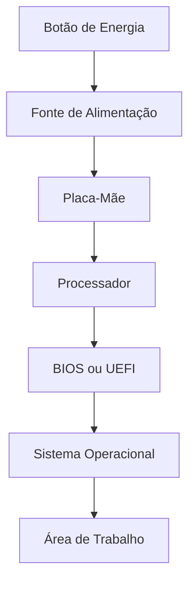
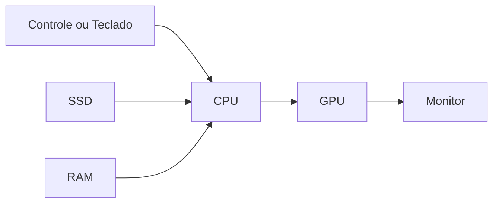

# 💡 06 — Exemplos

> [!IMPORTANT]
> **Módulo:** 01 — Fundamentos da Informática
>
> **Aula:** 02 — Hardware e Software
>
> **Arquivo:** `06-Exemplos.md`

---

# 📖 Introdução

Compreender os conceitos de hardware e software torna-se muito mais fácil quando observamos situações do cotidiano.

Embora muitas pessoas utilizem computadores, celulares e outros equipamentos diariamente, poucas percebem a quantidade de componentes físicos e programas que trabalham em conjunto para realizar tarefas aparentemente simples.

Neste capítulo serão apresentados exemplos práticos que demonstram como hardware e software estão presentes em diferentes ambientes e como interagem para executar as mais diversas atividades.

---

# 🖥️ Exemplo 1 — Ligando o Computador

Ao pressionar o botão de energia, diversas etapas acontecem em poucos segundos.

Durante esse processo:

- a fonte fornece energia;
- a placa-mãe inicializa os componentes;
- o firmware verifica o hardware;
- o sistema operacional é carregado do SSD;
- o usuário pode utilizar o computador.

---

# 🌐 Exemplo 2 — Acessando um Site

Imagine abrir um navegador e acessar um portal de notícias.

Os seguintes componentes participam da operação:

### Hardware

- mouse;
- CPU;
- memória RAM;
- SSD;
- placa de rede;
- monitor.

### Software

- sistema operacional;
- navegador;
- drivers de rede.

Resultado:

A página é carregada e exibida ao usuário.

---

# 📝 Exemplo 3 — Digitando um Documento

Durante a criação de um documento de texto:

| Hardware | Função |
|-----------|--------|
| Teclado | Captura a digitação |
| CPU | Processa os caracteres |
| Memória RAM | Armazena temporariamente o documento |
| Monitor | Exibe o texto |
| SSD | Salva o arquivo |

Sem qualquer um desses componentes, o processo seria interrompido.

---

# 🎮 Exemplo 4 — Executando um Jogo

Jogos eletrônicos utilizam praticamente todos os recursos do computador.

Os componentes trabalham continuamente para:

- processar comandos;
- gerar gráficos;
- reproduzir sons;
- armazenar informações;
- salvar o progresso do jogador.

---

# 🎵 Exemplo 5 — Reproduzindo Música

Ao ouvir uma música no computador:

### Hardware utilizado

- SSD;
- CPU;
- memória RAM;
- placa de som;
- caixas de som ou fones.

### Software utilizado

- sistema operacional;
- reprodutor de mídia.

O software interpreta o arquivo de áudio e o hardware converte essas informações em som.

---

# 📷 Exemplo 6 — Participando de uma Videoconferência

Uma chamada de vídeo utiliza diversos recursos simultaneamente.

### Hardware

- webcam;
- microfone;
- CPU;
- memória RAM;
- placa de rede;
- monitor;
- alto-falantes.

### Software

- aplicativo de videoconferência;
- sistema operacional.

Durante a reunião, áudio e vídeo são capturados, processados, transmitidos e exibidos em tempo real.

---

# 🏦 Exemplo 7 — Caixa Eletrônico

Um caixa eletrônico também é um computador.

Ele possui:

### Hardware

- monitor;
- teclado;
- leitor de cartão;
- impressora;
- leitor biométrico;
- CPU;
- armazenamento.

### Software

- sistema operacional;
- sistema bancário;
- software de autenticação.

O usuário normalmente percebe apenas a interface, mas dezenas de componentes trabalham simultaneamente.

---

# 🏥 Exemplo 8 — Equipamentos Hospitalares

Hospitais utilizam computadores especializados em diversos setores.

Exemplos:

- tomógrafos;
- aparelhos de ultrassom;
- monitores cardíacos;
- bombas de infusão;
- equipamentos laboratoriais.

Todos possuem hardware específico controlado por softwares desenvolvidos para aplicações médicas.

---

# 🏭 Exemplo 9 — Indústria

Em uma fábrica automatizada existem:

### Hardware

- sensores;
- motores;
- controladores;
- computadores industriais;
- câmeras.

### Software

- sistemas supervisórios;
- programas de automação;
- bancos de dados;
- sistemas de monitoramento.

Esses elementos trabalham juntos para controlar linhas de produção.

---

# 📱 Exemplo 10 — Smartphone

Embora seja menor que um computador desktop, um smartphone possui praticamente os mesmos elementos.

| Hardware | Software |
|-----------|----------|
| Processador | Android ou iOS |
| Memória RAM | Aplicativos |
| Armazenamento | Sistema operacional |
| Tela | Navegadores |
| Câmeras | Jogos |
| Alto-falantes | Redes sociais |

Isso demonstra que os conceitos estudados nesta aula não se aplicam apenas aos computadores tradicionais.

---

# 🏫 Exemplo 11 — Laboratório de Informática

Em um laboratório escolar encontramos diversos exemplos da interação entre hardware e software.

### Hardware

- computadores;
- projetor;
- impressoras;
- roteadores;
- switches.

### Software

- sistema operacional;
- navegador;
- pacote de escritório;
- antivírus.

Todos esses recursos trabalham de forma integrada para apoiar o processo de ensino.

---

# 🏢 Exemplo 12 — Escritório

Durante um dia de trabalho, um funcionário pode utilizar:

- editor de textos;
- planilhas;
- navegador;
- e-mail;
- videoconferência;
- impressora.

Cada atividade envolve diferentes componentes físicos e programas funcionando simultaneamente.

---

# 📊 Comparando Situações

| Situação | Hardware Principal | Software Principal |
|----------|--------------------|--------------------|
| Digitar texto | Teclado | Editor de texto |
| Navegar na Internet | Placa de rede | Navegador |
| Ouvir música | Caixa de som | Reprodutor de mídia |
| Jogar | GPU | Jogo eletrônico |
| Imprimir documento | Impressora | Driver de impressão |
| Assistir vídeos | Monitor | Reprodutor de vídeo |
| Fazer chamada de vídeo | Webcam | Aplicativo de videoconferência |

---

# 🧠 Situação para Análise

Imagine que um computador apresenta o seguinte comportamento:

- liga normalmente;
- o monitor exibe imagem;
- o mouse funciona;
- nenhum programa abre.

Perguntas:

- o hardware está totalmente defeituoso?
- o problema pode estar no sistema operacional?
- pode haver falhas no SSD?
- um software corrompido pode causar esse comportamento?

Esse tipo de análise será muito comum durante atividades de suporte técnico.

---

# 🌍 Conclusão

Independentemente do ambiente — residência, escola, hospital, indústria ou escritório — os mesmos princípios permanecem válidos.

Sempre haverá:

- componentes físicos realizando operações;
- softwares controlando essas operações;
- usuários interagindo com o sistema;
- troca constante de informações entre hardware e software.

É essa integração que torna possível a utilização dos computadores modernos.

---

# 📋 Resumo

Os exemplos apresentados demonstram que hardware e software estão presentes em praticamente todas as atividades que envolvem tecnologia.

Desde abrir um documento até controlar equipamentos hospitalares ou linhas de produção industriais, o funcionamento depende da colaboração entre componentes físicos e programas.

Compreender essas situações facilita a identificação de problemas e prepara o estudante para conteúdos mais avançados sobre manutenção, sistemas operacionais, redes e infraestrutura.

> [!TIP]
> Sempre que utilizar um equipamento eletrônico, tente identificar quais componentes de hardware estão envolvidos e quais softwares controlam seu funcionamento. Esse exercício desenvolve a percepção técnica e fortalece a compreensão dos conceitos estudados.
