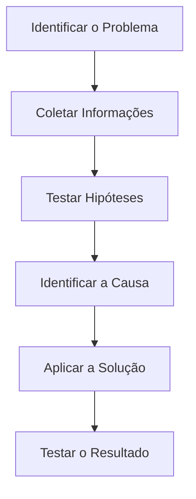

# 🧩 09 — Estudo de Caso

> [!IMPORTANT]
> **Módulo:** 01 — Fundamentos da Informática
>
> **Aula:** 02 — Hardware e Software
>
> **Arquivo:** `09-Estudo-de-Caso.md`

---

# 📖 Introdução

Uma das principais habilidades de um Técnico em Informática é identificar a origem de um problema antes de tentar resolvê-lo.

Muitas pessoas acreditam que qualquer falha em um computador significa que alguma peça está defeituosa. Na prática, diversos problemas são causados por softwares, configurações incorretas, drivers incompatíveis ou até mesmo pelo uso inadequado do equipamento.

Neste estudo de caso você analisará situações semelhantes às encontradas diariamente em empresas, escolas, hospitais e residências.

O objetivo não é apenas encontrar uma solução, mas desenvolver o raciocínio utilizado durante um diagnóstico técnico.

---

# 🎯 Objetivos

Ao concluir este capítulo você será capaz de:

- analisar problemas relacionados a hardware e software;
- levantar hipóteses antes de substituir componentes;
- identificar possíveis causas de falhas;
- compreender a importância do diagnóstico;
- desenvolver pensamento crítico na resolução de problemas.

---

# 🏢 Cenário

Uma pequena empresa possui dez computadores utilizados pelos funcionários do setor administrativo.

Na segunda-feira pela manhã, três computadores apresentaram problemas diferentes.

O responsável pelo suporte técnico foi chamado para realizar o atendimento.

Seu papel será analisar cada situação antes de tomar qualquer decisão.

---

# 💻 Caso 1 — Computador Muito Lento

## Situação

Um funcionário informa que o computador está extremamente lento.

Ele relata que:

- o computador liga normalmente;
- a área de trabalho aparece;
- abrir qualquer programa demora vários minutos;
- o navegador trava frequentemente.

---

## Observações do Técnico

Durante a análise foram identificados os seguintes dados:

- processador funcionando normalmente;
- memória RAM de 4 GB;
- HD mecânico antigo;
- armazenamento quase totalmente ocupado;
- diversos programas iniciando junto com o sistema.

---

## Perguntas

1. O problema está necessariamente no processador?

2. Quais componentes podem influenciar esse comportamento?

3. Quais melhorias poderiam ser realizadas?

---

## Possíveis Conclusões

O problema pode estar relacionado a diversos fatores.

Entre eles:

- pouca memória RAM;
- HD mecânico lento;
- excesso de programas iniciando automaticamente;
- pouco espaço disponível para armazenamento.

Neste caso, substituir apenas o processador provavelmente não resolveria a situação.

---

# 🖥️ Caso 2 — Computador Liga, Mas Não Exibe Imagem

## Situação

Outro computador apresenta o seguinte comportamento:

- LEDs acendem;
- ventoinhas giram;
- monitor permanece sem imagem.

---

## Perguntas

Quais componentes devem ser verificados?

---

## Possíveis Hipóteses

- monitor desligado;
- cabo HDMI ou DisplayPort desconectado;
- memória RAM mal encaixada;
- placa de vídeo com falha;
- monitor defeituoso;
- problema na placa-mãe.

---

## Diagnóstico

Antes de substituir qualquer componente, o técnico deve realizar testes simples.

Exemplos:

- verificar os cabos;
- testar outro monitor;
- testar outro cabo;
- reconectar a memória RAM;
- verificar sinais sonoros (beeps), quando disponíveis.

---

# ⌨️ Caso 3 — Teclado Não Funciona

## Situação

Um usuário informa que o teclado parou de funcionar após uma atualização do sistema.

---

## Perguntas

O teclado está necessariamente quebrado?

---

## Possíveis Causas

- driver incompatível;
- porta USB com falha;
- atualização incompleta;
- teclado defeituoso;
- configuração incorreta.

---

## Procedimentos

Antes de trocar o teclado, o técnico poderia:

- conectar em outra porta USB;
- testar outro teclado;
- verificar o Gerenciador de Dispositivos;
- reinstalar o driver;
- reiniciar o computador.

---

# 🌐 Caso 4 — Internet Não Funciona

## Situação

Um computador não consegue acessar nenhum site.

Os demais computadores da empresa funcionam normalmente.

---

## Observações

- navegador abre normalmente;
- cabo de rede conectado;
- sistema operacional inicia corretamente.

---

## Possíveis Causas

- cabo defeituoso;
- driver de rede;
- configuração IP incorreta;
- placa de rede;
- problema de DNS;
- firewall;
- configuração do roteador.

---

## Conclusão

Nem todo problema de Internet significa defeito na placa de rede.

Diversas configurações de software também podem impedir o acesso.

---

# 💾 Caso 5 — Arquivo Desapareceu

## Situação

Uma funcionária afirma que perdeu um documento importante.

---

## Perguntas

Antes de concluir que o SSD apresentou defeito, o técnico deve verificar:

- o arquivo foi realmente salvo?
- foi movido para outra pasta?
- está na lixeira?
- existe backup?
- houve sincronização com a nuvem?

---

## Diagnóstico

Muitas ocorrências de "arquivo perdido" são causadas por organização inadequada ou erro do usuário.

---

# 🦠 Caso 6 — Computador Reinicia Sozinho

## Situação

Durante o uso, o computador reinicia inesperadamente.

---

## Possíveis Causas

### Hardware

- superaquecimento;
- fonte de alimentação;
- memória RAM defeituosa;
- placa-mãe.

### Software

- drivers incompatíveis;
- atualização problemática;
- sistema operacional corrompido;
- malware.

---

## Procedimento

O técnico deve investigar ambas as possibilidades antes de substituir componentes.

---

# 📊 Comparando os Casos

| Caso | Possível Origem |
|-------|-----------------|
| Computador lento | Hardware e software |
| Sem imagem | Principalmente hardware |
| Teclado não funciona | Hardware ou software |
| Sem Internet | Configuração ou hardware |
| Arquivo desapareceu | Organização ou software |
| Reinicializações | Hardware ou software |

---

# 🔍 Processo de Diagnóstico

Independentemente do problema, recomenda-se seguir uma sequência lógica.

Esse método reduz erros e evita substituições desnecessárias.

---

# 💼 O Que um Técnico Nunca Deve Fazer?

Evite atitudes como:

- trocar peças sem diagnóstico;
- assumir que o problema é sempre hardware;
- ignorar mensagens de erro;
- apagar arquivos sem confirmação;
- desmontar equipamentos sem necessidade;
- instalar programas desconhecidos para "resolver" problemas.

Um bom profissional baseia suas decisões em evidências e testes.

---

# 📝 Atividade Proposta

Analise a situação abaixo.

> Um computador demora para iniciar o sistema operacional, mas depois funciona normalmente durante todo o dia.

Responda:

1. Quais componentes podem estar envolvidos?
2. O problema parece ser de hardware ou software?
3. Quais verificações você faria primeiro?
4. Quais soluções poderiam ser aplicadas?

Discuta suas respostas com seus colegas ou professor.

---

# 🎓 Lições Aprendidas

Os estudos de caso apresentados demonstram que:

- diferentes problemas podem produzir sintomas semelhantes;
- uma única falha pode ter diversas causas;
- um bom diagnóstico evita desperdício de tempo e dinheiro;
- observar o comportamento do computador é tão importante quanto conhecer seus componentes;
- hardware e software devem sempre ser analisados em conjunto.

---

# 📋 Resumo

O trabalho de um Técnico em Informática vai muito além da troca de peças.

A capacidade de investigar sintomas, levantar hipóteses, testar possibilidades e confirmar a verdadeira causa de um problema é uma das competências mais importantes da profissão.

Dominar os conceitos estudados nesta aula permitirá realizar diagnósticos mais rápidos, precisos e seguros, reduzindo falhas e aumentando a eficiência no atendimento técnico.

> [!TIP]
> Antes de concluir que um componente está defeituoso, reúna evidências, realize testes e elimine outras possibilidades. Um diagnóstico bem executado é a base de qualquer manutenção de qualidade.
