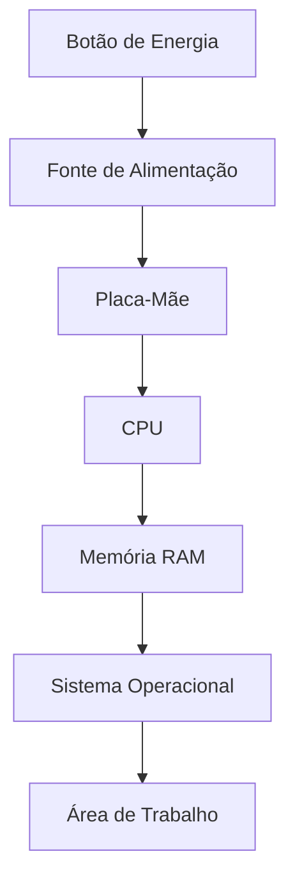

# 📚 10 — Resumo

> [!IMPORTANT]
> **Módulo:** 01 — Fundamentos da Informática
>
> **Aula:** 02 — Hardware e Software
>
> **Arquivo:** `10-Resumo.md`

---

# 📖 Introdução

Nesta aula foram apresentados os conceitos fundamentais de **hardware** e **software**, dois elementos indispensáveis para o funcionamento de qualquer sistema computacional.

Embora desempenhem funções diferentes, ambos trabalham de forma integrada. O hardware fornece a estrutura física necessária para o processamento das informações, enquanto o software controla os recursos disponíveis e permite que o usuário execute tarefas.

Compreender essa relação é um dos primeiros passos para atuar na área de Tecnologia da Informação.

---

# 🖥️ Hardware

Hardware é o conjunto de todos os componentes físicos de um computador ou dispositivo eletrônico.

São peças que podem ser vistas e tocadas.

Exemplos:

- processador (CPU);
- placa-mãe;
- memória RAM;
- SSD;
- HD;
- placa de vídeo;
- fonte de alimentação;
- monitor;
- teclado;
- mouse;
- impressora;
- webcam.

Cada componente possui uma função específica e contribui para o funcionamento do sistema.

---

# 💻 Software

Software é o conjunto de programas e instruções responsáveis por controlar o hardware e executar tarefas.

Sem o software, o hardware não seria capaz de realizar atividades úteis.

Exemplos:

- Windows;
- Linux;
- macOS;
- Android;
- Microsoft Word;
- LibreOffice;
- Google Chrome;
- Mozilla Firefox;
- VLC Media Player.

---

# 🔄 Como Hardware e Software Trabalham Juntos

Hardware e software são dependentes entre si.

O software envia instruções para o hardware, que executa as operações solicitadas.

O fluxo básico de funcionamento pode ser representado da seguinte forma:

Sem hardware não há onde executar os programas.

Sem software o hardware permanece sem função prática.

---

# 🧩 Componentes Fundamentais

Durante a aula foram estudados diversos componentes importantes.

| Componente | Função Principal |
|------------|------------------|
| CPU | Processar informações |
| Memória RAM | Armazenar dados temporariamente |
| SSD / HD | Armazenar dados permanentemente |
| Placa-mãe | Conectar todos os componentes |
| Fonte de alimentação | Fornecer energia |
| Placa de vídeo | Processar imagens |
| Monitor | Exibir informações |
| Teclado | Inserir dados |
| Mouse | Interagir com o sistema |

---

# 📂 Classificação dos Softwares

Os softwares podem ser divididos em diferentes categorias.

## Software de Sistema

Responsável pelo funcionamento do computador.

Exemplos:

- Windows;
- Linux;
- macOS.

---

## Software Aplicativo

Permite ao usuário executar tarefas específicas.

Exemplos:

- navegadores;
- editores de texto;
- planilhas;
- jogos;
- editores de imagem.

---

## Software Utilitário

Auxilia na manutenção e proteção do sistema.

Exemplos:

- antivírus;
- compactadores de arquivos;
- ferramentas de backup;
- limpeza de disco.

---

# ⚙️ Funcionamento Geral

Ao ligar o computador ocorre uma sequência de etapas.

Após a inicialização, o usuário pode utilizar os aplicativos instalados.

---

# 📝 Procedimentos Práticos

Nesta aula foram realizadas atividades como:

- identificar componentes físicos;
- reconhecer softwares instalados;
- observar periféricos;
- classificar dispositivos de entrada e saída;
- comparar diferentes equipamentos;
- analisar o funcionamento do computador;
- interpretar situações reais de suporte técnico.

Essas atividades aproximam os conceitos teóricos da prática profissional.

---

# 💡 Exemplos Estudados

Foram apresentados diversos exemplos do cotidiano.

Entre eles:

- ligar o computador;
- navegar na Internet;
- editar documentos;
- executar jogos;
- assistir vídeos;
- realizar videoconferências;
- utilizar caixas eletrônicos;
- operar equipamentos hospitalares;
- controlar processos industriais;
- utilizar smartphones.

Todos demonstram a integração entre hardware e software.

---

# ⚠️ Principais Erros Comuns

Durante o estudo foram destacados equívocos frequentes.

Os mais importantes são:

- confundir hardware com software;
- chamar o gabinete de CPU;
- acreditar que a memória RAM armazena arquivos permanentemente;
- confundir SSD com memória RAM;
- pensar que mais memória RAM resolve qualquer problema;
- substituir componentes sem realizar diagnóstico;
- desligar o computador incorretamente;
- ignorar atualizações do sistema.

Evitar esses erros facilita o aprendizado e melhora a capacidade de diagnóstico.

---

# ✅ Boas Práticas

Também foram apresentadas recomendações importantes.

Entre elas:

- desligar corretamente o computador;
- manter boa ventilação;
- limpar o equipamento periodicamente;
- instalar softwares confiáveis;
- manter o sistema atualizado;
- realizar backups;
- utilizar senhas fortes;
- organizar arquivos;
- verificar a compatibilidade antes de instalar componentes;
- observar sinais de falhas antes que se tornem problemas maiores.

Esses hábitos aumentam a vida útil dos equipamentos e reduzem riscos.

---

# 🧠 Estudo de Caso

Os estudos de caso mostraram que um mesmo sintoma pode possuir diferentes causas.

Foram analisadas situações como:

- computador lento;
- ausência de imagem;
- teclado sem funcionamento;
- falhas de Internet;
- desaparecimento de arquivos;
- reinicializações inesperadas.

O principal aprendizado foi a importância de investigar o problema antes de substituir qualquer componente.

---

# 📊 Comparação Geral

| Hardware | Software |
|-----------|----------|
| Componentes físicos | Programas e instruções |
| Pode ser tocado | Não possui forma física |
| Executa operações | Controla o hardware |
| Sofre desgaste físico | Pode ser atualizado |
| Exemplo: SSD | Exemplo: Windows |

---

# 🎯 Competências Desenvolvidas

Ao concluir esta aula, espera-se que o estudante seja capaz de:

- diferenciar hardware e software;
- identificar os principais componentes de um computador;
- compreender a função de cada componente;
- reconhecer diferentes tipos de software;
- explicar como hardware e software trabalham em conjunto;
- identificar erros comuns;
- aplicar boas práticas de utilização;
- realizar análises iniciais de problemas computacionais.

---

# 📖 Conclusão

Hardware e software formam a base de qualquer sistema computacional moderno.

Todo computador, notebook, smartphone, servidor ou equipamento eletrônico depende da integração entre componentes físicos e programas para executar tarefas.

O domínio desses conceitos é essencial para compreender os próximos conteúdos do curso, como sistemas operacionais, manutenção, redes de computadores, infraestrutura e segurança da informação.

---

# 🚀 Próximos Passos

Na próxima aula você aprofundará seus conhecimentos sobre novos conceitos fundamentais da informática, expandindo a compreensão sobre o funcionamento dos computadores e preparando-se para conteúdos cada vez mais práticos e técnicos.

---

# 📋 Resumo Final

Nesta aula você aprendeu:

- o conceito de hardware;
- o conceito de software;
- os principais componentes físicos de um computador;
- os diferentes tipos de software;
- como hardware e software trabalham em conjunto;
- exemplos práticos do cotidiano;
- erros comuns cometidos por iniciantes;
- boas práticas de utilização e manutenção;
- a importância do diagnóstico técnico antes da substituição de componentes.

Esses conhecimentos representam uma das bases mais importantes para a formação de um Técnico em Informática.

> [!TIP]
> Antes de avançar para a próxima aula, revise os conceitos apresentados, identifique os componentes do computador que você utiliza e procure relacionar cada hardware ao software responsável por controlá-lo. Essa prática fortalecerá sua compreensão e facilitará o aprendizado dos próximos módulos.
