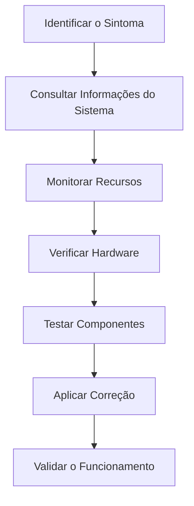

# 🛠️ Ferramentas

> [!IMPORTANT]
> **Módulo:** 01 — Fundamentos da Informática
>
> **Aula:** 02 — Hardware e Software
>
> **Arquivo:** `Ferramentas.md`

---

# 📖 Introdução

Conhecer as ferramentas utilizadas para identificar, monitorar e diagnosticar componentes de hardware e software é uma habilidade essencial para qualquer Técnico em Informática.

Algumas dessas ferramentas já fazem parte do sistema operacional, enquanto outras são desenvolvidas por empresas especializadas e auxiliam na manutenção, no monitoramento de desempenho e na identificação de problemas.

Neste capítulo você conhecerá as principais ferramentas utilizadas por estudantes, técnicos e profissionais da área de Tecnologia da Informação.

---

# 🎯 Objetivos

Ao concluir este capítulo você será capaz de:

- identificar ferramentas de diagnóstico de hardware;
- reconhecer utilitários do sistema operacional;
- monitorar recursos do computador;
- coletar informações técnicas do equipamento;
- compreender quando utilizar cada ferramenta.

---

# 🖥️ Ferramentas do Sistema Operacional

A maioria dos sistemas operacionais já inclui utilitários para visualizar informações do computador e realizar tarefas básicas de manutenção.

## Exemplos

- Gerenciador de Tarefas;
- Gerenciador de Dispositivos;
- Informações do Sistema;
- Monitor de Recursos;
- Gerenciamento de Disco;
- Prompt de Comando;
- Windows PowerShell ou Terminal;
- Configurações do Sistema.

---

# 📊 Gerenciador de Tarefas

O Gerenciador de Tarefas permite acompanhar o desempenho do computador em tempo real.

## Principais recursos

- utilização da CPU;
- consumo de memória RAM;
- uso do SSD ou HD;
- atividade da rede;
- utilização da GPU;
- programas em execução;
- aplicativos que iniciam com o sistema.

## Quando utilizar?

- computador lento;
- programas travando;
- consumo excessivo de memória;
- encerramento de processos.

---

# 🔌 Gerenciador de Dispositivos

Essa ferramenta apresenta todos os dispositivos de hardware reconhecidos pelo sistema operacional.

Permite:

- verificar drivers;
- identificar dispositivos com falhas;
- atualizar drivers;
- desabilitar dispositivos;
- remover dispositivos.

---

# 📝 Informações do Sistema

Esse utilitário exibe diversas características do computador.

Entre elas:

- fabricante;
- modelo;
- processador;
- memória instalada;
- BIOS ou UEFI;
- versão do sistema operacional;
- arquitetura (32 ou 64 bits).

É muito utilizado durante atendimentos de suporte técnico.

---

# 💾 Gerenciamento de Disco

Permite administrar dispositivos de armazenamento.

Funções principais:

- visualizar discos;
- criar partições;
- excluir partições;
- formatar unidades;
- alterar letras de unidades.

---

> [!WARNING]
> Alterações incorretas em discos e partições podem causar perda de dados. Sempre realize backup antes de modificar o armazenamento.

---

# 📈 Monitor de Recursos

O Monitor de Recursos fornece informações detalhadas sobre o uso dos componentes do computador.

É possível acompanhar:

- CPU;
- memória;
- disco;
- rede.

É útil para identificar gargalos de desempenho.

---

# 💻 Terminal (Prompt de Comando e PowerShell)

O terminal permite executar comandos administrativos e obter informações do sistema.

Exemplos de comandos no Windows:

```text
systeminfo
```

Exibe informações detalhadas do computador.

```text
ipconfig
```

Mostra as configurações de rede.

```text
ping google.com
```

Testa a conectividade com outro dispositivo ou servidor.

```text
tasklist
```

Lista os processos em execução.

---

# 🐧 Ferramentas no Linux

Distribuições Linux também oferecem excelentes ferramentas.

Alguns comandos úteis:

```bash
lscpu
```

Mostra informações do processador.

```bash
free -h
```

Exibe o uso da memória RAM.

```bash
lsblk
```

Lista dispositivos de armazenamento.

```bash
df -h
```

Mostra o espaço disponível em disco.

```bash
top
```

Monitora os processos em tempo real.

---

# 🌡️ HWiNFO

O **HWiNFO** é um dos programas mais completos para diagnóstico de hardware.

## Permite visualizar

- temperatura da CPU;
- temperatura da GPU;
- velocidade das ventoinhas;
- tensões;
- sensores;
- memória RAM;
- armazenamento;
- placa-mãe.

É muito utilizado por técnicos durante diagnósticos avançados.

---

# 🧩 CPU-Z

O **CPU-Z** fornece informações detalhadas sobre o hardware do computador.

## Exibe

- processador;
- placa-mãe;
- memória RAM;
- cache;
- chipset;
- frequência do processador.

É uma ferramenta leve e amplamente utilizada para identificação de componentes.

---

# 🎮 GPU-Z

O **GPU-Z** é especializado em placas de vídeo.

Permite visualizar:

- modelo da GPU;
- memória de vídeo;
- temperatura;
- frequência;
- utilização da GPU;
- versão dos drivers.

---

# 💽 CrystalDiskInfo

O **CrystalDiskInfo** monitora a saúde dos dispositivos de armazenamento.

Informações apresentadas:

- temperatura;
- estado de saúde;
- tecnologia S.M.A.R.T.;
- tempo de uso;
- quantidade de inicializações.

É bastante utilizado para detectar falhas em SSDs e HDs.

---

# 🚀 CrystalDiskMark

O **CrystalDiskMark** mede o desempenho do armazenamento.

Permite testar:

- velocidade de leitura;
- velocidade de gravação;
- desempenho sequencial;
- desempenho aleatório.

É útil para comparar diferentes dispositivos de armazenamento.

---

# 🔍 Speccy

O **Speccy** apresenta um resumo completo da configuração do computador.

Mostra informações sobre:

- CPU;
- memória RAM;
- placa-mãe;
- armazenamento;
- sistema operacional;
- temperaturas.

É indicado para obter rapidamente uma visão geral do equipamento.

---

# 🛡️ Microsoft Defender

O Microsoft Defender é o antivírus integrado ao Windows.

Principais funções:

- proteção contra malware;
- análise em tempo real;
- proteção contra ransomware;
- verificação periódica;
- firewall integrado (em conjunto com o Windows).

---

# 🌐 Navegadores Web

Embora não sejam ferramentas de diagnóstico, os navegadores fazem parte da rotina do profissional de TI.

Exemplos:

- Google Chrome;
- Mozilla Firefox;
- Microsoft Edge;
- Opera.

São utilizados para:

- acessar documentações;
- pesquisar soluções;
- utilizar sistemas web;
- acessar equipamentos de rede.

---

# ☁️ Armazenamento em Nuvem

Ferramentas de armazenamento em nuvem ajudam a proteger documentos e facilitar o compartilhamento de arquivos.

Exemplos:

- Google Drive;
- Microsoft OneDrive;
- Dropbox;
- iCloud.

São frequentemente utilizadas para backups e sincronização de dados.

---

# 📊 Comparação das Ferramentas

| Ferramenta | Principal Utilização |
|-------------|----------------------|
| Gerenciador de Tarefas | Monitorar desempenho |
| Gerenciador de Dispositivos | Gerenciar hardware e drivers |
| Informações do Sistema | Consultar especificações |
| Gerenciamento de Disco | Administrar armazenamento |
| Monitor de Recursos | Analisar uso de recursos |
| Terminal | Administração por comandos |
| HWiNFO | Diagnóstico avançado |
| CPU-Z | Informações do processador e memória |
| GPU-Z | Informações da placa de vídeo |
| CrystalDiskInfo | Saúde do armazenamento |
| CrystalDiskMark | Teste de velocidade do disco |
| Speccy | Resumo completo do hardware |
| Microsoft Defender | Proteção contra malware |

---

# 🧪 Fluxo Básico de Diagnóstico

Quando um computador apresenta problemas, uma sequência organizada facilita a identificação da causa.



Esse processo reduz erros e evita substituições desnecessárias de componentes.

---

# 💡 Recomendações

Ao utilizar ferramentas de diagnóstico:

- mantenha os programas atualizados;
- utilize apenas softwares confiáveis;
- registre as informações coletadas;
- compare os resultados antes de substituir componentes;
- realize backups antes de alterações importantes;
- documente procedimentos executados.

Esses cuidados tornam o diagnóstico mais seguro e profissional.

---

# 📋 Resumo

As ferramentas apresentadas neste capítulo permitem identificar componentes, monitorar o desempenho do computador e auxiliar na resolução de problemas relacionados ao hardware e ao software.

Dominar esses utilitários é uma competência essencial para estudantes e profissionais de Tecnologia da Informação, pois possibilita diagnósticos mais rápidos, precisos e fundamentados.

> [!TIP]
> Familiarize-se com as ferramentas nativas do sistema operacional antes de utilizar programas de terceiros. Em muitos casos, os recursos integrados já fornecem as informações necessárias para identificar e solucionar problemas de hardware e software.
