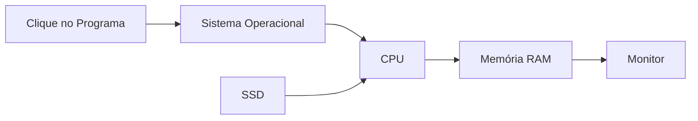

# 🧪 Laboratório — Hardware e Software

> [!IMPORTANT]
> **Módulo:** 01 — Fundamentos da Informática
>
> **Aula:** 02 — Hardware e Software
>
> **Arquivo:** `Laboratorio.md`
>
> **Tempo estimado:** 90 a 120 minutos

---

# 📖 Introdução

Este laboratório foi desenvolvido para proporcionar o primeiro contato prático com os componentes físicos (hardware) e os programas (software) presentes em um computador.

Ao longo das atividades, você observará o equipamento, identificará seus componentes, analisará o sistema operacional e compreenderá como hardware e software trabalham em conjunto para executar tarefas.

As atividades podem ser realizadas em computadores com **Windows**, **Linux** ou **macOS**, adaptando os procedimentos conforme o ambiente disponível.

---

# 🎯 Objetivos

Ao concluir este laboratório você será capaz de:

- identificar os principais componentes de hardware;
- reconhecer diferentes tipos de software;
- consultar informações técnicas do computador;
- diferenciar dispositivos de entrada e saída;
- compreender a interação entre hardware e software;
- desenvolver uma metodologia básica de diagnóstico.

---

# 📋 Materiais Necessários

- Computador ou notebook
- Sistema operacional instalado
- Acesso administrativo (opcional)
- Conexão com a Internet (opcional)
- Bloco de anotações ou editor de texto

---

# ⚠️ Regras de Segurança

Antes de iniciar:

- não abra o gabinete sem autorização do professor;
- não desconecte cabos internos;
- não altere configurações do sistema sem orientação;
- não instale programas sem permissão;
- salve seus arquivos antes de qualquer procedimento.

---

# 🧪 Experimento 1 — Conhecendo o Equipamento

Observe cuidadosamente o computador disponível.

Preencha a tabela.

| Item | Identificado |
|------|--------------|
| Monitor | ☐ |
| Teclado | ☐ |
| Mouse | ☐ |
| Gabinete | ☐ |
| Webcam | ☐ |
| Microfone | ☐ |
| Caixa de Som | ☐ |
| Impressora | ☐ |

---

## Perguntas

1. O equipamento é um desktop ou notebook?

____________________________________________________

2. Existem periféricos adicionais conectados?

____________________________________________________

---

# 🧪 Experimento 2 — Identificando o Hardware

Consulte as especificações do computador.

Complete.

| Componente | Informação |
|------------|------------|
| Processador | |
| Memória RAM | |
| Armazenamento | |
| Sistema Operacional | |
| Arquitetura | |
| Fabricante | |

---

## Perguntas

Qual componente possui maior capacidade de armazenamento?

____________________________________________________

---

# 🧪 Experimento 3 — Explorando os Periféricos

Classifique os dispositivos.

| Dispositivo | Entrada | Saída | Entrada e Saída |
|-------------|:-------:|:-----:|:---------------:|
| Teclado | ✅ | | |
| Mouse | ✅ | | |
| Monitor | | ✅ | |
| Impressora | | ✅ | |
| Webcam | ✅ | | |
| Headset | | | ✅ |
| Touchscreen | | | ✅ |

Agora identifique outros periféricos disponíveis no laboratório.

| Dispositivo | Classificação |
|-------------|---------------|
| | |
| | |
| | |

---

# 🧪 Experimento 4 — Identificando Softwares

Abra alguns programas instalados.

Exemplos:

- navegador;
- editor de texto;
- calculadora;
- explorador de arquivos.

Complete.

| Programa | Categoria |
|-----------|-----------|
| | |
| | |
| | |
| | |

---

## Perguntas

Qual software está sendo utilizado como sistema operacional?

____________________________________________________

---

# 🧪 Experimento 5 — Monitorando Recursos

Abra o monitor de desempenho do sistema.

Observe durante alguns minutos:

- utilização da CPU;
- memória RAM;
- armazenamento;
- rede.

Anote os valores observados.

| Recurso | Valor Aproximado |
|----------|------------------|
| CPU | |
| RAM | |
| Disco | |
| Rede | |

---

## Perguntas

Qual recurso apresentou maior utilização?

____________________________________________________

---

# 🧪 Experimento 6 — Executando Programas

Abra simultaneamente:

- navegador;
- editor de texto;
- calculadora;
- explorador de arquivos.

Observe:

- houve aumento do uso da memória?
- o computador ficou mais lento?
- a CPU aumentou sua utilização?

Anote suas observações.

____________________________________________________

____________________________________________________

---

# 🧪 Experimento 7 — Fluxo de Funcionamento

Analise o processo de abertura de um programa.

Explique o papel de cada componente.

| Componente | Função |
|-------------|--------|
| Sistema Operacional | |
| CPU | |
| SSD | |
| RAM | |
| Monitor | |

---

# 🧪 Experimento 8 — Hardware ou Software?

Classifique corretamente.

| Item | Hardware | Software |
|------|:--------:|:--------:|
| Windows | | ☐ |
| Linux | | ☐ |
| CPU | ☐ | |
| SSD | ☐ | |
| Mouse | ☐ | |
| Google Chrome | | ☐ |
| Android | | ☐ |
| Impressora | ☐ | |
| Microsoft Word | | ☐ |
| Memória RAM | ☐ | |

---

# 🧪 Experimento 9 — Simulação de Diagnóstico

Analise cada situação.

## Situação 1

O computador liga, mas não aparece imagem.

Quais componentes você verificaria primeiro?

____________________________________________________

____________________________________________________

---

## Situação 2

O computador demora muito para iniciar.

Quais seriam as possíveis causas?

____________________________________________________

____________________________________________________

---

## Situação 3

Um programa fecha inesperadamente.

O problema é necessariamente de hardware?

____________________________________________________

____________________________________________________

---

# 🧪 Experimento 10 — Comparação de Equipamentos

Compare o computador do laboratório com outro equipamento.

Exemplo:

- notebook;
- smartphone;
- tablet.

| Característica | Computador | Outro Equipamento |
|----------------|------------|-------------------|
| Processador | | |
| Memória RAM | | |
| Armazenamento | | |
| Sistema Operacional | | |
| Entrada | | |
| Saída | | |

---

# 🔍 Desafio Técnico

Escolha um equipamento eletrônico disponível.

Identifique:

- cinco componentes de hardware;
- cinco softwares instalados;
- dois dispositivos de entrada;
- dois dispositivos de saída.

Depois explique como todos trabalham em conjunto.

______________________________________________________________________

______________________________________________________________________

______________________________________________________________________

---

# 📊 Registro dos Resultados

| Atividade | Concluída |
|------------|:---------:|
| Identificação do hardware | ☐ |
| Identificação do software | ☐ |
| Classificação dos periféricos | ☐ |
| Monitoramento do sistema | ☐ |
| Diagnóstico básico | ☐ |
| Comparação de equipamentos | ☐ |

---

# 🧠 Questões para Discussão

1. Por que hardware e software dependem um do outro?

____________________________________________________

2. Qual componente você considera mais importante? Justifique.

____________________________________________________

3. O que aconteceria se o computador não possuísse memória RAM?

____________________________________________________

4. Quais boas práticas ajudam a aumentar a vida útil do equipamento?

____________________________________________________

---

# 🏆 Critérios de Avaliação

| Critério | Pontos |
|-----------|:------:|
| Participação | 2,0 |
| Execução das atividades | 3,0 |
| Identificação correta dos componentes | 2,0 |
| Resolução das questões | 2,0 |
| Organização do relatório | 1,0 |
| **Total** | **10,0** |

---

# 📋 Conclusão

Ao concluir este laboratório, você teve contato direto com os principais componentes físicos de um computador, identificou softwares essenciais e observou como ambos trabalham de forma integrada.

Essas atividades representam a base para disciplinas futuras, como manutenção de computadores, sistemas operacionais, redes de computadores e infraestrutura de TI.

> [!TIP]
> Sempre que utilizar um computador, procure identificar seus componentes de hardware, os softwares em execução e como eles interagem. Transformar a observação em hábito é uma das formas mais eficientes de desenvolver o raciocínio técnico de um profissional de Tecnologia da Informação.
