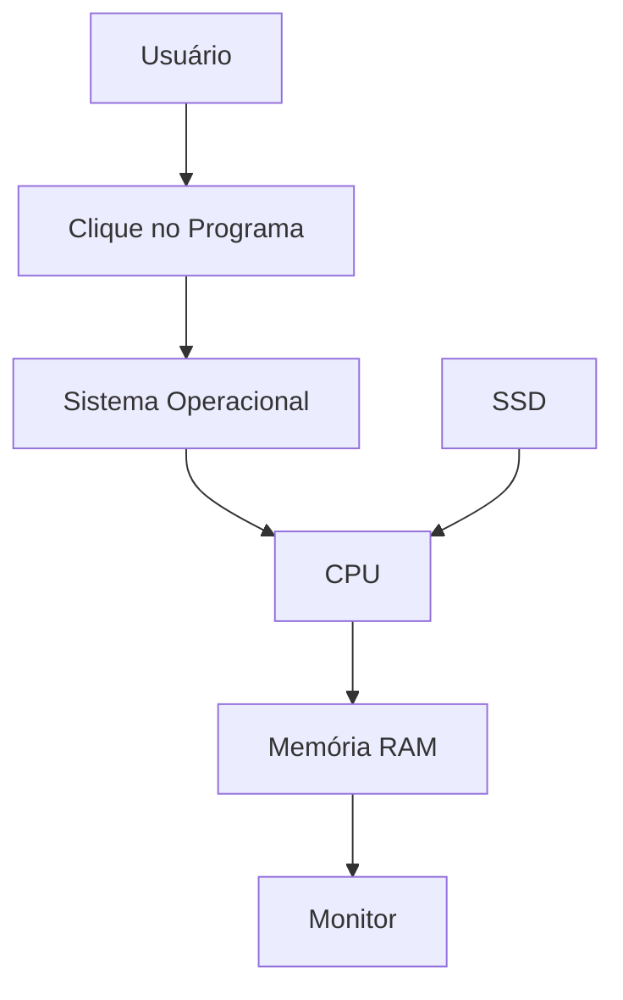

# 💻 Projeto Prático — Explorando Hardware e Software

> [!IMPORTANT]
> **Módulo:** 01 — Fundamentos da Informática
>
> **Aula:** 02 — Hardware e Software
>
> **Arquivo:** `Projeto.md`
>
> **Nível:** Iniciante
>
> **Tempo estimado:** 3 a 5 horas

---

# 📖 Introdução

Ao longo desta aula você conheceu os conceitos fundamentais de hardware e software, identificou componentes de um computador, compreendeu como eles trabalham em conjunto e aprendeu boas práticas de utilização.

Neste projeto você aplicará esses conhecimentos realizando um levantamento completo de um computador real ou de um equipamento eletrônico semelhante, documentando suas características e analisando seu funcionamento.

O objetivo é aproximar o estudante da rotina de um Técnico em Informática, desenvolvendo habilidades de observação, organização e documentação técnica.

---

# 🎯 Objetivos

Ao concluir este projeto você será capaz de:

- identificar componentes físicos de um computador;
- reconhecer diferentes tipos de software;
- levantar especificações técnicas;
- analisar a interação entre hardware e software;
- produzir documentação técnica organizada;
- desenvolver pensamento analítico.

---

# 🧰 Materiais Necessários

- Computador ou notebook
- Smartphone (opcional)
- Acesso ao sistema operacional
- Editor de texto
- Navegador
- Internet (opcional)

---

# 📌 Situação-Problema

Uma pequena empresa precisa atualizar seu inventário de computadores.

Você foi contratado para identificar as características dos equipamentos utilizados pelos funcionários e elaborar um relatório técnico contendo as principais informações sobre hardware e software.

Seu trabalho será analisar um equipamento e produzir uma documentação completa.

---

# 📋 Etapa 1 — Identificação do Equipamento

Preencha as informações.

| Item | Informação |
|------|------------|
| Fabricante | |
| Modelo | |
| Tipo | Desktop / Notebook |
| Ano aproximado | |
| Número de patrimônio (opcional) | |

---

# 🖥️ Etapa 2 — Levantamento de Hardware

Complete a tabela.

| Componente | Especificação |
|------------|---------------|
| Processador | |
| Memória RAM | |
| Armazenamento | |
| Placa de vídeo | |
| Sistema de refrigeração | |
| Fonte de alimentação (Desktop) | |
| Placa de rede | |

---

## Periféricos

Marque os dispositivos presentes.

- ☐ Monitor
- ☐ Teclado
- ☐ Mouse
- ☐ Webcam
- ☐ Microfone
- ☐ Impressora
- ☐ Scanner
- ☐ Caixas de som
- ☐ Headset

---

# 💻 Etapa 3 — Levantamento de Software

Registre os principais softwares instalados.

| Categoria | Software |
|------------|----------|
| Sistema Operacional | |
| Navegador | |
| Editor de Texto | |
| Antivírus | |
| Compactador | |
| Reprodutor de Mídia | |

---

# 📊 Etapa 4 — Classificação

Classifique cada item.

| Item | Hardware | Software |
|------|:--------:|:--------:|
| CPU | ✅ | |
| Windows | | ✅ |
| SSD | ✅ | |
| Google Chrome | | ✅ |
| Monitor | ✅ | |
| Linux | | ✅ |
| Impressora | ✅ | |
| Microsoft Word | | ✅ |

Agora acrescente mais cinco exemplos.

---

# ⚙️ Etapa 5 — Fluxo de Funcionamento

Explique como ocorre a abertura de um programa.



Descreva o papel de cada etapa.

| Etapa | Função |
|--------|--------|
| Usuário | |
| Sistema Operacional | |
| CPU | |
| SSD | |
| RAM | |
| Monitor | |

---

# 🔍 Etapa 6 — Diagnóstico Inicial

Analise o computador.

Responda.

## O equipamento apresenta:

- lentidão?
- travamentos?
- ruídos?
- superaquecimento?
- erros frequentes?

Caso positivo, descreva.

_________________________________________________________

_________________________________________________________

---

## Possíveis causas

_________________________________________________________

_________________________________________________________

---

## Possíveis soluções

_________________________________________________________

_________________________________________________________

---

# 📈 Etapa 7 — Avaliação de Desempenho

Observe o comportamento do computador durante o uso.

Abra:

- navegador;
- editor de texto;
- explorador de arquivos;
- calculadora.

Registre.

| Item | Observação |
|------|------------|
| Uso da CPU | |
| Uso da RAM | |
| Uso do Disco | |
| Velocidade percebida | |

---

# 🛡️ Etapa 8 — Segurança

Verifique.

- ☐ Sistema atualizado
- ☐ Antivírus instalado
- ☐ Firewall ativo
- ☐ Senha configurada
- ☐ Backup realizado
- ☐ Espaço livre suficiente

Caso algum item esteja ausente, registre recomendações.

_________________________________________________________

---

# 🌡️ Etapa 9 — Conservação

Analise o estado físico do equipamento.

Observe:

- limpeza;
- cabos;
- ventilação;
- organização da mesa;
- estado dos periféricos.

Classifique.

| Item | Bom | Regular | Ruim |
|------|:---:|:-------:|:----:|
| Limpeza | ☐ | ☐ | ☐ |
| Organização | ☐ | ☐ | ☐ |
| Cabos | ☐ | ☐ | ☐ |
| Ventilação | ☐ | ☐ | ☐ |
| Periféricos | ☐ | ☐ | ☐ |

---

# 📋 Etapa 10 — Relatório Técnico

Elabore um pequeno relatório contendo:

- identificação do equipamento;
- principais componentes;
- softwares encontrados;
- estado geral do computador;
- problemas observados;
- sugestões de melhoria.

Modelo:

```text
RELATÓRIO TÉCNICO

Equipamento:
...

Hardware:
...

Software:
...

Problemas encontrados:
...

Recomendações:
...
```

---

# 🚀 Desafio

Escolha outro equipamento eletrônico.

Exemplos:

- smartphone;
- tablet;
- videogame;
- Smart TV.

Monte uma tabela comparando-o com o computador.

| Característica | Computador | Outro Equipamento |
|----------------|------------|-------------------|
| Processador | | |
| Memória | | |
| Armazenamento | | |
| Sistema Operacional | | |
| Entrada | | |
| Saída | | |

Depois responda:

**Quais conceitos estudados nesta aula também se aplicam ao novo equipamento?**

_________________________________________________________

_________________________________________________________

_________________________________________________________

---

# 🧠 Reflexão

Responda às perguntas.

1. Qual componente você considera mais importante? Por quê?

_________________________________________________________

2. O que mais chamou sua atenção durante a análise?

_________________________________________________________

3. Qual foi a maior dificuldade encontrada?

_________________________________________________________

4. O que você aprendeu com este projeto?

_________________________________________________________

---

# 🏆 Critérios de Avaliação

| Critério | Pontos |
|-----------|:------:|
| Levantamento do hardware | 2,0 |
| Levantamento do software | 2,0 |
| Organização do relatório | 2,0 |
| Diagnóstico técnico | 2,0 |
| Clareza das conclusões | 2,0 |
| **Total** | **10,0** |

---

# 📚 Conclusão

Este projeto permitiu aplicar, em um contexto prático, os conceitos estudados ao longo da aula sobre hardware e software.

A identificação de componentes, a análise de programas, a observação do funcionamento do sistema e a elaboração de um relatório técnico representam atividades comuns na rotina de profissionais de suporte e manutenção.

Além de consolidar os conhecimentos adquiridos, o projeto desenvolve habilidades importantes de observação, documentação, organização e diagnóstico, fundamentais para a formação de um Técnico em Informática.

> [!TIP]
> Sempre documente as informações coletadas durante uma análise técnica. Um relatório claro, organizado e baseado em evidências facilita futuras manutenções, agiliza o suporte e demonstra profissionalismo.
