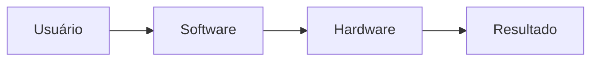

# 🖥️ Aula 02 — Hardware e Software

> [!IMPORTANT]
> **Módulo:** 01 — Fundamentos da Informática
>
> Esta aula apresenta os conceitos fundamentais de **hardware** e **software**, explicando como os componentes físicos e os programas trabalham em conjunto para permitir o funcionamento de computadores, notebooks, smartphones, servidores e diversos outros dispositivos eletrônicos.

---

# 📚 Sobre esta Aula

Hardware e software são os dois pilares da computação moderna.

Nesta aula você aprenderá:

- o que é hardware;
- o que é software;
- quais são os principais componentes físicos de um computador;
- como os programas utilizam esses componentes;
- como ocorre a comunicação entre hardware e software;
- boas práticas de utilização;
- erros comuns;
- conceitos utilizados diariamente por profissionais de Tecnologia da Informação.

Ao final desta aula você terá uma base sólida para estudar sistemas operacionais, manutenção de computadores, redes, infraestrutura e segurança da informação.

---

# 🎯 Objetivos de Aprendizagem

Após concluir esta aula você será capaz de:

- ✅ Definir hardware e software.
- ✅ Diferenciar componentes físicos e programas.
- ✅ Identificar os principais componentes internos de um computador.
- ✅ Reconhecer dispositivos de entrada, saída e armazenamento.
- ✅ Explicar como hardware e software trabalham juntos.
- ✅ Aplicar boas práticas de utilização.
- ✅ Identificar erros comuns.
- ✅ Realizar diagnósticos básicos.

---

# 📖 Conteúdo Principal

| Arquivo | Conteúdo |
|----------|----------|
| 📄 [00-Apresentacao.md](00-Apresentacao.md) | Apresentação da aula, competências e objetivos. |
| 📄 [01-Fundamentos.md](01-Fundamentos.md) | Introdução aos conceitos de hardware e software. |
| 📄 [02-Conceitos-Essenciais.md](02-Conceitos-Essenciais.md) | Definições fundamentais, terminologia e conceitos básicos. |
| 📄 [03-Componentes-e-Elementos.md](03-Componentes-e-Elementos.md) | Componentes físicos do computador e categorias de software. |
| 📄 [04-Funcionamento.md](04-Funcionamento.md) | Como ocorre o funcionamento do computador e a interação entre hardware e software. |
| 📄 [05-Procedimentos-Praticos.md](05-Procedimentos-Praticos.md) | Atividades práticas de identificação e observação dos componentes. |
| 📄 [06-Exemplos.md](06-Exemplos.md) | Situações reais demonstrando a utilização de hardware e software. |
| 📄 [07-Erros-Comuns.md](07-Erros-Comuns.md) | Principais equívocos cometidos por iniciantes. |
| 📄 [08-Boas-Praticas.md](08-Boas-Praticas.md) | Recomendações para utilização, manutenção e segurança. |
| 📄 [09-Curiosidades.md](09-Curiosidades.md) | Curiosidades históricas e tecnológicas sobre hardware e software. |
| 📄 [09-Estudo-de-Caso.md](09-Estudo-de-Caso.md) | Estudos de caso para desenvolver raciocínio técnico. |
| 📄 [10-Resumo.md](10-Resumo.md) | Revisão completa dos conceitos estudados. |

---

# 🧪 Materiais Complementares

| Arquivo | Finalidade |
|----------|------------|
| 📝 [Atividade.md](Atividade.md) | Exercícios para fixação dos conceitos. |
| 🧪 [Laboratorio.md](Laboratorio.md) | Aula prática guiada com experimentos. |
| 💻 [Projeto.md](Projeto.md) | Projeto de análise e documentação de um computador. |
| ❓ [FAQ.md](FAQ.md) | Perguntas frequentes sobre hardware e software. |
| 🛠️ [Ferramentas.md](Ferramentas.md) | Softwares e utilitários utilizados por técnicos de informática. |
| 🔗 [Links.md](Links.md) | Sites, documentações e plataformas recomendadas. |
| 📚 [Referencias.md](Referencias.md) | Bibliografia e referências utilizadas. |
| 🎥 [Videos.md](Videos.md) | Vídeos recomendados para aprofundamento. |

---

# 🗂️ Sequência Recomendada de Estudo

```text
Apresentação
      │
      ▼
Fundamentos
      │
      ▼
Conceitos Essenciais
      │
      ▼
Componentes
      │
      ▼
Funcionamento
      │
      ▼
Procedimentos Práticos
      │
      ▼
Exemplos
      │
      ▼
Erros Comuns
      │
      ▼
Boas Práticas
      │
      ▼
Curiosidades
      │
      ▼
Estudo de Caso
      │
      ▼
Resumo
      │
      ▼
Atividade
      │
      ▼
Laboratório
      │
      ▼
Projeto
```

---

# 🔄 Como Hardware e Software Trabalham Juntos



Sempre que um usuário realiza uma ação, o software interpreta o comando e utiliza o hardware para executá-lo.

---

# 🧠 Competências Desenvolvidas

Ao concluir esta aula você desenvolverá competências relacionadas a:

- identificação de componentes;
- documentação técnica;
- diagnóstico inicial;
- análise de computadores;
- manutenção preventiva;
- organização de informações;
- suporte técnico;
- utilização de ferramentas de diagnóstico.

---

# 💼 Aplicações no Mercado de Trabalho

Os conhecimentos desta aula são utilizados em:

- 🖥️ Suporte Técnico
- 🔧 Manutenção de Computadores
- 🌐 Redes de Computadores
- 🏢 Infraestrutura de TI
- ☁️ Computação em Nuvem
- 🔒 Segurança da Informação
- 💾 Administração de Sistemas
- 💻 Desenvolvimento de Software
- 🤖 Automação
- 📡 Internet das Coisas (IoT)

---

# 📚 Pré-requisitos

Esta aula não exige conhecimentos técnicos avançados.

É recomendado apenas:

- saber utilizar um computador;
- possuir conhecimentos básicos de informática;
- ter curiosidade para compreender o funcionamento da tecnologia.

---

# 📋 O que você aprenderá?

Ao final desta aula será capaz de responder perguntas como:

- O que é hardware?
- O que é software?
- Qual a diferença entre SSD e memória RAM?
- Qual é a função da CPU?
- O que faz a placa-mãe?
- O que é um sistema operacional?
- Como os programas utilizam o hardware?
- Como identificar problemas básicos em um computador?
- Quais cuidados aumentam a vida útil do equipamento?

---

# 🚀 Após concluir esta aula

Recomenda-se seguir a seguinte sequência:

1. 📝 Resolver a [Atividade](Atividade.md)
2. 🧪 Executar o [Laboratorio](Laboratorio.md)
3. 💻 Desenvolver o [Projeto](Projeto.md)
4. ❓ Consultar o [FAQ](FAQ.md)
5. 🛠️ Explorar as [Ferramentas](Ferramentas.md)
6. 🎥 Assistir aos vídeos em [Videos.md](Videos.md)
7. 📚 Consultar as [Referencias.md](Referencias.md)

---

# 📖 Resumo

Esta aula estabelece uma das bases mais importantes para a formação de um Técnico em Informática.

Os conceitos de hardware e software serão utilizados em praticamente todos os módulos seguintes do curso. Dominar esses fundamentos permitirá compreender com maior facilidade conteúdos relacionados à manutenção de computadores, sistemas operacionais, redes, infraestrutura, programação e segurança da informação.

> [!TIP]
> Estude os capítulos em ordem e realize todas as atividades práticas. A combinação entre teoria e prática é a melhor forma de consolidar os conhecimentos e desenvolver competências essenciais para atuar na área de Tecnologia da Informação.
